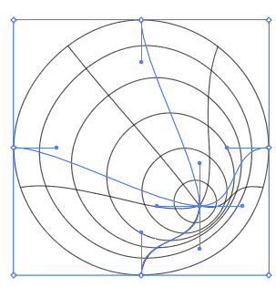
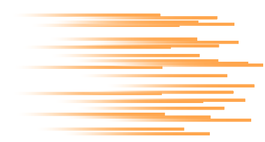
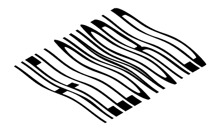

## AI 花里胡哨

> undefined

 

### 一些不太实用的炫技方法

#### 网格工具伪 3D

先点击直线段工具，并将其切换为 `极坐标网格工具`；

随意画出一个圆形网格图形；

选中图形，对象->封套扭曲->用网格建立

> 使用极坐标网格工具时，左键按住绘制图形时点击左右和上下箭头可以增删圈数和分割数

 

#### 符号喷枪快速随机线条布局

任意绘制一个长方形，这里为其添加了橙色渐变；

将该长方形拖入 `符号（画布右侧一排按钮里面）` 框中，使其变成一个符号；

然后使用 `符号喷枪` 工具，按住鼠标左键开始绘制图像；

 

#### 奇怪的波纹文字

创建一段文字，编辑完成后把他扩展，并添加到`符号库`里面；

绘制一条直线，点击 效果->扭曲与变换->波纹效果，弹出窗口勾选平滑，之后其他参数自己调；

选中波纹线段，点击 效果->3D->突出和斜角；
位置：等角-左方；
突出厚度：600px 左右；

然后点击凸出和斜角对话框左下角的 `贴图`；
选择你要放置文字的表面，在画布中会以红色边框线展示范围；
勾选三维模型不可见；
选择我们刚刚只做好的文字符号，之后直接调整文字匹配贴图就完事了；

 
