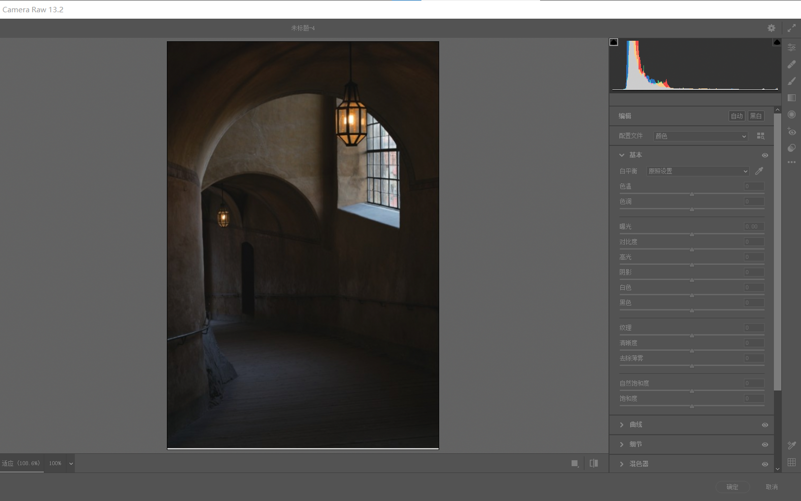

### 简介与安装

CameraRaw（一般简称 ACR，后续也将沿用该简称）是一款快速调整 raw 文件的 ps 插件

虽然明面上是调整 raw 格式文件，实际上 jpg 或者 png 的图片他依然可以调整

 

可以搜索 CameraRaw13.2 版本下载（于 2021 年更新，目前最新版）

下载得到的 exe 安装包，直接安装，安装完毕打开 ps 即可看见插件已被加载

 

### 基础

#### 快捷键与基础设置

打开 ACR 滤镜有两种方式：

1. 顶部菜单选择 滤镜->CameraRaw 滤镜
2. shift+ctrl+a 快速打开滤镜

 

#### 修剪警告

工具栏顶部的直方图左右上角均有两个小三角，默认情况下他们均为黑色

当出现以下几种色彩时其对应的含义如下：

1. 右侧三角变红：高光修剪警告，当前图像高光强度过大，需要调暗一点
2. 左侧三角变蓝：阴影修剪警告，当前图像阴影区域太黑，丢失了色彩，需要调亮一点
3. 三角形变白：丢失色彩，图像开始失真

 

#### 快速自动调整图片

进入滤镜编辑面板，直接看右侧的工具栏，找到顶部默认显示的“编辑”栏，右侧提供了自动和黑白两种形式

直接点击“自动”，ACR 将会为图片自动调节对比度与高光，但有些时候图片反差过大会导致自动调节力度不够或者偏离我们想要的方向  
此时就要人工介入手动调节

 
