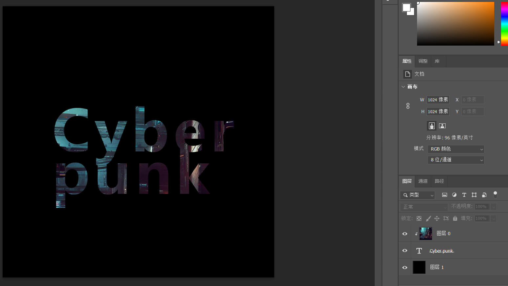

### 剪切蒙版剪影文字

剪切蒙版原理即：有一上一下两个图层，上方为背景，下方为文本，对上方图层使用剪切蒙版，则上方图层部分会被下方图层部分所剪切（看起来不像人话）

创建剪切蒙版快捷键 `ctrl+alt+g`

下图剪影文字实现方式

1. 导入一张 newbing 生成的赛博朋克城市图
2. 背景图解除锁定
3. 新建空白图层，并移动到最下方，将其填充纯黑色
4. 新建文本图层，位于背景图层下方，文本颜色随意
5. 点击背景图层，使用快捷键创建剪切蒙版
6. 此时背景内容就会被剪切到文本区域，也即是图中所示效果

 

###
