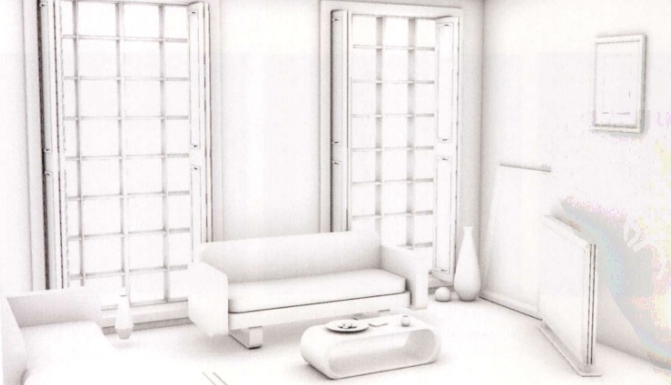
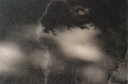

### 第一部分 用光基础

#### 明暗交界

明暗交界线是最暗的区域（他无法获取正面光以及地面反射的辅助光），它包含的较弱的蓝光为天空蓝色所给予；

红橙黄绿蓝靛紫，从前到后波长逐渐变短，而短波散射能力强；  
故会出现以下现象：

1. 夕阳下，天空全红，暗部亮度很弱
2. 晴天下，天空全蓝，暗部会有较高的淡蓝色，因为蓝光波长短散射强

 

#### 辐射

即某一物件在光源照射下，其本身的材质所带颜色会投射到周边环境中去；

 

#### 光影平衡

高调照明：白色等浅色调为主，柔和，细节少，多出现在雾雪天；

低调照明：压抑，黑暗为主，雷暴天

 

#### 白平衡

上图左侧为自然光照下呈现纯白，右侧为人造光下呈现橘黄；

当光源以一定比例混合三原色时，人脑自动过滤；  
这就造成了我们在室内看到人造光是纯白的，而移步到室外透过窗户看发现它是橘黄的；

白平衡的作用即中和人脑智能处理光照信息而导致“看起来不等于拍起来”的问题出现；

> 省流：远离光源所影响的环境范围，即可观察到真实的光感；

 

### 第二部分 光的照射方向

#### 正面光

优点：可修饰对象，隐藏譬如皱纹和瑕疵（人物肖像常用）  
缺点：无纵深感，平面化；人物肖像较为苍白

 

#### 侧光

易于制造立体效果，利于光影体现；

会导致细节损失，凸显皱纹，造成较大反差

 

#### 逆光

为物体显示一个剪影，添加戏剧性；

可刻画轮廓，光照越强则边缘轮廓发光越明显；  
对半透明物体有奇效；

 

#### 顶光与脚光

顶光：光源从顶部直打下来，导致人脸部分器官被遮盖，添加神秘感与不安感

脚光：光源从底部向上打，恐怖片常用

 

### 第三部分 自然光

#### 散射与漫射

大气散射：波长越短的光散射力度越大；

云层漫射：由于云层可视为半透明，故全波长的光线穿过云层都会被漫射，这就导致了天空较为柔和的色彩体现

 

#### 正午与日落光照

正午光照最强，饱和度低，反差较大，一般不会在此场景下拍摄，但可以用于拍摄某些热带动物

日落前亮部与暗部互补极佳，是为所谓的拍摄“黄金一小时”

 

#### 阴天

阴天拍摄水面诀窍：只拍水面，用水面反射天空

阴天投影柔和、饱和度高、反差小，易于表现物体形态

 

#### 夜光

月球接近地平线时呈现橘红色，随着其升高颜色逐渐趋于纯白

快门速度降低可以充分体现夜间多彩的颜色

 

#### 大气效应

霾总是存在于空气中，而雾的散射程度更大而已

霾反应天空的颜色，譬如晴天是蓝的则霾也是浅蓝色；  
雾总是清一色的白

 

### 第四部分 人造光与室内光源

#### 家庭照明

北窗光：窗户朝北，永远没有太阳直射，故光线总是很柔和且稳定

钨丝灯由于制造简单而被大量适用于室内人造光，人脑会自动过滤钨丝灯原本的橘黄色而呈现在我们眼前的是纯白色

灯罩可以使光源散射，柔化本就僵硬的人造光

多灯（也可以是不同类型的）合作照明也可以消除僵硬性

 

#### 商业照明

餐厅用光属商业性质，其中氛围光照均不相同，需仔细观察

荧光灯运作成本低廉，商店普遍使用其廉价照明，但人脑无法完美的过滤其淡绿色光线，美观度不行

 

#### 混合光

自然光淡蓝+人造光橘黄，混合起来可以表现不一样的艺术效果，比如用在上图的建筑上

 

#### 其他光源与手法

火光：色温很低，人脑无法过滤而只能呈现其本色——橘黄

 

### 第五部分 阴影

#### 阴影种类

轮廓阴影：地表作为一个大光源反射给球体的光+大气散射光（较大）  
投射阴影：球体本色光投射到大地的光（极少）

物体立体感需要轮廓阴影来体现

 

环境光遮蔽(AO)  
即在物体与物体接近或者相交的小区域添加阴影，可以更好体现立体感

 

#### 光源

硬阴影：面积小或距离远的光源  
软阴影：面积大或距离近的光源  
（软阴影出现的原因是光源的相交）

本影：阴影中最暗的部分  
半影：阴影外围的边缘区域

本体若和阴影距离过远也会出现软阴影的效果；  
譬如下图展示正午光线穿过树叶的阴影很模糊，因为树叶和地面的距离很大，即本体与阴影距离很大，故出现软阴影

 

#### 色彩

次表面散射：若光源穿过一个透明或半透明物体，光在物体内部散射后投射出的阴影包含物体的本色（例如通过红色玻璃的投影就是红色的）

若要实现次表面散射，则物体本身必须要具有一定的饱和度（太淡了不行）

当光线色彩极为浓烈时，阴影会呈现出主导色的互补色，这实际上是我们视觉系统自动产生的一种幻象

 

### 第六部分 物体表面

普通物体只有四种反射需要关注：漫反射、直接反射（即镜面反射）、透明与半透明、自发光

边缘越硬，表示反差越大，视觉越能聚焦到该位置上；
如下图，仅留下一个带直接反射的金属球，视觉自然就会聚焦到该反差大的物体上去了

 

处理好非轮廓边缘，不要出现很多锐利的边，添加明暗过渡使得画面更加可信

 

### 第七部分 漫反射

#### 色彩

近距离漫射会在物体某处产生一个“热点”，即亮度最强的一个点；  
阴影随着远离热点而逐渐加强

 

#### 反射

当物体被打湿后，色彩都会变深，因为部分漫反射光被镜面反射抵消了  
这就是为什么给木材打了清漆后会看起来颜色更深的原因！  
（而镜子就不会出现这种状况，因为其几乎 100%镜面反射，有无水打湿都不会造成任何改变）

 

毛绒面料会具有一种特殊的光泽感，是由于其内部纤维构成造成的漫反射差异导致的

 

### 第八部分 直接反射

#### 表面特性

自然界中能产生强烈直接反射得物体很少，大多数都是人造物体（如摩天大楼的玻璃幕墙）

不要随意的为物体表面加高光，应当把高光当做光源的实际反射来对待

 

物体表面高光面积与形状与光源特性有关；  
如左图为日光直射下，叶子表面产生即为明亮的，来自太阳的光点；  
而右图没了太阳，天空在叶子上产生的高光时宽泛的且较为柔和的

可见太阳因为强度太大，直接压过了天空，在叶片上产生了聚集明亮的高光

 

镜面反射也会因为物体表现不平整而出现多个分散的散射，譬如湖面波光粼粼的效果，实际上就是波浪导致了反射面不平整，镜面反射连续性被破坏的结果

 

#### 其他性质

畸变：可以理解为“各向异质反射”的一种表现，即我们常见的铁盆盆体上镜面反射物会出现拉伸变长的现象

磨损和残破可能会导致直接反射能力的增强或者衰减

菲涅尔效应：观察时，视觉相对于法线的角度越大，反光性越强；  
这一点在水面上可以证明，垂直看向水面发现他是透明的，而随着视角角度变大（远离法线），水面就出现了越来越强的直接反射！

绝大多数金属物体基本都不会发生菲涅尔效应（即从任何角度看过去都是一样的直接反射程度）

 

#### 影调

纯黑物体轮廓基本是由镜面反射决定的，因为他的漫反射实在太弱

其余浅色物体则更能凸显反射中较暗的部分

 

镜面反射不会受到投影的影响，即真正的镜面反射不会存在投影

 

### 第九部分 透明性

#### 反射与折射

一般的透明物质都会有反射能力，如玻璃通常情况下会反射百分之四的光，这样子我们才能看见玻璃本身

如果透明物体缺乏反射以及折射，那么他就完全隐形了

焦散：透镜由于表面波动的原因，导致光线汇聚于一个点或者分布于多个地方的状态

 

#### 半透明

半透明物体，光线会透过它本体而投射到其后的环境内

半透明物体的轮廓阴影较淡，但其本身会带有一种特殊的光芒，这也就导致了在整体较暗的环境下，半透明物体依然不会显得很暗

半透明物体大多数不具有镜面反射，而由于穿过其本体的光线发生了漫反射，所以也不会产生折射与焦散现象！  
（比如上图的樱桃，你不会把他当做一个放大镜来聚焦光线的，对吧？）

 

### 第十部分 色彩

#### 色谱

太阳发出的白色光线光谱是一个连续的范围

任何物体表面反射的光波范围都是不固定的

浅色物体偏于白色，故反射光波的范围就比较大；反之深色物体只会反射本色及其小范围的邻近色

要注意，在可见光范围下的透明物体（如玻璃），在紫外线范围下就不是透明的，所以透明并不是绝对的！

 

#### 色光

只有色调而无色彩（如黑白照片），不会影响人类理解其内容；  
而只有色彩没有色调则会完全丢失图像的空间感而变得无法理解

 

### 第十一部分 光线与人物

#### 皮肤

人类皮肤是半透明的，光线往往会从皮下血管反射回而被我们观察到，即你会发现布满毛细血管的皮肤会看起来红一点的缘故

皮肤表面实际上覆盖一层油膜，他造成了一定程度的反光

 

#### 特征

鼻子和脸颊通常比脸部的其他区域红一些

白人皮肤最为透明，皮下血管对肤色影响较大；  
黑人由于属于深色皮肤，会产生更明显的镜面反射，看起来更有光泽

头发越顺滑整齐，高光的连续性就越强，反之支离破碎较为分散

 

### 第十二部分 环境光线

树叶表面通常会附带一些蜡，使得其产生镜面反射，但你只能在距离其比较近的情况下该反射才能明显观察

 

### 第十三部分 构图与场景设计

制造焦点：通过聚光灯或者其他光源，使得你要表达的关键物体处于视觉焦点

引导视线：画面色彩反差、对比度变化或者线条都可以起到将读者视线引导到某个关键物体上去

利用反差：将关键物体放置于整个画面最暗和最亮的结合点上，可以起到突出表现的作用

逆光照明：可以借此实现“剪影”效果

 
