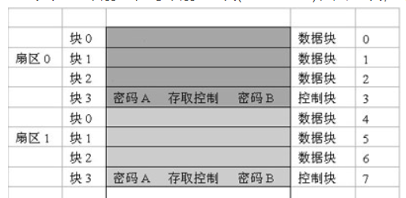

### 基本概要

近场通信（Near Field Communication，简称 NFC）

ISO/IEC 14443 定义了 `TypeA、TypeB` 两种卡片读写标准

**TypeA**

1. 使用最广泛，多用于门禁、公交、地铁
2. 读卡机向卡传递信号：通过 13.56MHz 的射频载波传送信号，使用同步、改进的 Miller 编码方式，通过 100%ASK 传送
3. 卡向读卡机传递信号；通过调制载波传送信号。使用 847kHz 的副载波传送 Manchester 编码

 

**TypeB**

1. 多用于第二代身份证和部分银行卡
2. 读卡机向卡传递信号：通过 13.56MHz 的射频载波信号，但采用的是异步、NRZ 编码方式，通过用 10%ASK 传送
3. 卡向读写机传送信号：则是采用的 BPSK 编码进行调制

 

> ISO/IEC 14443-3 规定了 TYPEA，TYPEB 的防冲突机制，通过不同算法使得不同类型的卡片可以并行读写而不相互干扰

 

### TypeA

#### MifareOne (M1)

M1 类型卡片有很多型号，目前仅介绍使用最广泛的 S50 型号芯片

S50 型号设备参数：

1. 16 个扇区、每个扇区 4 块(0~3 Block)、共 64 块，每块 16 个字节
2. 第 0 扇区的块 0 用于存放厂商代码
3. 扇区的块 0、块 1、块 2 为数据块，用于存储数据，块 3 为控制块，分别存放
4. 每个扇区的密码和存取控制是独立的，必须要使用密钥验证才可以进行下一步读写

 

M1 卡 UID 保护机制

1. 每张卡的 0 扇区 0 端都固定的被指定为 UID 位；
2. 每张卡的 UID 都完全不同，厂商会通过 UID 将卡的写权限锁死使其仅能读取，但某些卡并没有这些限制

 

爆破 M1 卡

1. 暴力破解：由于 M1 是被动卡，无论我们尝试多少次都不会锁卡，故可以在算力支持的情况下试出密钥
2. 重放攻击：基于 PRNG 漏洞实现，由于卡每次上电后均生成一随机数序列，断电再上电后生成的序列不变，可通过这一点篡改数据
3. 验证漏洞：通过卡片发出的随机数，读卡器进行验证，攻破一个扇区的密钥后，后续所有的扇区都可如法炮制一一攻破

 
