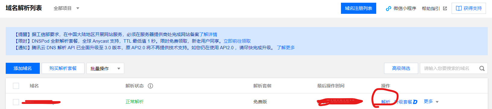
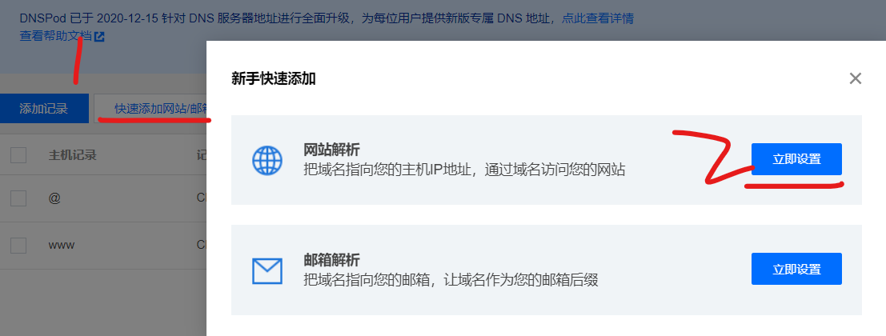
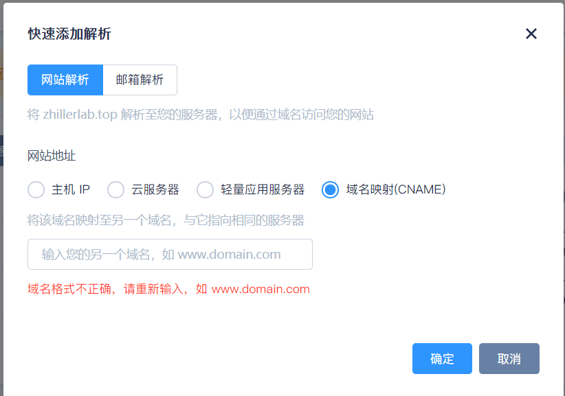
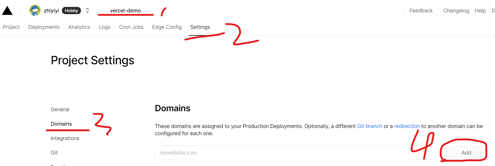
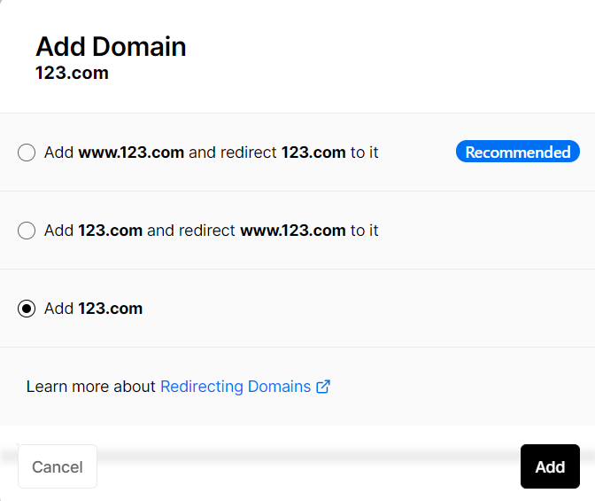
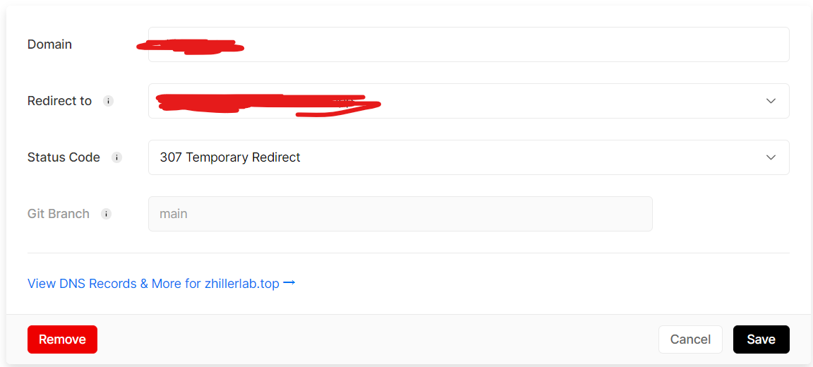

### 腾讯云

请在腾讯云中购买任意一个域名

之后进入控制台，找到域名管理，点击进入（一般的，刚购买的域名会显示正在注册，稍等约一小时后即可注册完毕），你会看到显示你已购买的域名：

 

点击“解析”，由于我们仅需要对 vercel 提供的静态网页地址进行解析，故使用 CNAME 类型  
点击`“快速添加网站/邮箱”`，弹出窗口选择第一个，此时进入 DNSpod 面板

 

快速添加解析，选择域名映射，填入你静态网站的地址（不要带 `http://`）  
此时他会提示你域名不能这样写，不用管，直接点击确定，微信验证完毕后即可添加 CNAME 解析

 

### Vercel

进入 vercel 控制台，依次点击：  
`项目名->settings->domains->add`

 

填写你要进行解析的域名  
由于我们已经对域名进行了 `@和 WWW` 解析，故我们需要先后在此处进行两次域名解析

这里点击 add 按钮后，一般选择第三项，有我们自己指定重定向的网页；

 

腾讯云进行域名解析后，在此处添加域名后 vercel 会进行检测，成功状态下会显示：`Valid Configuration` 以及 `Assigned to main`

点击 edit 按钮，将 redirect to 选择我们的静态网站地址，之后点击确认；  
此时所有的域名解析均已完成，我们可以直接通过域名访问静态网址

 

### 注意事项

腾讯云内必须配置 `@` 以及 `WWW` 两个记录，且类型均为 `CNAME`  
同理，vercel 内进行域名解析也需要同时配置这两种类型（例如：`xxx.com` 与 `www.xxx.com`）  
此时我们访问该域名并重定向后才不会改变 URL
