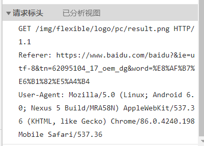

### 请求体格式

> 一般我们使用 POST 请求时都会附带请求体，而常用的比如 formdata，那么它作用的环境是什么？特点又如何？下面将逐一介绍最常用的几种请求体格式，以及如何使用搭配案例介绍

<br>

#### json

JSON 是较为常用且易于分析的请求体格式；

JSON 格式的需求：

1. 整体使用一个大括号包裹
2. 以键值对的形式逐个书写属性，且 key 必须使用双引号括起来
3. 值 value 存在多种形式，比如字符串以及数值、数组类型
4. 每条属性（除去最后一条）末尾必须添加英文逗号作为分隔

```json
{
  "name": "tom",
  "age": 12,
  "habits": ["swim", "other"]
}
```

<br>

JSON 所有支持的属性类型：数值、字符串、对象、数组、布尔、null

JS 中可以使用 `JSON.parse()` 方法将字符串类型数值直接转换为 JSON 格式  
同理，`JSON.stringify(）` 可以吧 JSON 对象转换为字符串类型

<br>

#### multipart/form-data

当前对于此格式的请求体使用概率不高，特别是表单提交时，此格式提供的安全性保证较低

若要上传文件，则推荐使用此格式；

他依然是按照键值对的形式存储数据（下面展示 js 中如何操作 formdata 类型数据）：

1. 使用 `new FormData()` 创建一个新的空 form-data 表单
2. `formData.append("tag","cat")` 使用 append 插入一条新属性
3. `formData.get("tag")` 使用 get 根据键来获取对应值

<br>

#### application/x-www-form-urlencoded

此为 POST 的默认传输格式，也即 form 表单提交时默认使用的编码方式

当使用 `GET` 请求时：`x-www-form-urlencoded` 会将所有键值对转换后添加到 URL 的尾部，即我们常见到的 `?name=123&age=12` 之类的内容；

当使用 `POST` 请求时，`x-www-form-urlencoded` 会把所有键值对切分后封装到请求体里面后在发送请求，当且仅当我们请求时附带文件时才会动用 `multipart/form-data`（上文有提到）

<br>

#### XML

使用场景较少，以类似 HTML 的标签组成的文件结构

这是我们必须要关注到的重要特性：

1. 由一个根标签+N 个子标签组成，且根节点必须存在
2. 标签命名随意
3. 标签命名是大小写敏感的

<br>

这是一个非常简单的 XML 格式文件

文件首行为 XML 声明，它定义了当前 XML 文件的一些属性（比如编码类型）  
同理，你可以和 HTML 一样，为这些节点们添加自定义属性

```xml
<?xml version="1.0" encoding="UTF-8"?>
<root>
    <name>zhiller</name>
    <age tag="demo"></age>
</root>
```

<br>

#### raw

即字符串形式，最简单的一种格式

<br>

### Header

Header 有两种类型：`响应标头和请求标头`；  
而每种标头又由 `起始行+请求头` 组成

下图展示一个我们检测到的简单请求标头：  


<br>

起始行即首行，其格式为：`请求方式 请求URL HTTP协议版本`

剩余部分即请求头内容，请求头可写属性数量不限，允许自定义属性值；但若使用特殊请求方式时，某些属性就不可省略（下面讲）

<br>

标头有四种：`通用标头、请求标头、响应标头、实体标头`

<br>

#### 常见请求方法详解

GET 请求访问已被 URI 识别的资源，一般不填充实体部分；

POST 传输实体部分；

PUT 上传文件时用

HEAD 不返回报文主体，用以确认 URI 有效性与日期更新

DELETE 删除指定资源时使用

<br>

#### 通用标头

**Date 表示时间**

**Cache-Control 缓存控制**  
`max-age` 属性，表示资源可以被缓存的最大时间；  
`max-state` 属性，表示客户端可接受的最大响应时间；

<br>

**Connection**  
用以表示当前 TCP/IP 链接是否对其进行保活处理；  
若值为 `keep-alive` 则保活，维持链接；  
若值为 `close` 则立即断开，不维持链接；

<br>

#### 实体标头

**Content-Length**  
表示实体大小，对于 POST 请求则必须填写此字段！

**Content-Language**  
描述客户端与服务端所用语言

**Content-Encoding**  
表示实体部分使用到的编码类型；  
常用的编码类型有：gzip、compress、identity  
请求标头里此字段需要把 Content 替换为 Accept  
响应标头里不变

<br>

#### 请求标头

> 这里不全部介绍，只说一些前后端开发最常见的属性

**Accept**  
作用：告知（服务器）客户端可以处理的内容类型  
类型需填写 MIME 类型（后续可查表）

**Referer**  
通知服务器该网页是从哪一个页面链接到这里来的；

**Upgrade-Insecure-Requests**  
客户端通知服务端，表示自己需要使用加密且带身份验证的响应；

<br>

### 资源交换

#### 内容协商

简言之即客户端与服务端之间传输文件时对文件各个属性的定义来保证传输完整性

<br>

#### MIME 类型

> MIME 类型配合上 q 属性就可以表示权重值

`文本文件`： text/html、text/plain、text/css、application/xhtml+xml、application/xml

`图片文件`： image/jpeg、image/gif、image/png

`视频文件`： video/mpeg、video/quicktime

`应用程序二进制文件`： application/octet-stream、application/zip

<br>

<br>

### 参考文献

[CSDN-看完这篇 HTTP](https://blog.csdn.net/qq_36894974/article/details/103930478?ops_request_misc=%257B%2522request%255Fid%2522%253A%2522167409564116782428610741%2522%252C%2522scm%2522%253A%252220140713.130102334..%2522%257D&request_id=167409564116782428610741&biz_id=0&utm_medium=distribute.pc_search_result.none-task-blog-2~all~top_positive~default-2-103930478-null-null.142^v71^insert_chatgpt,201^v4^add_ask&utm_term=http&spm=1018.2226.3001.4187)
