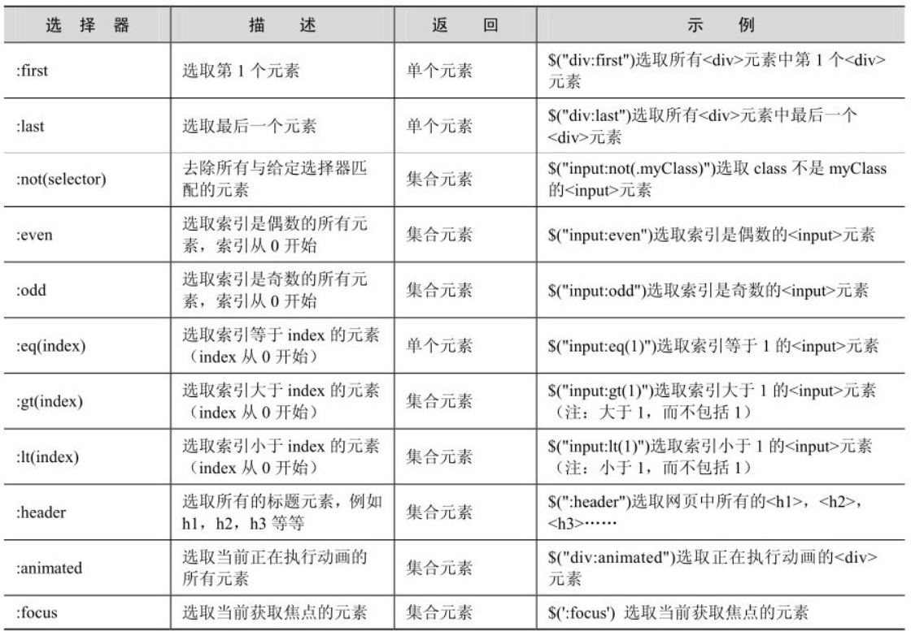
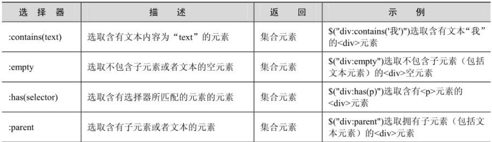
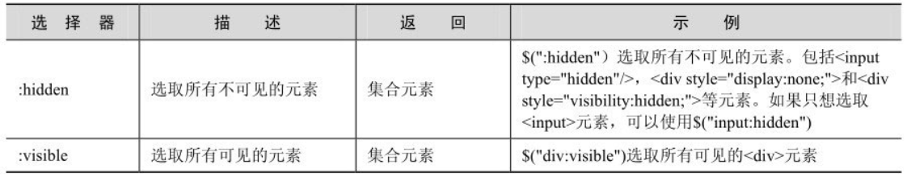
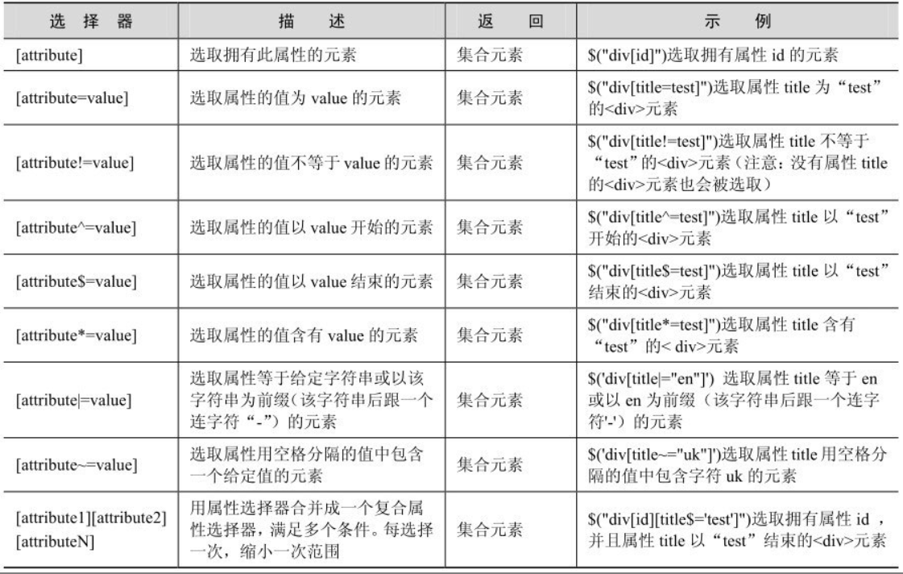
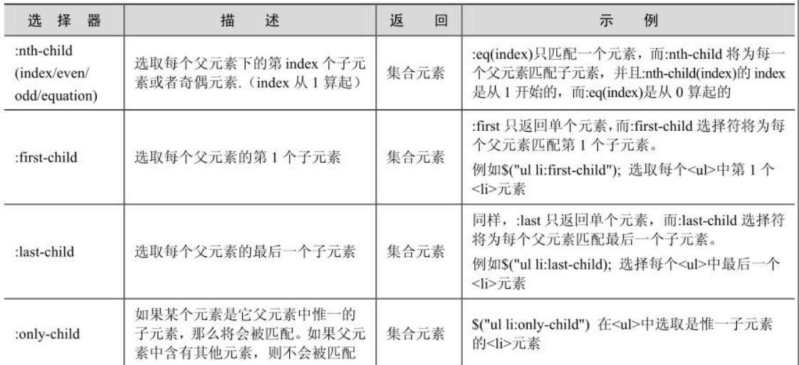
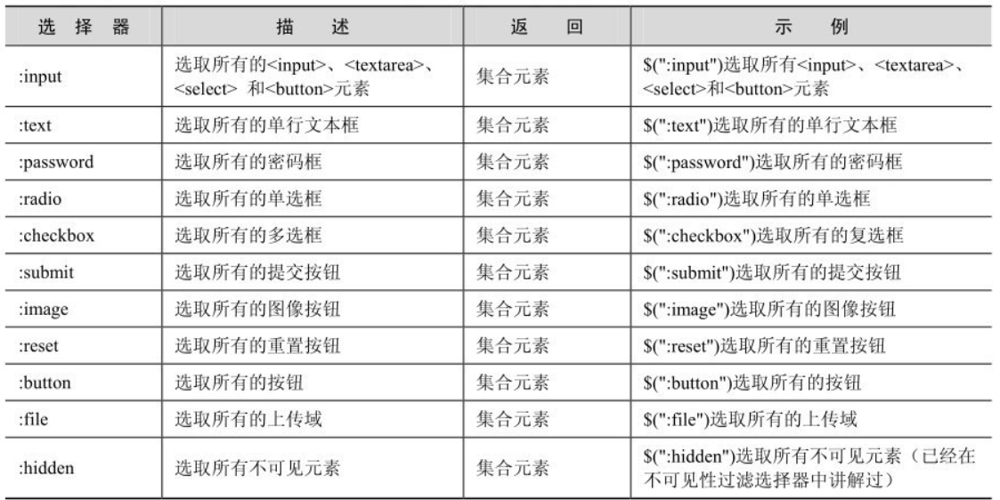

### jQuery 选择器

#### 基本选择器

类选择器：`$(".asd")`  
ID 选择器：`$("#asd")`  
标签选择器：`$("div")`  
全选择：`$("*")`

<br>

案例展示

```html
<!DOCTYPE html>
<html lang="en">
  <head>
    <meta charset="UTF-8" />
    <meta http-equiv="X-UA-Compatible" content="IE=edge" />
    <meta name="viewport" content="width=device-width, initial-scale=1.0" />
    <title>Document</title>

    <script src="../scripts/jquery.js" type="text/javascript"></script>
  </head>
  <body>
    <div class="shit">
      123
      <p class="demo"></p>
    </div>

    <script>
      // 获取DOM，并设置一个新的CSS样式：文本颜色改变为#bbffcc
      let $div1 = $(".shit");
      $div1.css("color", "#bbffcc");
    </script>
  </body>
</html>
```

<br>

#### 层次选择器

和我们编写 CSS 中的选择器用法完全一致，你可以直接照搬过来

比如这个：`$(".asd > #asd")`

<br>

相邻兄弟选择器可以使用 JQ 语法替代： `$(".asd").next("div")`  
后继兄弟选择器同理：`$(".asd").nextAll()`

<br>

#### 过滤选择器

普通的过滤选择器







属性过滤选择器，实例：`$("div[title=demo]")`



子元素过滤选择器



<br>

#### 表单选择器



<br>

### DOM 操作

创建节点

```js
var $li_1 = $("<li></li>")；    //创建第1个<li>元素
var $li_2 = $("<li></li>")；    //创建第2个<li>元素
```

插入节点

```js
var $li_1 = $("<li title='香蕉'>香蕉</li>")；   //创建第1个<li>元素
var $li_2 = $("<li title='雪梨'>雪梨</li>")；   //创建第2个<li>元素
var $li_3 = $("<li title='其它'>其它</li>")；   //创建第3个<li>元素
var $parent = $("ul")；                         //获取<ul>节点，即<li>的父节点
var $two_li = $("ul li:eq(1)")；                //获取<ul>节点中第2个<li>元素节点
$parent.append($li_1)；                         //append()方法将创建的第1个<li>元素添加到父元素的最后面
$parent.prepend($li_2)；                        //prepend()方法将创建的第2个<li>元素添加到父元素的最前面
$li_3.insertAfter($two_li)；                    //insertAfter()方法将创建的第3个<li>元素元素插入
                                                //到获取的<li>元素之后
```

删除节点

```js
// remove完全删除DOM
$("ul li").remove("li[title!=菠萝]")； //将<li>元素中属性title不等于“菠萝”的<li>元素删除

// detach删除元素会保留元素的数据
var $li = $("ul li:eq(1)").detach()；

// 清空元素内部的所有内容，而不是删除
$("ul li:eq(1)").empty()；
```

复制节点

```js
// clone传参true，表示被复制的节点也具备复制的能力
$(this).clone(true).appendTo("body")；
```

<br>

还有属性操作和类操作  
`removeClass` 移除类  
`addClass` 添加类  
`attr` 获取对应属性、设置对应属性

<br>

### 事件与动画
