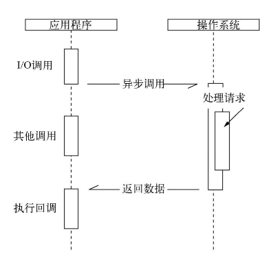
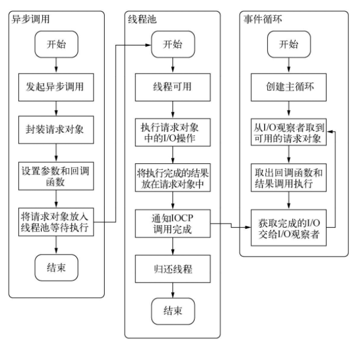

## 第二章-模块机制

### CommonJS 规范

模块的定义

1. 模块引用： `var math = require('math')`
2. 模块定义：即导出模块 exports `exports.add = function(){return xxx}`
3. 模块标识：即传递给 require 的参数，他可以使用相对路径，且末尾省略 js 后缀

<br>

### Node 模块实现

node 中的模块

1. 核心模块：node 源码编译后直接加载进内存，拿来就用，加载最快
2. 文件模块：用户自己编写的模块，需要动态加载

<br>

node 引入模块默认优先选择从缓存加载

<br>

路径分析与文件定位

1. 模块路径：node 会默认递归向上查找 node_modules 目录直到找到，并将此作为模块路径
2. 后缀解析：node 会根据 require 中传入的文件名自动判断后缀，但对于 node\json 文件，我们直接把后缀加上可以加快速度（即避免分析）！
3. index 会被 node 作为默认文件名

<br>

模块编译  
对于 js 文件的编译，是从 fs 模块读取后完成的；  
而 node 文件由于是 cpp 写成，需要更长时间

<br>

require,module,exports 包装  
在 node 编译过程中使用 IIFE 包装整个我们自己编写的库并以以上三个关键词作为形参，故我们可以直接使用而不报错！

<br>

### 核心模块

编译结果：node 会把源文件编译成两种格式文件

1. cpp 文件：存在 node/src
2. js 文件：存在 node/lib

<br>

cpp 编写的模块特性

1. 使用 get_builtin_module()获取这些模块
2. cpp 编写的模块性能由于 js 模块
3. 模块直接加载到内存，调用速度极快

<br>
  
模块封装关系图（封装程度由高到低）  
文件模块->核心模块（js）->内建模块（cpp）

<br>

## 第三章-异步 IO

### 异步特性

node 创新性的使用了：单线程+异步 IO  
以下是异步 IO 调用的示意图



<br>

### 非阻塞 IO

阻塞 IO：浪费 CPU 时间片  
非阻塞 IO：因为业务层不知道状态，导致轮询问题

<br>

非阻塞 IO 查询方案
epoll：目前最佳方案，轮询状态下未检测到 IO 事件后就立刻休眠，直到事件发生后唤醒

<br>

### node 异步 IO

事件循环：进程一启动，node 即创建 while(true)函数，每循环一次间隔称为 tick，在该 tick 中检测是否有事件需要处理

事件循环实际上即为观察者模式，事件会被定向的传递到不同的观察者内进行处理

<br>

完整异步 IO 流程图（文字描述你绝对没法看）  


<br>

### 非 IO 异步 API

该类型的 API 有以下四个：

```js
setTimeout();
setInterval();
setImmediate();
process.nextTick();
```

<br>

settimeout 会创建红黑树，导致循环过程中出现超时误差  
而 process.nexttick()则可以避免创建红黑树！

<br>

不同方法归属的观察者（优先级：idle>io>check）  
process.nexttick() idle 观察者；  
setimmediate() check 观察者；

<br>

## 异步编程

### 函数式编程

偏函数  
如下方代码所示，我们把判断字符串的函数封装了起来；  
请注意，第一次调用 isType 函数传入的参数为最外层的 type 形参，而当我们调用 isString 函数时传入的形参就是下一层的 obj 形参！！！

```js
var toString = Object.prototype.toString;

// 偏函数，即最大程度封装主要功能
var isType = (type) => {
  return function (obj) {
    return toString.call(obj) == "[object " + type + "]";
  };
};

// 编写判断是否为字符串的方法
var isString = isType("String");

// 调用判断方法进行判断
console.log(isString("tomcat"));
```

<br>

### 异步编程解决方案

node 中的异常处理

大多数状况下，我们针对一个方法中的异常都会使用 trycatch 代码块，而 node 为我们提供了另一种方式

任何方法默认的第一个形参存储着返回的错误信息，如果没有错误，该形参的值即为空，我们即可通过该形参来处理错误！

```js
function(err,...arguments){
    //todo
}
```

<br>

一般的，发布订阅者模式都是“一对多”，即一个事件对应多个侦听器；

使用 `EventProxy.all()` 实现多对一（一个侦听器侦听多个事件）  
我们仅需要实例化 EventProxy，并使用 all()方法注册需要侦听的事件名称及对应的回调函数，之后于事件方法内部使用 emit 触发事件即可！

```js
var proxy = new EventProxy();

proxy.all(
  "template",
  "data",
  "resources",
  function (template, data, resources) {
    // TODO
  }
);

fs.readFile(template_path, "utf8", function (err, template) {
  proxy.emit("template", template);
});
db.query(sql, function (err, data) {
  proxy.emit("data", data);
});
l10n.get(function (err, resources) {
  proxy.emit("resources", resources);
});
```

<br>

Promises/A

1. 相比原始 promise，该 API 仅具备 then 方法
2. then 仅接受 function 对象，并且可以返回 function 以实现链式调用
3. 接收完成态、错误态回调

<br>

Promise/Deferred 模式  
将业务中不可变的部分封装在了 Deferred 中，将可变的部分交给了 Promise

<br>

## 第五章-内存控制

### v8 内存限制

Node 中通过 JavaScript 使用内存时只能使用部分内存  
（64 位系统下约为 1.4 GB,32 位系统下约为 0.7GB）

<br>

V8 中，所有的 JavaScript 对象都是通过`堆`来进行分配的，当我们在代码中声明变量并赋值时，所使用对象的内存就分配在堆中

<br>

### v8 垃圾回收

V8 的垃圾回收策略主要基于 `分代式垃圾回收机制`

V8 内存分代

1. 主要将内存分为新生代和老生代两代
2. 整体大小就是新生代所用内存空间加上老生代的内存空间
3. 新生代中的对象主要通过 Scavenge 算法（具体实现采用 Cheney 算法）进行垃圾回收 4.对象晋升的条件主要有两个，一个是对象是否经历过 Scavenge 回收，一个是 To 空间的内存占用比超过限制
4. 老生代中主要采用了 Mark-Sweep 和 Mark-Compact 相结合的方式进行垃圾回收
5. 采用增量标记（incremental marking）避免全停顿
6. 引入了延迟清理（lazy sweeping）

<br>

### 高效利用内存

**解除引用**  
V8 中的全局变量仅会在进程结束时回收，我们可以使用 delete 解除引用（不推荐，可能干扰 V8 优化）；或者赋值 null 的方式来回收

<br>

堆外内存：不是通过 V8 分配的内存  
堆外内存可以突破内存限制的问题

<br>

### 内存泄漏

内存泄漏的几种可能状况

1. 缓存。
2. 队列消费不及时。
3. 作用域未释放。

<br>

避免将内存直接作为缓存！这将导致对老生代的无意义重复扫描

<br>

node 提供了一个自带的模块 stream 来处理大文件！

<br>

## 第六章-Buffer

### 概念

> buffer 默认挂载全局，故无需 require 引入  
> buffer 模块由 `js 核心+cpp内建` 构成

`buffer` 使用 `动态内存管理机制 slab` 来分配内存  
(slab 就是一块申请好的固定大小的内存区域，具有 full,partial,empty 三种状态)

<br>

buffer 并不占用堆内存，而是使用构建于 cpp 层面的内存

一个正确的 buffer 拼接例子：

```js
var chunks = [];
var size = 0;
res.on("data", function (chunk) {
  chunks.push(chunk);
  size += chunk.length;
});
res.on("end", function () {
  var buf = Buffer.concat(chunks, size);
  var str = iconv.decode(buf, "utf8");
  console.log(str);
});
```

<br>

### 性能

网络传输多使用将字符串转换为 buffer 类型进行二进制传输的方式来加快速度！

可以预先将静态资源转换为 buffer 对象来加快传输速度

<br>

## 第七章-网络编程

> END 完结，减少无关废话占用
