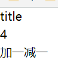

### 简介与安装

中文网（非官网）：https://www.mobxjs.com/

安装：`npm install --save mobx mobx-react-lite`

<br>

### 基本结构

> 还是以一个计数器的案例解释这个容器的基本使用方法与结构

#### 总容器

借助 `Context` 实现全局共享容器

```js
import { createContext, Context, useContext } from "react";
import testStore from "./TestStore";

// 在此处注册我们的子容器
const store = {
	testStore: testStore(),
};

// 创建上下文，封装总容器
export const StoreContext = createContext(store);
export const useStore = () => {
	return useContext(StoreContext);
};

// 别忘了导出
export default store;
```

<br>

#### 子容器

`makeAutoObservable` 类似语法糖，能快速创建一个子容器（注意导包位置为 mobx）

`makeAutoObservable` 存在三个主要结构：

- 第一个参数一定是欲监听的数据，类似于 pinia 的 state
- 可定义多个方法，类似 pinia 的 actions
- 同时可定义 getter

```js
import { makeAutoObservable } from "mobx";

// 下文创建了一个简单的计数器容器
// 1. 监听数据为count，初始值为0
// 2. 定义两个acitons，用于增减count
const testStore = () => {
	return makeAutoObservable({
		count: 0,
		increment() {
			this.count += 1;
		},
		decrement() {
			this.count -= 1;
		},
	});
};

export default testStore;
```

<br>

#### 组件调用

子容器内部的 `state` （也就是数据）是不可以使用 `useState` 或者 `useEffect` 进行动态监听并更新的！！！  
必须要使用 `mobx-react-lite` 提供的 `observer` 方法进行监听

```jsx
// 被observer包裹的所有jsx模板，都处于被监听的状态，只要容器值被改变就会立刻更新
const Title = observer(() => {
	// 和使用大多数容器一样，调用子容器
	const { testStore } = useStore();
	return (
		<>
			<h2>title</h2>
			<div>{testStore.count}</div>
		</>
	);
});
```

<br>

订制主组件

`mobx` 调用 `actions` 的方式也比较特殊，需要借助 action 方法并传入一个箭头函数才可调用对应方法

```jsx
const TestMobx = () => {
	const { testStore } = useStore();
	return (
		<>
			{/*在这里调用我们实验observer监听的子组件*/}
			<Title />
			{/*action调用子容器内的方法，注意方法名后必须要添加小括号！！！*/}
			<button
				onClick={action((e) => {
					testStore.increment();
				})}
			>
				加一
			</button>
			<button
				onClick={action((e) => {
					testStore.decrement();
				})}
			>
				减一
			</button>
		</>
	);
};
```

<br>

> 总代码

```jsx
import React, { useEffect, useState } from "react";
import { useStore } from "../../store/store";
import { action } from "mobx";
import { observer } from "mobx-react-lite";

const TestMobx = () => {
	const { testStore } = useStore();
	return (
		<>
			<Title />
			<button
				onClick={action((e) => {
					testStore.increment();
				})}
			>
				加一
			</button>
			<button
				onClick={action((e) => {
					testStore.decrement();
				})}
			>
				减一
			</button>
		</>
	);
};

const Title = observer(() => {
	const { testStore } = useStore();
	return (
		<>
			<h2>title</h2>
			<div>{testStore.count}</div>
		</>
	);
});

export default TestMobx;
```

<br>

#### 效果图


