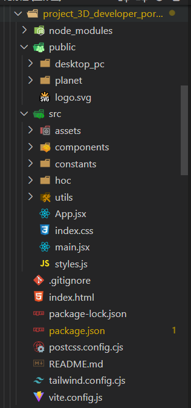

### 简介

本文根据 youtube 教程[点击访问教程地址](https://www.youtube.com/watch?v=0fYi8SGA20k&t=3491s)总结分析而来

主要基于 `react` 框架，使用 `tailwindcss+threejs` 实现快速 CSS 配置与 3D 模型导入

<br>

### 创建工程

> 使用 vite 创建 react 项目，不使用 CRA（create-react-app）

创建工程 `npm create vite@latest`
选择 react，使用 JS

之后按照 vite 的提示进入根目录下安装库：`npm i`

<br>

### 库介绍

`@emailjs/browser` 快速发送邮件

`@react-three/fiber @react-three/drei` react 专属 threejs 支持库

`framer-motion` 动画库

`react-tilt` 结合 threejs 实现 tilt 效果的库

`react-vertical-timeline-component` 快速生成垂直时间轴

`tailwindcss` 实用的 CSS 预处理器

`postcss autoprefixer` 支持 tailwindcss 开发的必备库

<br>

完整 `package.json` 文件：

```json
{
	"name": "3dfolio",
	"private": true,
	"version": "0.0.0",
	"type": "module",
	"scripts": {
		"dev": "vite",
		"build": "vite build",
		"preview": "vite preview"
	},
	"dependencies": {
		"@emailjs/browser": "^3.10.0",
		"@react-three/drei": "^9.56.24",
		"@react-three/fiber": "^8.11.1",
		"framer-motion": "^9.0.7",
		"maath": "^0.5.2",
		"react": "^18.2.0",
		"react-dom": "^18.2.0",
		"react-router-dom": "^6.8.1",
		"react-tilt": "^0.1.4",
		"react-vertical-timeline-component": "^3.6.0",
		"three": "^0.149.0"
	},
	"devDependencies": {
		"@types/react": "^18.0.27",
		"@types/react-dom": "^18.0.10",
		"@vitejs/plugin-react": "^3.1.0",
		"autoprefixer": "^10.4.13",
		"postcss": "^8.4.21",
		"tailwindcss": "^3.2.6",
		"vite": "^4.1.0"
	}
}
```

> 建议直接赋值 `package.json` 文件到项目根目录下后直接 `npm i` 即可

<br>

### 项目结构介绍



`public` 公共文件夹，包括贴图以及首页对应的模型

`components` 所有组件

`constants` 存储静态页面中的所有数据

`hoc` 高阶组件，用来在渲染组件时调用 frame-motion 执行动画

`utils` 工具类，设置 motion 动画参数

`styles.js` 总样式文件，据 tailwindcss 风格编写

`postcss.config.cjs` CSS 预处理器设置

`tailwind.config.cjs tailwind` 设置

<br>

### 后记

该文章仅就完整项目代码进行分析
