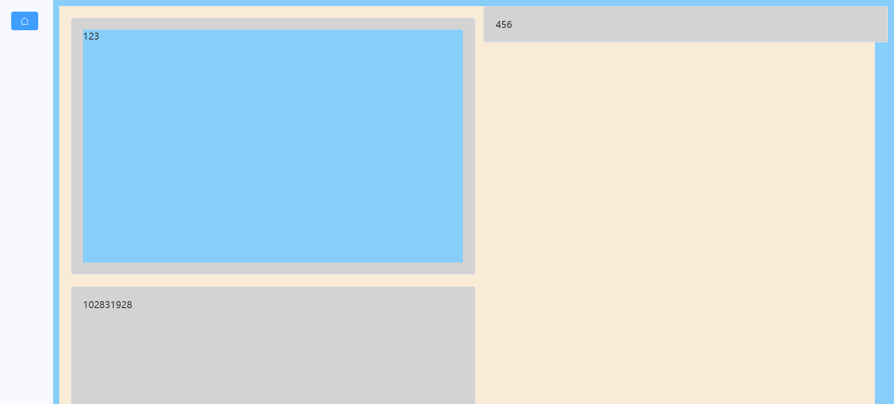

### 案例结果

#### 大图演示

实现在指定区域内渲染所有我们需要的全部组件，并且组件会自动撑开卡片的空间，会自动换行布局

这是运行结果（其中的样式表这里不会介绍，因为不属于本文范畴）



<br>

#### 文件结构

删去了 `router、store、assets` 等和当前案例无关紧要的文件夹

```│ App.vue
│  main.js
│  style.css
│
├─components
│  └─demo
│          file-upload.vue
│          multi-pages.vue
│          pic-selector.vue
├─utils
│      demoImportsDefine.js
│
└─view
        demo.vue
```

<br>

### 实现步骤

#### 了解 component 标签

> 参考官方文档：https://cn.vuejs.org/api/built-in-special-elements.html#component

简言之，`component` 标签即 vue3 提供的，根据组件 id 快速渲染对应组件的一个标签；

我们可以直接在单个 vue 文件内，先导入我们需要使用的组件，再直接根据导入名引入到 component 标签内使用即可；  
`is属性` 填写我们需要渲染的组件别名，这里使用动态绑定！

```html
<template>
  <div>
    <component :is="demo">
  </div>
</template>

<script>
import demo from './view/demo.vue'
</script>
```

<br>

#### 抽离组件

很明显，如果我们直接按照上文在单文件内导入组件并使用，在当组件数量过于庞大时，极易造成整体代码的臃肿；  
所以将其抽离为单文件并直接引用是比较好的解决办法

新建工具模块： `utils/demoImportsDefine.js`

```js
import picselector from "../components/demo/pic-selector.vue";
import fileupload from "../components/demo/file-upload.vue";
import multipages from "../components/demo/multi-pages.vue";

export const components = {
  picselector,
  fileupload,
  multipages,
};
```

<br>

可见，我们在该文件内导入所有我们准备好的组件，将常量 components 直接导出；

接下来进行 vfor 列表渲染时就可以直接使用常量 components 而无需重复指定！

<br>

#### 列表渲染组件

> 对于列表渲染 vfor 还不是很熟悉的，请参考官方文档：https://cn.vuejs.org/api/built-in-directives.html#v-for

我们把 component 标签嵌套在卡片组件内部，这样就能使组件直接撑开卡片而无需指定卡片大小；

导入 demoImportsDefine.js ，将其使用 ref 变成响应式的；  
之后直接在 vfor 中调用它就可以了；

```html
<template>
  ...
  <el-card shadow="hover" v-for="(item,index) in compNames" :key="index">
    <component :is="item" />
  </el-card>
</template>

<script setup>
  import { components } from "../utils/demoImportsDefine.js";
  import { ref } from "vue";

  const compNames = ref(components);
</script>
```

<br>
