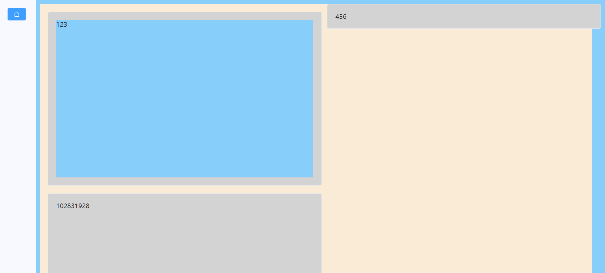

### 前言

> 提示：建议先看同系列上一篇文章《Prj2-动态渲染组件》，此次案例即依照上一章所述继续铺开

需求：实现双列布局，并且不能留有多余的空隙，使用 column 来实现

实现结果



<br>

### 实现步骤

#### html 代码

根据上一篇文章我们所得结果，使用 vfor 直接渲染组件，每一个自定义组件都放在了卡片组件里面；卡片会随着组件的高度而自动扩展！

这一块比较难表达（作者水平欠佳），请直接看代码会更清晰一些

```html
<!-- 最外层作为整体套住所有卡片 -->
<div class="d-right">
  <!-- 滚动条组件，实现无线滚动 -->
  <el-scrollbar height="100vh">
    <!-- 里面再套一个盒子，用来使用column进行双列布局 -->
    <div class="dr-scroll">
      <!-- 卡片，每个卡片里面渲染一个自定义组件 -->
      <el-card
        class="dr-card"
        shadow="hover"
        v-for="(item,index) in compNames"
        :key="index"
      >
        <!-- 组件渲染 -->
        <component :is="item" class="dr-comp" />
      </el-card>
    </div>
  </el-scrollbar>
</div>
```

<br>

#### 样式表

> 重中之重！！！细看

默认使用 less 编写样式表

首先是最外层的样式：`.d-right`  
高度充满整个浏览器高度，背景色设置是为了增强区分度

之后是 `.dr-scroll`

1. `column-count: 2` 表示将子元素分成两列
2. `display: inline-block` 必填，是为了避免子元素被截断
3. `width: 97%` 这里的宽度绝对不可以填满，不然子元素会超出视野

<br>

最关键的 `.dr-card`

1. break-inside: avoid; 这也是避免子元素被截断的关键步骤
2. width: 100%; 必须填满，否则显示错误

```less
.d-right {
  width: 94%;
  height: 100vh;
  background-color: lightskyblue;

  .dr-scroll {
    margin: 10px;
    width: 97%;
    background-color: antiquewhite;
    display: inline-block;
    column-count: 2;
    .dr-card {
      break-inside: avoid;
      width: 100%;
      background-color: lightgray;
      margin: 20px;
    }
  }
}
```

### 进阶解释

> 关于其他瀑布流的实现方法目前还未发现更好的处理方式，请等等后续的文章更新或者看看大佬们写的优质文献

END

<br>
