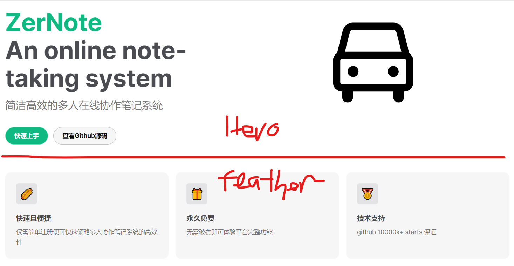
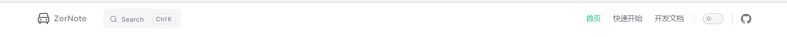
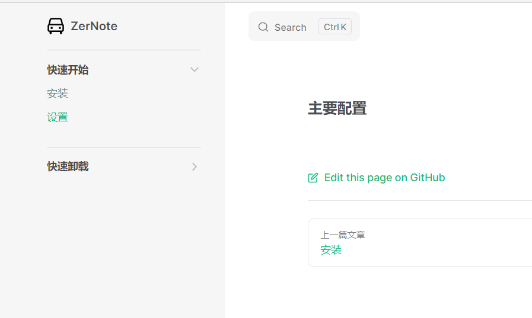

### 简介

> 官网介绍：Vitepress 是一款简单高校的 SSG+SPA 框架

简单的来讲，我们将会利用 vitepress 框架来快速搭建我们的项目文档（或者做个人博客使用）

<br>

### 安装

首先新建一个文件夹作为项目的根目录，称为 vitepress-starter

进入该目录，使用 npm 初始化 package.json  
`npm init -y`

安装 vue 以及 vitepress 依赖  
`npm install -D vitepress vue`

然后打开 package.json 修改启动参数

```json
"scripts": {
    "docs:dev": "vitepress dev docs",
    "docs:build": "vitepress build docs",
    "docs:preview": "vitepress preview docs"
  },
```

最后最后，在 `vitepress-starter` 文件夹下新建一个 docs 文件夹，作为所有主体文件的存放处

<br>

**额外依赖**

额外依赖即该项目中可有可无的依赖

`Algolia DocSearch` 搜索支持：安装该依赖后，将可以在文档中启用搜索功能  
`npm install @docsearch/js@3`

carbonads 广告支持：通过该依赖将可以直接在项目文档内部插入广告

<br>

### 项目结构与路径分析

基础指南搭建完成后的项目结构（这里是 `docs` 文件夹下的内容）

```
│  index.md
│
├─.vitepress
│  │  config.js
│  │
│  ├─cache
│  │  └─deps
│  │          package.json
│  │          vue.js
│  │          vue.js.map
│  │          _metadata.json
│  │
│  └─theme
│          index.js
│
├─document
│      index.md
│
├─public
│  └─icons
│          car.svg
│
└─starter
        starter-configuration.md
        starter-install.md
        starter-uninstall.md
```

这是主要文件夹的功能分析：

1. `.vitepress` 主要处理全局配置以及自定义主题
2. `document&starter` 我们自定义的两个文章主题，在里面写入 markdown 文件
3. `public` 静态资源存放

<br>

**几个注意事项**

根目录下必须定义一个 index.md 作为起始页  
其余子目录（如 document）就不需要定义 index.md 了

如果一个目录下定义了 index.md，则对应 URL 无需精确到文件名即可自动转到  
譬如 starter 文件夹下定义了 index.md，则对应的 URL 为：`/starter/`或者`/starter/index`

一般的，建议所有需要填写路径的地方，开头最好都有一个 `/` 符号

再不做任何配置的情况下，默认就是以 docs 作为整个项目路径索引的根目录  
比如 public 文件夹就可以表示为 `/public`

<br>

### frontmatter

> 所谓 frontmatter 即在 markdown 文件头部添加的一个 yaml 字段，他一般可用于配置 markdown 文件

vitepress 支持三种格式的布局，不同布局对应不同特性

1. doc 布局：基础文档布局，一般的 markdown 文件都使用该头部字段
2. page 布局：自定义页面用的
3. home 布局：起始页布局，一般特定用在根目录下的 index.md，将其作为起始页使用

譬如下方，我们就为当前的 markdown 文件指定了布局类型 doc

```markdown
---
layout:doc
---

### helloworld

helloworld
```

<br>

#### home 布局

被定义为 home 布局的文件最好不要再额外多写内容了，所有的内容都写在 yaml 头里面！  
所以可见下方 `index.md` 代码仅包含了一个 `frontmatter`

将根目录下的 `index.md` 文件全部内容删除并替换为以下内容

```yaml
---
# 定义布局为home
layout: home

#
hero:
  name: ZerNote
  text: An online note-taking system
  tagline: 简洁高效的多人在线协作笔记系统
  image:
    src: /public/icons/car.svg
    alt: VitePress
  actions:
    - theme: brand
      text: 快速上手
      link: /guide/what-is-vitepress
    - theme: alt
      text: 查看Github源码
      link: https://github.com/vuejs/vitepress

features:
  - icon: 🌭
    title: 快速且便捷
    details: 仅需简单注册便可快速领略多人协作笔记系统的高效性
  - icon: 🎁
    title: 永久免费
    details: 无需破费即可体验平台完整功能
  - icon: 🥇
    title: 技术支持
    details: github 10000k+ starts 保证
---
```

<br>

frontmatter 中的 hero 以及 features 对应的展示模块在下图给出



<br>

#### doc 布局

doc 布局较 home 少了很多，主要作用还是为了做小细节优化

```yaml
---
# 这一段可以省略，因为默认布局就是doc
layout: doc

# title定义浏览器标签页上显示的标题
title: 快速上手
# editLink没啥用
editLink: true
---
```

<br>

#### page 布局

page 布局可视为空白布局，他会对 markdown 进行渲染，但是不会应用 vitepress theme（即默认主题），而是允许开发者任意定义主题的权限

<br>

### config.js

> 此为全局配置文件，存放于 docs/.vitepress/config.js

下面将介绍所有主要的配置项，一般项目文档直接套用这些配置项就差不多了

这是 config.js 默认初始代码，建议直接复制

```js
export default {
	// 定义在浏览器标签上显示的标题
	title: "ZerNote",
	// 大部分主要的主题配置都在里面了
	themeConfig: {},
	// 简洁化URL，即我们访问文件时不需要加后缀了，直接 /xxx/xxx即可，不要/xxx/xxx.md
	cleanUrls: true,
};
```

<br>

#### 顶部导航栏



```js
themeConfig: {
    // 语言
    lang: "zh-CN",

    // 导航栏最左侧的LOGO
    logo: "/icons/car.svg",
    // 导航栏最左侧的大标题
    siteTitle: "ZerNote",
    // 是否在文章内显示最新更新指示（没什么用，可以删去这一行）
    lastUpdated: true,

    // 定义右侧菜单导航
    // 这里根据图中所示定义了三个菜单，分别是：首页、快速开始以及开发文档
    // 菜单可以使用嵌套语法定义多个，但这里没必要就不演示了
    nav: [
      {
        text: "首页",
        link: "/",
      },

      // text表示显示的标题
      // link表示链接到的文章地址
      // activeMatch表示当URL中存在那些内容时，点亮该菜单按钮
      {
        text: "快速开始",
        link: "/starter/starter-install",
        activeMatch: "/starter/",
      },
      { text: "开发文档", link: "/document/index", activeMatch: "/document/" },
    ],

    // 最右侧的友情链接小图标
    // 监狱大多数人不会在这个时候挂梯子，所以vitepress自带的twitter和youtube啥的就没必要加进去了
    socialLinks: [
      { icon: "github", link: "https://github.com/vuejs/vitepress" },
    ],
}
```

<br>

#### 搜索框以及底部栏

搜索框可见上一节顶部导航栏的图片，靠左侧就有一个搜索框

必须要添加 `algolia docsearch` 依赖才可以添加搜索框！

footer 定义的底部栏必须是没有 sidebar 的情况下才会显示（譬如起始页）  
所以一般的文档内是无法显示底部栏的

```js
themeConfig: {
    // 底部栏定义的内容
    footer: {
      message: "Released under the MIT License.",
      copyright: "Copyright © 2019-present Evan You",
    },

    // 编辑链接，具体显示情况见下图
    editLink: {
      pattern: "https://github.com/vuejs/vitepress/edit/main/docs/:path",
      text: "于GitHub中编辑这一段内容",
    },

    // 添加搜索框
    // 下面的三个参数直接赋值即可，都是官方基于的固定值
    algolia: {
      appId: "R2IYF7ETH7",
      apiKey: "599cec31baffa4868cae4e79f180729b",
      indexName: "index",
    },

    // 定义文章底部按钮对应的文本标题
    docFooter: {
      prev: "上一篇文章",
      next: "下一篇文章",
    },
}
```

docFooter 定义的是每一篇文章底部的“上一页”和“下一页”按钮的文本


<br>

#### sidebar



定义侧边栏有两种方式，但是建议直接安装下方代码的方式！

因为我们单独创建了 starter 文件夹用来存储该主题对应的 markdown 文章，所以我们想要做的就是当用户点击进入 starter 专题下，才会显示侧边栏，而处于首页状态下就只需显示起始页（没有侧边栏）即可

故 `"/starter/"` 的作用是，当且仅当用户的 URL 存在这一字段时才自动显示侧边栏  
此时即进入了 starter 专题

```js
themeConfig: {
    sidebar: {

      // 定义仅在进入了starter专题后才显示侧边栏
      "/starter/": [
        {
          text: "快速开始",
          collapsed: false,  // collapsed设置默认是否收缩，true为默认收缩
          items: [
            { text: "安装", link: "/starter/starter-install" },
            { text: "设置", link: "/starter/starter-configuration" },
          ],
        },
        {
          text: "快速卸载",
          collapsed: true,
          items: [{ text: "卸载指南", link: "/starter/starter-uninstall" }],
        },
      ],
    },
  },
```

<br>

#### aside 右侧栏


同时设定：`aside:true`以及`outline:'deep'`，即可为每一篇文章自动于按照标题等级划分索引，并在右侧悬浮显示对应链接（如上图右侧）

`outlineTitle` 可以自定义右侧 aside 的标题，一旦设定则全部文章都会显示该标题，而不是显示文章原始标题

```js
themeConfig: {
  // aside，设定为false将关闭右侧栏，文档内容会填充剩余空白部分
  aside: true,
  // outline设置为deep可以解析2-6层深度的标题嵌套
  outline: "deep",
  // 暂时没发现这个属性有啥用
  outlineBadges: true,
  // 设置所有aside的标题
  outlineTitle: "just an demo",
}
```

<br>

#### 完整代码

```js
export default {
	title: "ZerNote",
	themeConfig: {
		lang: "zh-CN",
		logo: "/icons/car.svg",
		siteTitle: "ZerNote",
		lastUpdated: true,
		nav: [
			{
				text: "首页",
				link: "/",
			},
			{
				text: "快速开始",
				link: "/starter/starter-install",
				activeMatch: "/starter/",
			},
			{ text: "开发文档", link: "/document/index", activeMatch: "/document/" },
		],
		socialLinks: [
			{ icon: "github", link: "https://github.com/vuejs/vitepress" },
		],
		footer: {
			message: "Released under the MIT License.",
			copyright: "Copyright © 2019-present Evan You",
		},
		editLink: {
			pattern: "https://github.com/vuejs/vitepress/edit/main/docs/:path",
			text: "Edit this page on GitHub",
		},
		lastUpdatedText: "Updated Date",
		algolia: {
			appId: "R2IYF7ETH7",
			apiKey: "599cec31baffa4868cae4e79f180729b",
			indexName: "index",
		},
		docFooter: {
			prev: "Pagina prior",
			next: "Proxima pagina",
		},
		sidebar: {
			"/starter/": [
				{
					text: "快速开始",
					collapsed: false,
					items: [
						{ text: "安装", link: "/starter/starter-install" },
						{ text: "设置", link: "/starter/starter-configuration" },
					],
				},
				{
					text: "快速卸载",
					collapsed: true,
					items: [{ text: "卸载指南", link: "/starter/starter-uninstall" }],
				},
			],
		},
	},
	cleanUrls: true,
	aside: true,
	outline: "deep",
	outlineBadges: true,
	outlineTitle: "just an demo",
};
```

<br>

### 文档添加

大家可以直接按照开头给出的文件结构图所示，添加 document 以及 starter 文件夹下对应的所有 markdown 文件，内容可以随便定义，没有具体要求，只要是符合 markdown 格式即可

全部文件插入完毕，来到根目录执行以下代码即可看到我们的项目搭设成功啦！

`npm run docs:dev`

<br>
