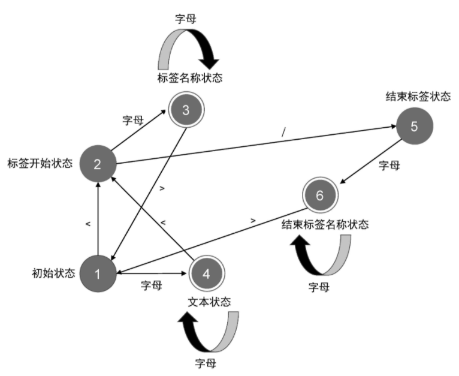
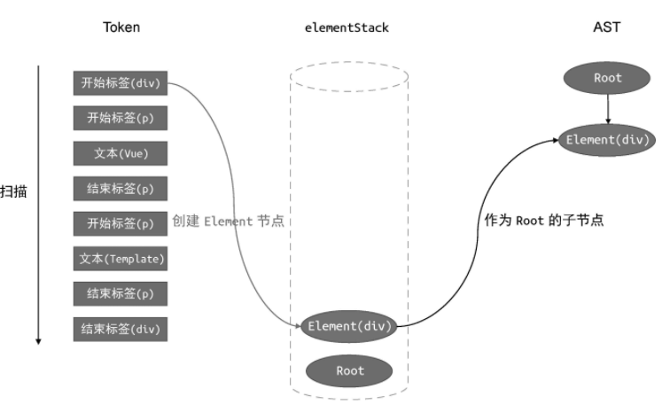

### 一、框架设计概览

#### 权衡的艺术

Vue.js 的内部实现一定是`命令式`的，而暴露给用户的却更加`声明式`
声明式代码的性能不优于命令式代码的性能，因为声明式需要最终需要转换成命令式，整个步骤的时间总和大于单次使用命令式

框架设计者要做的就是：在保持可维护性的同时让性能损失最小化

声明式代码的更新性能消耗 = 找出差异的性能消耗 + 直接修改的性能消耗

<br>

**在创建新页面时**
虚拟 DOM 运作方式： 先创建 JS 对象，后遍历虚拟 DOM 树并创建真实 DOM
纯 JS 运作方式： 创建新的 DOM 后依次拼接
若创建新页面，俩方式性能差异不大；
**在更新指定 DOM 时**
虚拟 DOM 运作方式：重构虚拟 DOM 树，比较存在差异的 DOM 并修改它
纯 JS 运作方式：销毁所有旧的 DOM 元素，再全量创建新的 DOM 元素
显然，此情况下虚拟 DOM 更占优

> 总结：原生 DOM 操作，性能最优，最难维护；虚拟 DOM，声明式且可维护性强

<br>

**三种框架应用手段**
纯运行时：用户手写树形结构数据后渲染；
运行时+编译时：用户手写 HTML 标签结构后渲染；
编译时：用户手写 HTML 标签后编译为命令式代码，中途无需渲染

> svelte 使用纯编译时，而 vuejs 使用运行时+编译时

<br>

#### 框架设计的核心要素

vue3 源码中的 `initCustomFormatter` 方法可以协助解析 `ref` 并以 `formatter` 的形式输出到 console

以下是 vue3 源码中警告输出方法，if 中变量*DEV*表示目前是否为开发环境，如果是的话此值为 true，即输出警告信息；若为生产环境则不会输出

```js
if (_DEV_ && !res) {
  warn(`xxxxxxx`);
}
```

<br>

**Tree-Shaking**

1. 本术语解释：消除那些永远不被执行的代码；
2. `rollup.js` 以及 `webpack` 都支持 tree-shaking
3. 实现条件：模块必须为 ES Module 类型，因为它依赖 ESM 的静态结构
4. 若代码存在副作用（即代码可能修改全局变量等），那么 tree-shaking 就无法将其消除

<br>

**框架输出构建产物**
由于 vue.global.js 本就是一个自执行函数 IIFE，故于 script 中调用就会立即执行

如果 package.json 中存在 module 字段，那么会优先使用 module 字段指向的资源来代替 main 字段指向的资源
若你使用 webpack 构建工程，那么使用的 vuejs 资源就是后者

```json
// vuejs源码中的package.json
{
  "main": "index.js",
  "module": "dist/vue.runtime.esm-bundler.js"
}
```

通过修改 rollup.config.js 配置为 `format:'cjs'`，即可使用 required （NodeJS 中的导包方法）来导入 vuejs

> cjs 表示 CommonJS

<br>

**特性管理机制**
用户可以自定义开启或者关闭某些特性，关闭的特性将会被 tree-shaking 清除；
一般使用 `webpack.DefinePlugin` 插件加上 `__VUE_OPTIONS_API__` 属性实现特性开闭

```js
new webpack.DefinePlugin({
  __VUE_OPTIONS_API__: JSON.stringify(true), // 开启特性
});
```

<br>

**错误处理**
为了避免用户使用工具类时仍然需要 try...catch 处理异常，我们可以在工具类中设置一个注册错误句柄，用户可以调用高句柄统一处理可能返回异常的函数！

```js
let handlerError = null;
export default {
  foo(fn) {
    callErrorHandling(fn);
  },
  registerErrorHandler(fn) {
    handlerError = fn;
  },
};
function callErrorHandling(fn) {
  try {
    fn;
  } catch (e) {
    handlerError(e);
  }
}
```

<br>

#### Vue3 设计思路

**所谓声明式 UI**
vuejs 中的渲染函数 render 借助 h 函数以虚拟 DOM 的形式描述 UI
h 函数的存在就是方便我们使用虚拟 DOM

```js
import { h } from "vue";
export default {
  render() {
    return h(`xxx`);
  },
};
```

<br>

**渲染器**
渲染器的作用就是把虚拟 DOM 渲染成真实 DOM
以下是渲染器方法的介绍：
参数一为 `vnode`，即虚拟 DOM；参数二为欲挂载虚拟 DOM 的真实 DOM
`renderer(vnode, document.body)`

渲染器运行的整个步骤：通过 vnode 为标签创建 DOM，为虚拟 DOM 添加各种属性后挂载到真实 DOM 上面

<br>

**组建本质**
组件就是一组 DOM 元素的封装
组件依然需要使用 renderer 方法挂载到真实 DOM 上，只不过 vnode 表示的是一个函数（该函数包含构成组建的许多虚拟 DOM）而非字符串

组件使用 `mountComponent` 进行渲染

<br>

**模板原理**
一个 vue 文件就是一个组件， `编译器` 会把 template 标签内容编译后加入到 script 里面去

vuejs 渲染的总流程就是：模板编译成渲染函数，渲染函数返回的虚拟 DOM 被渲染器接收后渲染为真实 DOM

组件的实现依赖于 `渲染器` ，模板的编译依赖于 `编译器`

<br>

### 二、响应系统

#### 响应系统作用域实现

响应式数据在 vue3 中使用 proxy 代理实现，基本原理：
当读取操作发生时，将副作用函数收集到“桶”中，
当设置操作发生时，从“桶”中取出副作用函数并执行
使用 `proxy` 拦截欲改变的数据 data，分别对 get 和 set 方法进行处理

> 这是比较简单的处理方法，因为我们调用 effect 副作用函数的方法是硬编码的形式，这极其不方便

```js
// 存储副作用函数的桶
const bucket = new Set();

// 原始数据
const data = { text: "helloworld" };

// 对原始数据进行代理操作
const obj = new Proxy(data, {
  // 读取拦截
  get(target, key) {
    bucket.add(effect);
    return target[key];
  },
  // 设置拦截
  set(target, key, newVal) {
    target[key] = newVal;
    bucket.forEach((fn) => fn());
    return true;
  },
});

// 副作用函数
function effect() {
  document.body.innerHTML = data.text;
}
```

<br>

**完整响应式结构剖析**
这里省略了极为冗长且条理清晰内容详实但仍然看不懂的响应式处理源码

为避免 effect 副作用函数的无线嵌套，vuejs 引入副作用函数栈 effectStack，即当副作用函数执行时压入栈中，待执行完毕后弹出

为避免副作用函数同时执行，设置一个 trigger 触发器，当 trigger 执行指定副作用函数时发现其与目前正在执行的副作用函数相同，则停止触发运行

<br>

**调度执行**
为了保证在 vuejs 内连续调用多次响应式数据但仅触发一次更新，vuejs 内部实现了一个完善的调度器

<br>

#### 非原始值的响应式方案

**代理 proxy**

代理仅能拦截对对象的基本操作（getter、setter）  
但是 obj.fn()属于复合操作，因为它 get 了两次

下方使用 proxy+apply 拦截，最终输出结果为 `let me think`

```js
const fn = (name) => {
  console.log("let me " + name);
};

const pp = new Proxy(fn, {
  apply(target, thisArg, arg) {
    target.call(thisArg, ...arg);
  },
});

pp("think");
```

<br>

**反射 reflect**

反射还可接收第三个参数，来表示 this，用来指示当前对象

```js
const obj = { foo: 1 };
// 直接读取
console.log(obj.foo); // 1
// 使用 Reflect.get 读取
console.log(Reflect.get(obj, "foo")); // 1
```

<br>

#### 合理的响应触发

一个简单的响应式 proxy 编写如下：

```js
const obj = { foo: 1 };

const p = new Proxy(obj, {
  // target对象
  // key欲修改的键
  // newval修改后的对应值
  // receiver
  set(target, key, newval, receiver) {
    // 获取旧值
    const oldval = target[key];
    // 判断当前类型
    const type = Object.prototype.hasOwnProperty.call(target, key)
      ? "SET"
      : "ADD";
    const res = Reflect.set(target, key, newval, receiver);
    // 当新旧值不全等且二者均不为NaN时，触发响应！
    if (oldval !== newval && (oldval === oldval || newval === newval)) {
      trigger(target, key, type);
    }
    return res;
  },
});
```

<br>

**深浅响应**

浅响应只会对首层的对象做响应式处理，而当我们改变深层属性时，并不会触发副作用产生函数更新！  
深响应即每次属性更改都将结果包装成响应式进行返回

shallowreactive 浅响应代码：

```js
function shallowReactive(obj) {
  return new Proxy(obj, {
    get(target, key, receiver) {
      if (key === "raw") return target;
      const res = Reflect.get(target, key, receiver);
      track(target, key);

      // 因为是浅响应，直接返回原值即可！
      return res;
    },
  });
}
```

<br>

可以添加一个“只读”readonly 判断，当视图修改一只读属性时，报错！

```js
if (isReadonly) {
  console.warn("该属性只读！");
  return true;
}
```

<br>

#### 代理数组

reactive 代理数组时主要有以下两个场景：

1. 判断索引值小于数组长度，表示不新增数据，则设置类型为 SET
2. 判断索引值大于数组长度，则新增数据，设置类型为 ADD

<br>

JS 迭代协议：即一个对象能否迭代，取决于该对象或者该对象的原型是否实现了 `@@iterator` 方法  
如果一个对象实现了 `Symbol.iterator` 方法，那么这个对象就是可以迭代的

数组内建了 `Symbol.iterator` 方法

> 一旦对象可迭代，就可使用 for...of...，而 for...in...无论迭代与否均可使用

```js
// 将一个对象变成可迭代的
const obj = {
  val: 0,
  // 设置标识，使其可迭代！
  [Symbol.iterator]() {
    return {
      next() {
        return {
          value: obj.val++,
          done: obj.val > 10 ? true : false,
        };
      },
    };
  },
};

// 调用可迭代对象
for (const values of obj) {
  console.log(values); // 0 1 2 3 4 5 6 7 8 9
}
```

<br>

#### 代理 set 与 map

**size 属性**

集合的 size 属性是一个访问器属性，故不能从代理对象中获取，只能从原始对象中取出！

以下表示当判断入参为 size 时，reflect 闭包作用域选择原始 set 对象，防止报错

```js
const s = new Set([1, 2, 3]);
const p = new Proxy(s, {
  get(target, key, receiver) {
    // 当入参为size时，指定反射第三个参数为原始set对象
    if (key === "size") {
      return Reflect.get(target, key, target);
    }
    // 非size参数就不多管了
    return Reflect.get(target, key, receiver);
  },
});

console.log(s.size); // 3
```

<br>

**delete 删除操作**

delete 是一个方法，他需要被绑定在原始对象而非代理对象上才可发挥作用！

使用 bind，改变作用域到原始对象上

```js
const s = new Set([1, 2, 3]);
const p = new Proxy(s, {
  get(target, key, receiver) {
    // 当入参为size时，指定反射第三个参数为原始set对象
    if (key === "size") {
      return Reflect.get(target, key, target);
    }

    // 绑定原始数据对象
    return target[key].bind(target);
  },
});
```

<br>

**foreach 难题**

如果 foreach 回调函数中的 value 形参不是一个响应式对象，那么将无法建立响应联系；

在 foreach 前对 value 进行检测，如果非响应式，则将其包装为响应式并返回使用

```js
forEach(callback) {
  const wrap = (val) => (typeof val === "object" ? reactive(val) : val);
  ...
},
```

<br>

**两大响应式操作**

get 读取数据时：使用 track 函数追踪依赖关系建立响应联系；  
set 设置数据时：使用 trigger 函数触发响应；

> 数据污染：把响应式数据设置到原始数据上的行为

<br>

**迭代器协议与可迭代协议**

可迭代协议指的是一个对象实现了 Symbol.iterator 方法  
迭代器协议指的是一个对象实现了 next 方法

一个对象可同时实现二者：

```js
const obj = {
  // 迭代器协议
  next() {},
  // 可迭代协议
  [Symbol.iterator]() {
    return this;
  },
};
```

<br>

#### 第二章快速总结

vuejs3 的响应式数据是基于 proxy 实现的

访问器属性 this 指向问题可以使用 reflect 进行重定向

合理触发 ITERATE_KEY 相关联的副作用函数重新执行

数组是一个异质对象（异质对象相对的概念是常规对象）

在代理对象中查找不到元素时，再去原始对象里面找

修改数组长度的原型方法需要使用标记变量 shouldTrack 来代表是否允许进行追踪，以免多个副作用函数相互调用导致栈溢出

集合以及映射的 size 属性是一个访问器属性！

注意数据污染问题

可迭代协议以及迭代器协议区分

<br>

### 三、原始值响应式

> 所谓原始值即针对六大基本类型的值的响应式

<br>

#### ref

由于 proxy 无法阻止原始值的修改，故此方法在这里不管用

我们可以创建一个包裹对象把原始值包起来；  
然后在使用 reactive 将该包裹对象变成响应式的即可

> \_\_v_isRef 属性是用来判断是否为 ref 包裹对象的判据

```js
function ref(val) {
  // 包裹对象
  const wrapper = {
    value: val,
  };
  // 是否为ref的判据
  Object.defineProperty(wrapper, "__v_isRef", {
    value: true,
  });
  // 返回响应式数据
  return reactive(wrapper);
}
```

<br>

#### 响应丢失

响应丢失问题：使用 reactive 创建响应式对象后，使用多参的形式 return，则实际上返回的是普通对象而非响应式对象！

```js
export default {
  setup() {
    const obj = reactive({ a: 1, b: 2 });
    return {
      ...obj,
    };
  },
};
```

<br>

**响应关系建立**

obj 为原响应对象

newobj 内拥有与 obj 同名的所有属性值，且均一一编写访问器属性 value  
value 执行后返回原响应对象中的值

这样一来，修改 obj 属性后，便会自动触发副作用函数执行！

```js
const obj = reactive({ a: 1, b: 2 });

const newobj = {
  a: {
    get value() {
      return obj.a;
    },
  },
  b: {
    get value() {
      return obj.b;
    },
  },
};

console.log(newobj.a.value);
```

<br>

**toRef 函数的实现**

使用包裹 wrapper，内部加上 getter、setter 方法实现响应式

```js
function toRef(obj, key) {
  const wrapper = {
    get value() {
      return obj[key];
    },
    set value(val) {
      obj[key] = val;
    },
  };

  Object.defineProperty(wrapper, "__v_isRef", {
    value: true,
  });

  return wrapper;
}
```

<br>

#### 自动脱 ref

使用 proxy 代理

判断如果存在属性 `__v_isRef` ，表示其为 ref，则返回该 ref 的值；  
如果只是普通对象，那原样返回即可

```js
function proxyRefs(target) {
  return new Proxy(target, {
    get(target, key, receiver) {
      const value = Reflect.get(target, key, receiver);
      return value.__v_isRef ? value.value : value;
    },
  });
}
```

> reactive 就是一个自动脱 ref 的例子，使用他的时候无需额外调用 value 即可获取值

<br>

### 四、渲染器设计

#### 渲染器+响应系统

**最简渲染函数**

使用以下函数渲染静态字符串或者动态拼接内容

```js
// 渲染函数
function renderer(domString, container) {
  container.innerHTML = domString;
}

// 渲染dom
renderer("<p>123</p>", document.getElementById("main"));
```

<br>

**vuereactivity**

`@vue/reactivity` 包包含了副作用函数 effect 以及响应式 ref

<br>

#### 渲染器基本原理

渲染器 renderer，渲染 render

虚拟节点（vnode） === 虚拟 DOM（vdom）

渲染器把虚拟 DOM 节点渲染为真实 DOM 节点的过程叫作挂载（mount）

第一次渲染称为挂载  
后续渲染称为打补丁（patch），也即更新 dom

<br>

#### DIY 渲染器

**createRenderer 函数**

这是一个构建渲染器的函数，特别留意其中的打补丁 patch 函数的编写！

patch 的三个参数分别指：旧 vnode，新 vnode，挂载位置

```js
function createRenderer() {
  // dom更新函数
  function patch(n1, n2, container) {}

  // 渲染函数
  function render(vnode, container) {
    // 如果虚拟DOM存在，则执行更新程序
    // 如果不存在，就挂载它
    if (vnode) {
      patch(container._vnode, vnode, container);
    } else {
      if (container._vnode) {
        container.innerHTML = "";
      }
    }
    container._vnode = vnode;
  }
}
```

<br>

**构建一个 vnode 然后渲染它**

```js
const vnode = {
  type: "h1",
  children: "helloworld",
};

const renderer = createRenderer();
renderer.render(vnode, document.querySelector("#main"));
```

<br>

**兼容所有浏览器渲染需求**

可以将配置项交予渲染者进行定义，而不写死，这样就可以适配多浏览器了！

首先在渲染器函数内定义三大配置项：

```js
function createRenderer() {

  // 定义三大配置项
  const { createElement, insert, setElementText } = options;

  function mountElement(){...}
}
```

<br>

定义 `mountElement`

```js
// 挂载元素函数
function mountElement(vnode, container) {
  // 判断元素类型
  const ele = createElement(vnode.type);
  // 如果类型为string，那么设置文本
  if (typeof vnode.children === "string") {
    setElementText(ele, vnode.children);
  }
  // 将新元素插入到指定挂载点
  insert(ele, container);
}
```

<br>

### 五、挂载与更新

#### 挂载子元素

DOM Properties != HTML Attributes  
但是二者往往（并非所有！）一一对应，如 `id="123"` 对应 `el.id`

把 HTML Attributes 与 DOM Properties 具有相同名称（即 id）的属性看作直接映射

核心理念：

1. HTML Attributes 的作用是设置与之对应的 DOM Properties 的初始值
2. 一个 HTML Attribute 可以对应多个 DOM Properties
3. 浏览器有矫正作用，即把不正确的属性值调整为默认值

<br>

#### 元素属性

对于布尔类型，空字符串相当于 false  
针对属性 disable，我们希望不传入任何参数（即空字符串）时，隐藏元素

这个时候就要加一个判断，当属性为布尔类型且值为空字符串时，手动设置为 true，而不是让浏览器矫正为 false！！！

<br>

#### class 处理

请看下方一段 DOM 以及其对应的 vnode

```js
// 渲染结果
<p class="pig cat"></p>;

// vnode
const vnode = {
  type: "p",
  props: {
    class: "pig cat",
  },
};
```

<br>

**设置 class 速度优劣**

目前有三种设置 class 的方式，其中速度最快的是使用 el.className

1. setAttribute
2. el.className
3. el.classList

<br>

#### 卸载

若要结束渲染，单纯设置 innerHTML 为空是不严谨的；

应当通过 vnode 获取真实 DOM，并使用原生 DOM 操作进行卸载；  
下面代码指在挂载 vnode 时自动关联真实 DOM

```js
function mountElement(vnode, container) {
  const el = (vnode.el = createElement(vnode.type));

  ...
}
```

<br>

#### 不同类型 vnode 打补丁流程

1. 如果旧节点存在且类型不等于新节点，则卸载旧节点并置 null
2. vnode 可以是普通标签或者组件或者 fragment，要做出判断

```js
function patch(n1, n2, container) {
  if (n1 && n1.type !== n2.type) {
    unmount(n1);
    n1 = null;
  }
  // 代码运行到这里，证明 n1 和 n2 所描述的内容相同
  const { type } = n2;
  // 如果 n2.type 的值是字符串类型，则它描述的是普通标签元素
  if (typeof type === "string") {
    if (!n1) {
      mountElement(n2, container);
    } else {
      patchElement(n1, n2);
    }
  } else if (typeof type === "object") {
    // 如果 n2.type 的值的类型是对象，则它描述的是组件
  } else if (type === "xxx") {
    // 处理其他类型的 vnode
  }
}
```

<br>

#### 事件处理

普通版处理流程：

1. 添加事件使用 addEventListener
2. 更新事件，先 removeEventListener 移除事件，再添加新事件

<br>

进阶版处理流程：

1. 绑定一个伪事件处理函数 invoker，设置真正事件处理函数为 invoker.value 的值
2. 每次更新事件仅需修改 invoker.value 即可
3. 使用一个对象管理所有的注册事件，避免事件之间的覆盖（原始情况下，后注册的事件会直接覆盖掉前面的）

<br>

**事件冒泡处理**

屏蔽所有绑定时间晚于事件触发时间的事件处理函数的执行

<br>

**fragment**

> 使用 fragment 片段来描述多个根节点

fragment 实现多根节点实际上就是把根节点全部存在 children 里面了！

描述一个模板标签 template 下存在四个 li 标签，可以用 vnode 这么表示

```js
const vnode = {
  type: Fragment,
  children: [
    { type: "li", children: "1" },
    { type: "li", children: "2" },
    { type: "li", children: "3" },
  ],
};
```

<br>

fragment 本身不会被渲染，故仅渲染其子节点

<br>

#### 小结哦！

HTML Attributes 和 DOM Properties

class 属性增强以及设置 class 的三种方式性能优劣分析

卸载操作需要注意的挂载问题

vnode 更新时判据，新旧 vnode 判断是否需要打补丁 patch

props 事件处理与伪事件 invoker 使用

绑定事件的时间与触发事件的时间

<br>

### 六、Diff

#### 基本原理

非 Diff 状态：更新时，卸载所有旧的 vnode 然后在挂载新的 vnode，无法复用，性能消耗大

Diff：新旧 vnode 进行比对，只更新有变化的地方

对于新旧 vnode，有以下三种更新方式：

1. 新旧 vnode 的 children 长度一致：遍历一个，然后与另一个进行比对
2. children 长度不一致，变量长度最短的那一个，然后依次挂载/卸载多出来的部分

<br>

#### DOM 复用

这里使用了 key 来让新旧 vnode 进行比对，提升复用度

移动节点的完整执行流程：

1. 取出新 vnode 中的任意一个节点，获取其 key
2. 寻找旧 vnode 中是否有相同的 key
3. 如果有相同的 key，比对新旧 vnode 发现有改动，则打补丁 patch

<br>

**节点移动解析**

新旧 vnode 的 key 不一致，此时就需要把新 vnode 的引用移动到旧 vnode 对应的位置上（即使 key 值相同），才能让真实 DOM 渲染在同一个位置上

通过移动，使得新 vnode 可以应用到真实 DOM

<br>

### 七、双端 Diff

#### 双端原理

新旧 vnode 的前后端均有一个 key，所以共计 4 个 keys

每轮进行一次交叉比较，单次命中后（即新旧节点的 key 相同），命中的索引向内收缩一个单位，之后进入下一轮交叉比较

交叉比较：

1. oldvnode 头部节点与 newvnode 头部节点比较
2. oldvnode 尾部节点与 newvnode 尾部节点比较
3. oldvnode 头部节点与 newvnode 尾部节点比较
4. oldvnode 尾部节点与 newvnode 头部节点比较

> 篇幅过大，无法阐述，后续补充

<br>

#### 非理想情况

所谓非理想情况，即一轮交叉比较过程内，没有一次命中 key

解决方法：拿新 vnode 的一组子节点的头部节点去旧 vnode 对应子节点内找到可复用的节点

<br>

### 八、快速 Diff 算法

#### 前后缀处理

首先进行预处理

1. 将两段文本进行全等比较，如果相同，直接就不需要后续的 diff 了
2. 删去两段文本相同的前后缀
3. 设新旧子节点的头部节点为 j=0，让 j++，直到遇到不同的节点，在此过程中对于相同 key 值的新旧子节点都需要执行打补丁 patch（此过程处理所有前置节点）

<br>

索引过程

1. 设置新子节点尾部为 newend，旧子节点尾部为 oldend
2. newend 与 oldend 同时递减，处理所有的后置节点

> 注重原理分析，后续补充！

<br>

### 九、组件实现原理

#### 渲染组件

一个组件内部必须要使用 render 进行渲染，且返回虚拟 DOM

这是一个最简组件实例

```js
const MyComponent = {
  // 组件名称，可选
  name: "MyComponent",
  // 组件的渲染函数，其返回值必须为虚拟 DOM
  render() {
    // 返回虚拟 DOM
    return {
      type: "div",
      children: `我是文本内容`,
    };
  },
};
```

渲染器中的 mountComponent 函数完成组件的渲染

```js
function mountComponent(vnode, container, anchor) {
  // 通过 vnode 获取组件的选项对象，即 vnode.type
  const componentOptions = vnode.type;
  // 获取组件的渲染函数 render
  const { render } = componentOptions;
  // 执行渲染函数，获取组件要渲染的内容，即 render 函数返回的虚拟
  const subTree = render();
  // 最后调用 patch 函数来挂载组件所描述的内容，即 subTree
  patch(null, subTree, container, anchor);
}
```

<br>

#### 组件更新

组件初始化步骤：

1. 取得 data 函数后用 reactive 将其变成响应式的
2. render 函数内将 this 指向 state，并将 state 作为第一个参数传入 render 函数

<br>

将渲染任务包装到一个副作用函数 effect 里面，即可实现响应式更新数据

若要使每次响应式数据修改后，effect 仅执行一次，则需要引入调度器概念  
这是书中给出的最简调度器实例

即先把 effect 放入微任务队列，等执行栈清空再调出来执行

```js
// 任务缓存队列，set可以自动去重
const queue = new Set();
// 一个标志，代表是否正在刷新任务队列
let isFlushing = false;
// 创建一个立即 resolve 的 Promise 实例
const p = Promise.resolve();
// 调度器的主要函数，用来将一个任务添加到缓冲队列中，并开始刷新队列
function queueJob(job) {
  // 将 job 添加到任务队列 queue 中
  queue.add(job);
  // 如果还没有开始刷新队列，则刷新之
  if (!isFlushing) {
    // 将该标志设置为 true 以避免重复刷新
    isFlushing = true;
    // 在微任务中刷新缓冲队列
    p.then(() => {
      try {
        // 执行任务队列中的任务
        queue.forEach((job) => job());
      } finally {
        // 重置状态
        isFlushing = false;
        queue.clear = 0;
      }
    });
  }
}
```

<br>

#### 父子组件

这是一个简单的父子组件代码

```js
// 子组件
<template>
  <MyComponent :title="title" />
</template>

// 父组件
const vnode = {
  type: MyComponent,
  props: {
    title: 'A Big Title'
  }
}
```

父组件更新导致子组件更新（被动更新）过程：

1. 父组件自更新
2. 渲染器检查 subTree 发现存在 vnode，则调用 patchComponent 实现子组件更新

<br>

#### setup 函数

setup 函数为配合组合式 API 所引入的

他有如下两种返回值形式

```js
// 返回函数
const comp = {
  setup() {
    return () => {
      return {
        type: "div",
        children: "give up for vuejs",
      };
    };
  },
};

// 返回对象
const comp = {
  setup() {
    const count = ref(0);
    return {
      count,
    };
  },
  render() {
    return {
      type: "div",
      children: `count is ${this.count}`,
    };
  },
};
```

<br>

setup 接收两个参数，分别是 props 以及 setupContext

setupContext 包含以下四个主要对象

1. slots 插槽
2. emit 自定义事件
3. attrs 自定义属性
4. expose 暴露

<br>

#### emit 实现

只需要实现一个 emit 函数并将其添加到 setupContext 对象中

<br>

### 十、异步组件

#### 异步组件实现

直接在 vue 文件内使用 `defineAsyncComponent` 方法定义异步组件，并直接 import 导入

defineAsyncComponent 最简实现（异步实现实际上就是使用 promise 的 then 方法）：

```js
// 接收一异步加载器
function defineAsyncComponent(loader) {
  // 存储需要异步加载的组件
  let InnerComp = null;

  // 返回封装好的组件
  return {
    name: "AsyncComponentWrapper",
    setup() {
      // 异步组件是否加载成功
      const loaded = ref(false);

      // 执行加载器函数，返回一个 Promise 实例
      // 加载成功后，将加载成功的组件赋值给 InnerComp，并将 loaded 标记为 true，代表加载成功
      loader().then((c) => {
        InnerComp = c;
        loaded.value = true;
      });

      return () => {
        // 如果异步组件加载成功，则渲染该组件，否则渲染一个占位内容
        return loaded.value
          ? { type: InnerComp }
          : { type: Text, children: "" };
      };
    },
  };
}
```

<br>

**超时问题**

根据用户网络环境，应设置超时时长，当某组件加载时间超过该时长后就报错；

原理即设置一个定时器，在组件开始加载时计时，超过设定的 timeout 就报错，代码添加在 defineAsyncComponent 方法里

<br>

#### 函数式组件

增补

<br>

### 十一、内建组件

#### keepalive

keepalive 是为了保证一个组件可以复用而无需每次都卸载重建浪费资源

被 keepalive 包裹的组件，会有以下两种状态：

1. 卸载（deactivated）状态：组件并不是真的卸载，而是放到一个隐藏容器中
2. 挂载（activated）状态：从隐藏容器中再拿出组件的过程

<br>

**keepalive 实现代码**

```js
const KeepAlive = {
  // KeepAlive 组件独有的属性，用作标识
  __isKeepAlive: true,
  setup(props, { slots }) {
    // 创建一个缓存对象
    // key: vnode.type
    // value: vnode
    const cache = new Map()
    // 当前 KeepAlive 组件的实例
    const instance = currentInstance
    // 对于 KeepAlive 组件来说，它的实例上存在特殊的 keepAliveCtx 对象，该对象由渲染器注入
    // 该对象会暴露渲染器的一些内部方法，其中 move 函数用来将一段 DOM 移动到另一个容器中
    const { move, createElement } = instance.keepAliveCtx
    // 创建隐藏容器
    const storageContainer = createElement('div')
    // 卸载和挂载的方法
   instance._deActivate = (vnode) => {
     move(vnode, storageContainer)
   }
   instance._activate = (vnode, container, anchor) => {
     move(vnode, container, anchor)
   }

   return () => {
     // KeepAlive 的默认插槽就是要被 KeepAlive 的组件
     let rawVNode = slots.default()
     // 如果不是组件，直接渲染即可，因为非组件的虚拟节点无法被 KeepAlive
     if (typeof rawVNode.type !== 'object') {
       return rawVNode

     // 在挂载时先获取缓存的组件 vnode
     const cachedVNode = cache.get(rawVNode.type)
     if (cachedVNode) {
       // 如果有缓存的内容，则说明不应该执行挂载，而应该执行激活
       // 继承组件实例
       rawVNode.component = cachedVNode.component
       // 在 vnode 上添加 keptAlive 属性，标记为 true，避免渲染器重新挂载它
       rawVNode.keptAlive = true
     } else {
       // 如果没有缓存，则将其添加到缓存中，这样下次激活组件时就不会执行新的挂载动作了
       cache.set(rawVNode.type, rawVNode)

     // 在组件 vnode 上添加 shouldKeepAlive 属性，并标记为 true，避免渲染器真的将组件卸载
      rawVNode.shouldKeepAlive = true
      // 将 KeepAlive 组件的实例也添加到 vnode 上，以便在渲染器中访问
      rawVNode.keepAliveInstance = instance
      // 渲染组件 vnode
      return rawVNode
    }
  }
}
```

<br>

**包含与否**

keepalive 可以根据用户传入的数据决定是否要缓存组件；  
include 属性：表示需要缓存的组件名  
exclude 属性：表示不需要缓存的组件名

俩属性一般使用正则进行匹配，下面是 keepalive 的模板：

```js
const keepalive = {
  _isKeepalive: true,
  props: {
    include: /regexp/,
    exclude: /regexp/,
  },
  setup(props, { slots }) {
    return () => {};
  },
};
```

<br>

**缓存**

当缓存不存在时会设置新的缓存，此时需要存在一个缓存阈值来控制缓存数量不能无限的增长下去；

可参考 JAVA 的 GC 中新老生代的方法，如果超出缓存阈值，那就清理掉最先使用的缓存；

<br>

#### teleport 组件

> teleport 组件的作用：跨 DOM 层级渲染，避免 z-index 影响

<br>

**teleport 最简实现**

teleport 的使用模板，还有很多问题没有解决，这里仅提供参考！

```js
const teleport = {
  _isTeleport: true,
  process(n1, n2, container, anchor, internals) {
    // 获取渲染器内部方法
    const { patch } = internals;

    // 若干旧vnode不存在，则挂载新的vnode
    if (!n1) {
      // 获取挂载点
      const target =
        typeof n2.props.to === "string"
          ? document.querySelector(n2.props.to)
          : n2.props.to;
      // 将新vnode的子节点挂载到指定挂载点
      n2.children.forEach((c) => patch(null, c, target, anchor));
    } else {
      // 更新代码
    }
  },
};
```

<br>

#### transition

> transition 俩要素：  
> DOM 被挂载，则添加动效到该 DOM  
> DOM 被卸载，等动效执行完毕再卸载

<br>

**实现原理**

假设有如下代码

```html
<Transition>
  <div>123</div>
</Transition>
```

transition 内部整体视为一个插槽 slot

故此为 transition 的基本实现源码

```js
const Transition = {
  name: "Transition",
  setup(props, { slots }) {
    return () => {
      // 通过默认插槽获取过渡元素
      const innerVnode = slots.default();
      // 对应动效加载各个阶段的钩子函数
      innerVnode.transition = {
        beforeEnter(ele) {},
        enter(ele) {},
        leave(ele, performRemove) {},
      };
      return innerVnode;
    };
  },
};
```

<br>

### 十二、编译器核心

#### 模板 DSL 编译器

**vuejs 编译流程**

1. 模板编译器对 HTML 源码进行词法分析获得模板 AST
2. 模板 AST 转换成 Javascript AST
3. 根据 JS AST 生成对应 JS 代码

AST 即抽象语法书，下面展示了一个简单的 AST  
即根节点下包裹一个 div 节点

```js
// type：定义节点类型
// children：定义子节点
// tag：定义标签类型
// props：定义标签对应的属性节点
// name：指令节点特有，表示指令名称
// content：表达式节点特有，表示表达式内容

const exp = {
  type: "Root",
  children: [
    {
      type: "Element",
      tag: "div",
    },
  ],
};
```

<br>

**对应解析函数**

parse 函数：解析字符串模板为模板 AST  
transform 函数：模板 AST 转换成 Javascript AST  
generate 函数：JS AST 转换为 JS 代码

<br>

#### 有限状态机

**解析器 parser 的有限状态自动机**

解析器会将字符串模板划分为多个 token  
譬如 `<p>1</p>` 会被划分为 3 个 token： `<p> & 1 & </p>`

有限状态自动机可以理解为：在有限个状态内自动进行状态转移，下图就是 parser 的分析图



<br>

**解析结果**

使用 tokenize 函数（源码过长，此处不贴出）获取字符串模板的所有 token

下方代码表示对一段字符串模板进行解析后得到的 3 个 token

> 正则表达式的本质就是有限自动机

```js
const tokens = tokenize(`<p>Vue</p>`);
// [
//   { type: 'tag', name: 'p' },        // 开始标签
//   { type: 'text', content: 'Vue' },  // 文本节点
//   { type: 'tagEnd', name: 'p' }      // 结束标签
// ]
```

<br>

#### 构造 AST

引用 `通用用途语言 GPL` 中的 `梯度下降算法` 来实现 DSL
（因为 vuejs 无运算符优先级，故无需考虑）

<br>

**构建过程**

主要有三个元素，其中 elementStack 用来维护一个栈，栈中存放 token，之后出栈就完美的构成 AST



<br>

#### AST 转换

`AST` 的转换，指的是对 `AST` 进行一系列操作，将其转换为新的 `AST` 的过程（用于适配不同语言）

使用 `DFS` 来替换 `AST` 中的指定标签，实现 `AST` 转换的功能！  
该替换操作可以解耦为以外部函数，每次都使用对应函数来处理替换、增删功能

<br>

转换标签节点的代码，必须要卸载退出阶段的回调函数内；  
这样可以保证所有子节点处理完毕后才开始转换！

<br>

AST 需要转换成 Javascript AST

转换完成后即可使用 render 渲染该 AST

<br>

#### 代码生成

> 本节实现 generate 代码，将 Javascript AST 生成对应的 JS 代码

<br>

**基本原理**

这是 generate 函数运作的基本流程

1. context 表示上下文，在里面处理文本
2. genNode 用来生成 JS，调用上下文 context

> 可以在 context 对象内部添加一些文本处理函数，譬如 `添加缩进indent()` 或者 `换行newline()`

```js
function generate(node) {
  const context = {
    // 存储最终生成的渲染函数代码
    code: "",
    // 在生成代码时，通过调用 push 函数完成代码的拼接
    push(code) {
      context.code += code;
    },
  };
  // 调用 genNode 函数完成代码生成的工作，
  genNode(node, context);
  // 返回渲染函数代码
  return context.code;
}
```

<br>

**genNode**

很简单，使用 switch 匹配不同的 JavascriptAST 节点，并使用对应生成函数即可

<br>

### 十三、解析器

#### 文本模式

文本模式指的是解析器在工作时所进入的一些特殊状态

解析器默认模式为 DATA，根据不同的标签会触发不同的模式：

1. RCDATA 模式：`<title> 标签、<textarea> 标签`
2. RAWTEXT 模式：`<style>、<xmp>、<iframe>、<noembed>、<noframes>、<noscript> 等`
3. CDATA 模式：`<![CDATA[ 字符串`

<br>

**DATA 模式**

遇到字符 < 时，会切换到标签开始状态  
遇到字符 & 时，会切换到字符引用状态  
能够处理 HTML 字符实体

<br>

**RCDATA 模式**

遇到字符 < 时，切换到 RCDATA less-than sign state 状态  
遇到字符 /，切换到 RCDATA 的结束标签状态

在不使用引用符号 & 的情况下，RCDATA 模式不会识别标签，如下代码  
会把 < 当做普通符号而无法识别内部的 div 标签

```html
<textarea>
  <div>asdf</div>asdfasdf
</textarea>
```

<br>

**RAWTEXT 模式**

与 RCDATA 模式类似，只是不支持 HTML 实体

<br>

**CDATA**

任何字符都作为普通字符处理，直到遇到 CDATA 的结束标志为止

<br>

#### 梯度下降算法构造 AST

模板解析器基本架构：

```js
// 定义文本模式，作为一个状态表
const TextModes = {
  DATA: "DATA",
  RCDATA: "RCDATA",
  RAWTEXT: "RAWTEXT",
  CDATA: "CDATA",
};

// 解析器函数，接收模板作为参数
function parse(str) {
  // 定义上下文对象
  const context = {
    // source 是模板内容，用于在解析过程中进行消费
    source: str,
    // 解析器当前处于文本模式，初始模式为 DATA
    mode: TextModes.DATA,
  };

  // 调用 parseChildren 函数开始进行解析，它返回解析后得到的子节点
  // parseChildren 函数接收两个参数：
  // 第一个参数是上下文对象 context
  // 第二个参数是由父代节点构成的节点栈，初始时栈为空
  const nodes = parseChildren(context, []);

  // 解析器返回 Root 根节点
  return {
    type: "Root",
    // 使用 nodes 作为根节点的 children
    children: nodes,
  };
}
```

**parserChildren**

可视为一状态机，状态数取决于子节点类型数；  
元素子节点可以有：

1. 标签节点，例如 `<div>`
2. 文本插值节点，例如 `{{ val }}`
3. 普通文本节点，例如：`text`
4. 注释节点，例如 `<!---->`
5. CDATA 节点，例如 `<![CDATA[ xxx ]]>`

模板代码

```js
function parseChildren(context, ancestors) {
  // 定义 nodes 数组存储子节点，它将作为最终的返回值
  let nodes = [];
  // 从上下文对象中取得当前状态，包括模式 mode 和模板内容 source
  const { mode, source } = context;

  // 开启 while 循环，只要满足条件就会一直对字符串进行解析
  while (!isEnd(context, ancestors)) {
    let node;
    // 只有 DATA 模式和 RCDATA 模式才支持插值节点的解析
    if (mode === TextModes.DATA || mode === TextModes.RCDATA) {
      // 只有 DATA 模式才支持标签节点的解析
      if (mode === TextModes.DATA && source[0] === "<") {
        if (source[1] === "!") {
          if (source.startsWith("<!--")) {
            // 注释
            node = parseComment(context);
          } else if (source.startsWith("<![CDATA[")) {
            // CDATA
            node = parseCDATA(context, ancestors);
          }
        } else if (source[1] === "/") {
          // 结束标签，这里需要抛出错误，后文会详细解释原因
        } else if (/[a-z]/i.test(source[1])) {
          // 标签
          node = parseElement(context, ancestors);
        }
      } else if (source.startsWith("{{")) {
        // 解析插值
        node = parseInterpolation(context);
      }
    }

    // node 不存在，说明处于其他模式，即非 DATA 模式且非 RCDATA 模式
    // 这时一切内容都作为文本处理
    if (!node) {
      // 解析文本节点
      node = parseText(context);
    }

    // 将节点添加到 nodes 数组中
    nodes.push(node);
  }

  // 当 while 循环停止后，说明子节点解析完毕，返回子节点
  return nodes;
}
```

<br>

**parseElement 解析**

该解析分为三个主要部分

1. 解析开始标签 parseTag
2. 解析子节点 parseChildren
3. 解析结束标签 parseEndTag

<br>

#### 状态机开启与关闭


