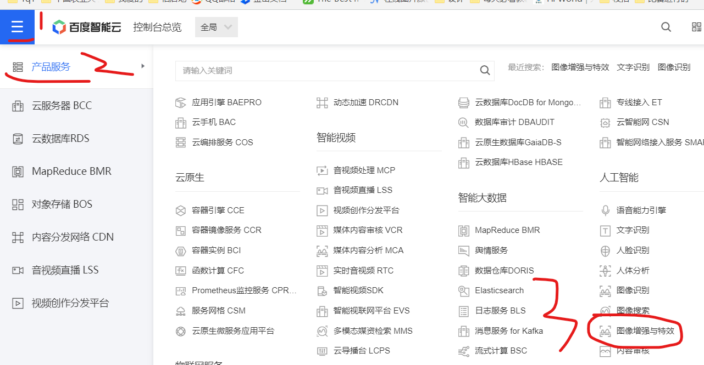
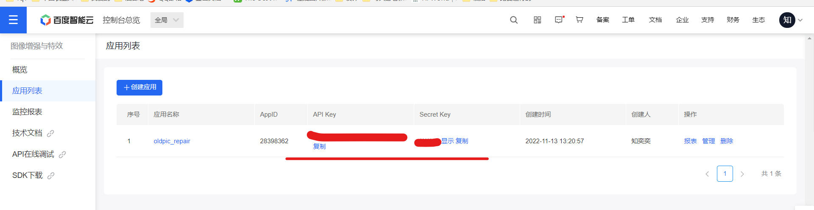
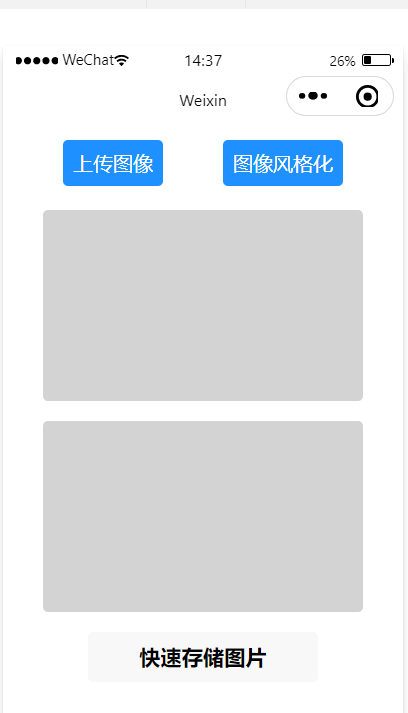
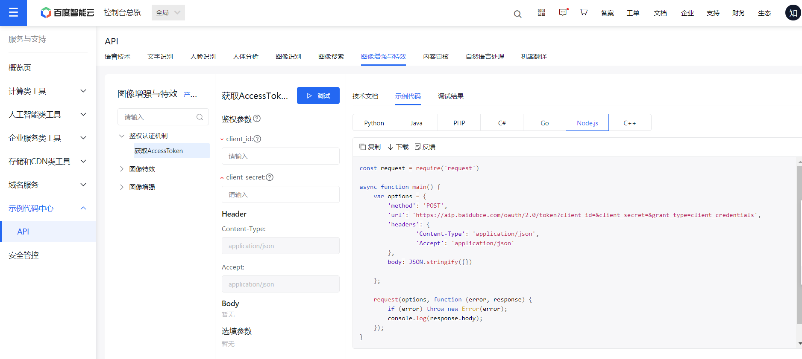

### 百度开放平台接口申领

第一步：注册一个百度账号，并登入其开放平台，进入控制台页面；

第二步：点击右上角的菜单，选择使用“图像增强与特效”接口！



<br>

第三步：领取免费接口使用额度（新用户） | 自己购买续费（老用户）

第四步：创建新的应用，进入应用列表，点击创建应用，填写好你的应用需要用到的接口，然后创建即可  
创建完毕后赋值下图中的 `API key` 以及 `secret key`



<br>

### 基本页面搭设

> 本项目体积较小，故只使用单页面 index 作为演示，项目结构仅 index 一个 page，下面所有代码都在该页面内编写

创建小程序项目：测试号、javascript、不使用模板、不使用云开发

下图是我们最终呈现的页面，上下两个灰色矩形分别表示转换前图像、转换后图像



<br>

index.wxml 代码清单；  
此时运行必然会出错，因为我们还没有编写对应代码

```html
<!-- 上传图片与请求接口转换图像 -->
<view class="containerBox">
  <view class="leftBtn" bindtap="loadImage"> 上传图像 </view>
  <view class="rightBtn" bindtap="identify"> 图像风格化 </view>
</view>

<!-- 原图与转换图展示区 -->
<view class="img-container">
  <!-- 因为图片均使用base64编码，故取src时必须要在图像文件前加上编码注解！！！ -->
  <image
    src="data:image/png;base64,{{baseData}}"
    class="img"
    mode="heightFix widthFix"
  />
  <image
    src="data:image/png;base64,{{imgBase64}}"
    class="img"
    mode="heightFix widthFix"
  />
</view>

<!-- 保存图片按钮 -->
<button style="margin-top: 20rpx;" bindtap="downloadReport">
  快速存储图片
</button>
```

<br>

index.wxss 代码清单  
添加页面对应的样式表

```css
.containerBox {
  height: 140rpx;
  display: flex;
  justify-content: space-evenly;
  align-items: center;
}
.leftBtn {
  color: white;
  background-color: dodgerblue;
  padding: 20rpx;
  border-radius: 10rpx;
}
.rightBtn {
  color: white;
  background-color: dodgerblue;
  padding: 20rpx;
  border-radius: 10rpx;
}

.img-container {
  display: flex;
  flex-direction: column;
  align-items: center;
}
.img {
  width: 80%;
  height: 360rpx;
  background-color: lightgray;
  border-radius: 10rpx;
  margin: 20rpx 0;
}
```

<br>

### 接口分析

我们请求一个接口的完整步骤：

1. 携带 `API key` 和 `secret key`，请求得到 `token`
2. 携带 token 以及欲风格化的图片文件发送给对应接口
3. 取回我们风格化后的图片文件

<br>

事实上，百度早就为我们准备好了线程的 request 代码，可以拿来就用；

在开头的百度开放平台的控制台里面，点击右侧的 “API 在线调试”

即可来到此页面，我们选择对应使用的接口，并把实例代码类型更改为 nodejs，即可得到整体代码框架

下图展示的是 ACCESS_TOKEN 接口的请求代码



<br>

> 注：token 请求次数不受限制且免费

<br>

### 主体代码编写

首先在 data 中设置好三个属性

```js
data: {
    token: '',      // token
    baseData: '',   // 原图数据
    imgBase64: '',  // 转换后的图片数据
  },
```

<br>

```js
onLoad(ops) {
    let that = this

    // 指定url的params
    let grant_type = 'client_credentials'
    let appkey = '这里写你的API key'
    let secretkey = '这里写你的secret key'

    // 这里的请求体直接可以照搬百度上的示例代码了
    wx.request({
      url: 'https://aip.baidubce.com/oauth/2.0/token?grant_type=' + grant_type + '&client_id=' + appkey + '&client_secret=' + secretkey,
      method: 'POST',
      header: {
        'Content-Type': 'application/json',
        'Accept': 'application/json'
      },

      // 请求成功，保存token
      success: (res) => {
        that.setData({
          token: res.data.access_token
        })
        console.log("用户鉴权成功，获取到token！");
      },
      fail(err){
        console.log(err);
      }
    })
  }
```

<br>

上传图片代码

chooseMedia 具体使用方法过于冗长，请移步官方文档：[点我跳转](https://developers.weixin.qq.com/miniprogram/dev/api/media/video/wx.chooseMedia.html)

```js
loadImage() {
    let that = this;

    // 由于方法chooseImage被废弃，故改用微信推荐的新方法chooseMedia
    wx.chooseMedia({
      count: 0,
      camera: 'back',
      mediaType:['image'],
      sourceType:['album','camera'],
      success(res) {

        //将图片转换为Base64格式
        wx.getFileSystemManager().readFile({

          // 注意这里！
          // res.tempFiles[0] 取得的是包含文件临时存储路径的对象object
          // res.tempFiles[0].tempFilePath 才是临时存储路径的string值
          filePath: res.tempFiles[0].tempFilePath,
          encoding: 'base64',
          success(data) {
            console.log(data.data);
            let baseData = data.data; //'data:image/png;base64,' + data.data;
            that.setData({
              baseData: baseData
            });
            console.log("成功取得图片！");
          },
          fail(err){
            console.log(err);
          }
        });
      }
    })
  },
```

<br>

图片转换请求代码

```js
identify() {
    let that = this;

    // 这里请求体需要携带的两个参数
    // image 即图片
    // option 即欲转换到的图片风格，具体风格类型可以查看开放平台内定义
    let data = {
      image: that.data.baseData,
      option:'cartoon'
    };
    wx.request({
      url: 'https://aip.baidubce.com/rest/2.0/image-process/v1/style_trans?access_token=' + that.data.token,
      method: 'POST',
      header: {
        'content-type': 'application/x-www-form-urlencoded'
      },
      data: data,
      success: function (identify) {
        console.log(identify);

        // 因为百度接口默认返回的图片就是base64编码的，就不需要二次转型了
        that.setData({
          imgBase64: identify.data.image
        })
      }
    })
  },
```

<br>

保存图片方法（可选）

```js
downloadReport() {
    let that = this;

    // 文件路径+默认文件名
    var filepath = wx.env.USER_DATA_PATH + '/demo.png';

    //获取文件管理器对象
    var aa = wx.getFileSystemManager();
    aa.writeFile({
      filePath: filepath,
      data: that.data.imgBase64,
      encoding: 'base64',
      success: res => {
        wx.showLoading({
          title: '正在保存...',
          mask: true
        });

        //保存图片到相册
        wx.saveImageToPhotosAlbum({
          filePath: filepath,
          success: function (res) {
            wx.hideLoading();
            wx.showToast({
              title: '保存成功！',
              icon: 'success',
              duration: 1200 //持续的时间
            })
          }
        })
      },
      fail: err => {
        console.log(err)
      }
    })
  },
```

> 非常好，一切都准备完毕了，点击真机调试开始尝试使用图片风格化把！

<br>

### 完整代码

> index.wxml

```html
<!-- 上传图片与请求接口转换图像 -->
<view class="containerBox">
  <view class="leftBtn" bindtap="loadImage"> 上传图像 </view>
  <view class="rightBtn" bindtap="identify"> 图像风格化 </view>
</view>

<!-- 原图与转换图展示区 -->
<view class="img-container">
  <!-- 因为图片均使用base64编码，故取src时必须要在图像文件前加上编码注解！！！ -->
  <image
    src="data:image/png;base64,{{baseData}}"
    class="img"
    mode="heightFix widthFix"
  />
  <image
    src="data:image/png;base64,{{imgBase64}}"
    class="img"
    mode="heightFix widthFix"
  />
</view>

<!-- 保存图片按钮 -->
<button style="margin-top: 20rpx;" bindtap="downloadReport">
  快速存储图片
</button>
```

<br>

> index.wxss

```css
.containerBox {
  height: 140rpx;
  display: flex;
  justify-content: space-evenly;
  align-items: center;
}
.leftBtn {
  color: white;
  background-color: dodgerblue;
  padding: 20rpx;
  border-radius: 10rpx;
}
.rightBtn {
  color: white;
  background-color: dodgerblue;
  padding: 20rpx;
  border-radius: 10rpx;
}

.img-container {
  display: flex;
  flex-direction: column;
  align-items: center;
}
.img {
  width: 80%;
  height: 360rpx;
  background-color: lightgray;
  border-radius: 10rpx;
  margin: 20rpx 0;
}
```

<br>

> index.js

```js
// index.js
// 获取应用实例
const app = getApp();

Page({
  data: {
    token: "",
    baseData: "",
    imgBase64: "",
  },

  loadImage() {
    let that = this;
    wx.chooseMedia({
      count: 0,
      camera: "back",
      mediaType: ["image"],
      sourceType: ["album", "camera"],
      success(res) {
        //将图片转换为Base64格式
        wx.getFileSystemManager().readFile({
          filePath: res.tempFiles[0].tempFilePath,
          encoding: "base64",
          success(data) {
            console.log(data.data);
            let baseData = data.data; //'data:image/png;base64,' + data.data;
            that.setData({
              baseData: baseData,
            });
            console.log("成功取得图片！");
          },
          fail(err) {
            console.log(err);
          },
        });
      },
    });
  },

  identify() {
    let that = this;
    let data = {
      image: that.data.baseData,
      option: "cartoon",
    };
    wx.request({
      url:
        "https://aip.baidubce.com/rest/2.0/image-process/v1/style_trans?access_token=" +
        that.data.token,
      method: "POST",
      header: {
        "content-type": "application/x-www-form-urlencoded",
      },
      data: data,
      success: function (identify) {
        console.log(identify);
        that.setData({
          imgBase64: identify.data.image,
        });
      },
    });
  },

  downloadReport() {
    let that = this;
    var filepath = wx.env.USER_DATA_PATH + "/demo.png";
    //获取文件管理器对象
    var aa = wx.getFileSystemManager();
    aa.writeFile({
      filePath: filepath,
      data: that.data.imgBase64,
      encoding: "base64",
      success: (res) => {
        wx.showLoading({
          title: "正在保存...",
          mask: true,
        });
        //保存图片到相册
        wx.saveImageToPhotosAlbum({
          filePath: filepath,
          success: function (res) {
            wx.hideLoading();
            wx.showToast({
              title: "保存成功！",
              icon: "success",
              duration: 1200, //持续的时间
            });
          },
        });
      },
      fail: (err) => {
        console.log(err);
      },
    });
  },

  onLoad(ops) {
    let that = this;
    let grant_type = "client_credentials";
    let appkey = "48PLvWp55fx7DO9pEWLnNzMp";
    let secretkey = "2O8SGetQpdnVIFIK5rkkB1kSjnAnmoiE";
    wx.request({
      url:
        "https://aip.baidubce.com/oauth/2.0/token?grant_type=" +
        grant_type +
        "&client_id=" +
        appkey +
        "&client_secret=" +
        secretkey,
      method: "POST",
      header: {
        "Content-Type": "application/json",
        Accept: "application/json",
      },
      success: (res) => {
        that.setData({
          token: res.data.access_token,
        });
        console.log("用户鉴权成功，获取到token！");
      },
      fail(err) {
        console.log(err);
      },
    });
  },
});
```

<br>

> END
