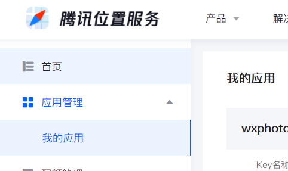

### 注册

> 前置需求：拥有一个 APPID（只要你注册了小程序就都会有）

前往腾讯位置服务官网：https://lbs.qq.com/

注册一个账号

<br>

点击 `控制台->应用管理->我的应用`



点击创建新的应用，应用名称和应用类型随便选


为该应用添加一个新的 key  
key 名称随便写

同时勾选“webserviceapi”以及“微信小程序”  
同时填入我们的 APPID； `webserviceapi` 默认选择“域名白名单”即可，白名单内什么都不用写


<br>

此时就会获得我们的第一个 key，请复制该 key，后续调用接口的时候需要用到它


<br>

### 快速测试

#### 配置 SDK

进入此网站下载 SDK：https://lbs.qq.com/miniProgram/jsSdk/jsSdkGuide/jsSdkOverview

或者点击顶部菜单栏的 `开发文档->微信小程序 JavaScriptSDK` 即可来到下载页面

按照官方文档 3、4 步的指引，下载 SDK 以及配置好小程序的合法域名！


<br>

官网给出的建议是，下载的 SDK 放在哪都可以，我在小程序项目的根目录下创建了 api 文件夹，将两个 js 文件都丢了进去

<br>

#### 小程序配置

网上许多方法给出的建议都是让我们去小程序后天管理页面，进入到开发管理中的接口设置面板，选择性的申请对应的接口；

这里建议大家优先选择申请 getLocation

事实上，申请与否都不影响当前我们调用腾讯位置服务接口，这里只是为了后续可能会用到的场景打下铺垫


<br>

最关键的一点来了！  
打开小程序项目下的 app.json ，我们需要配置如下两个配置项，才可以保证接口正确的调用

`scope.userLocation` 基于开发者调用地理位置接口的权限  
`requiredPrivateInfos` 在这里配置开发时需要用到的 API 名称，一般开发只会用到 getLocation

```json
"permission": {
    "scope.userLocation": {
      "desc": "您的位置信息将用于发布现象"
    }
  },
"requiredPrivateInfos": ["getLocation","chooseLocation"],
```

<br>

根据官网标准指引，我们新建一个 page，名字随意

按照模板输入以下代码，即可获取到当前位置周边的若干酒店状况

```js
var QQMapWX = require("../../api/qqmap-wx-jssdk.js");
var qqmapsdk;

Page({
    ...

    // 页面载入时通过我们之前复制的key注册接口
	onLoad() {
		qqmapsdk = new QQMapWX({
			key: "xxxxx",
		});
	},

    // 获取地理位置的方法，接口属性应该很简单不用再解释了
	getPosition() {
		qqmapsdk.search({
			keyword: "酒店",
			success: (res) => {
				console.log(res);
			},
			fail: (err) => {
				console.log(err);
			},
			complete: (res) => {
				console.log("完成获取地点信息");
			},
		});
	}
});
```

<br>
