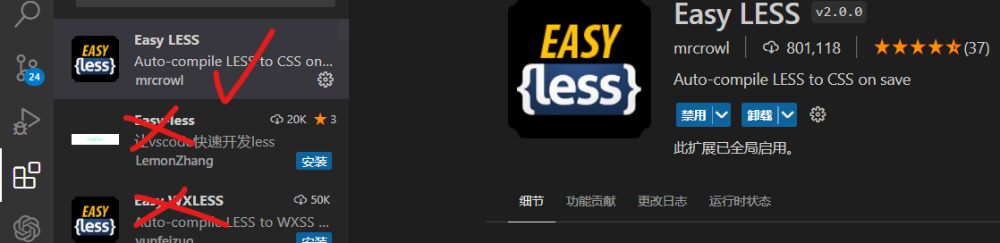
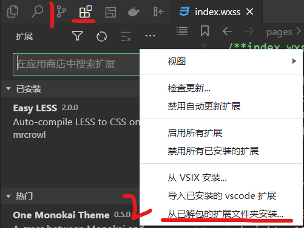
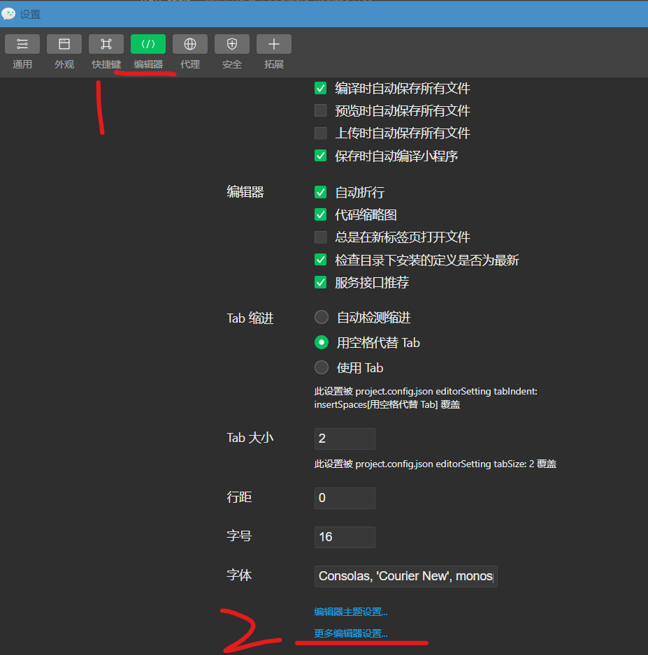
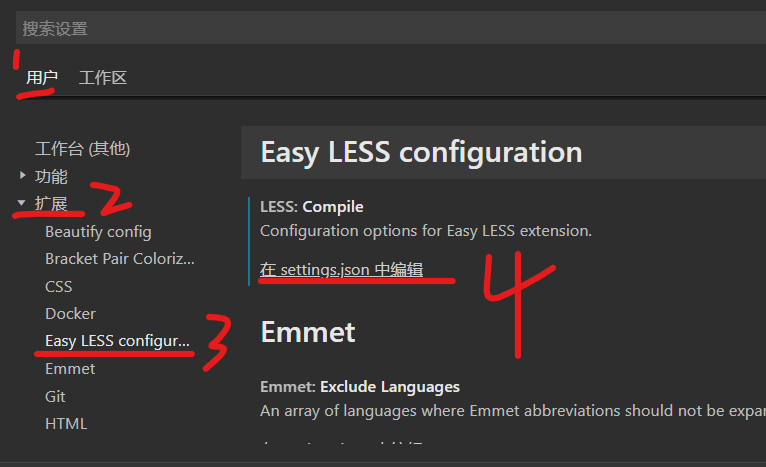
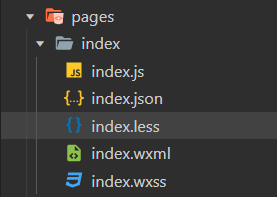

### 前言

大概搜索了一下目前关于给微信小程序安装 Less 的博客，基本上都还停留在使用 Vscode 安装扩展然后仅修改器 settings.json 的阶段，这会导致我们必须要同时打开 vscode 和微信开发工具来进行代码编写，这一点都不简洁

目前微信早已支持了安装外部插件的功能，就不需要使用过时的方法了！

<br>

### 解决办法



首先老样子，打开 vscode，搜索插件 EASY LESS，注意图片标注的那个才是我们需要下载的！

下载完后关掉 vscode，打开微信开发者工具

<br>



选择左侧扩展小图标，并点击下方三个小点按钮，选择“从已解包的扩展程序中安装”  
此时就会自动定位文件夹到 vscode 插件安装文件夹内！

我们仅需选择 `mrcrowl.easy-less-2.0.0` 这个文件夹（即我们刚刚安装好的 `EASY LESS` 插件）

就可以成功将该扩展导入微信开发者工具里面了

<br>



之后点击顶部菜单栏的 `设置->扩展设置`

设置面板选择“编辑器”，滑动到底部，点击“更多编辑器设置”

<br>



之后按照图中所示步骤依次点击 `用户->扩展->EasyLessConfiguration->在 settings.json 中编辑`

如果没有出现 `EasyLessConfiguration` ，则需要你重启一下 IDE，因为安装完扩展

<br>

非常好！我们仅需在弹出的 `settings.json` 文件最底部添加这一行代码即可  
这样就可以自动帮我们把 less 文件转换成 wxss 文件了

```json
"less.compile": {
    "outExt": ".wxss"
}
```

<br>

### 使用测试



任选一个 page，文件夹下新建一个与当前 wxss 文件同名的 less 文件  
我们仅需在该 less 文件写样式并保存后，EASYLESS 会自动编译好并转换成 wxss 文件保存的！

<br>
