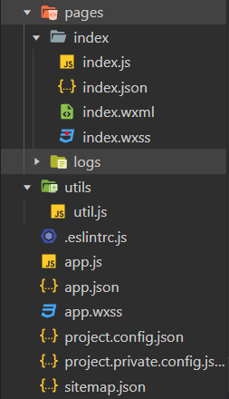

## 小程序基础核心

<br>

> 第一次编辑 2022-9-10
> 页面完善度 低
> PS：本文章即后续所有文章都是图片在上方，文字介绍在下方！

<hr>

<br>

### 开始

<br>

#### 下载安装注册开始使用

网站下载微信小程序开发者工具，安装包一路 next 安装就好了；
安装好后打开开发者工具，在你创建新的小程序时需要你登陆微信账户并且申请一个 AppID，或者直接使用测试号；

> 使用测试号开发后可以在设置面板中修改为 AppID，相当于把小程序转正

<br>

#### 文件结构



pages 所有页面存放的位置；
utils 工具类
.eslintrc.js 代码规范化插件配置文件
app.js 总配置
app.json 总数据
app.wxss 总样式
sitemap.json 微信自带样式

.wxss 文件：样式表，相当于 CSS
.wxml 文件：超文本标记语言，相当于 HTML

<br>

### 入门

<br>

#### 基本操作

设置数据以及方法声明的格式；

```js
Page({
  // 在这里面配置数据
  data: {
    msg: "123",
  },

  setName(name) {
    // 设置数据
    this.setData({
      msg: name,
    });
  },
});
```

bindtap，绑定 js 文件中声明的数据或者方法，以下代码实现点击按钮调用对应方法；
bindtap 是冒泡绑定，而换成 catchtap 就变成非冒泡形式

```html
<view>
  <button bindtap="setName">click</button>
</view>
```

<br>
