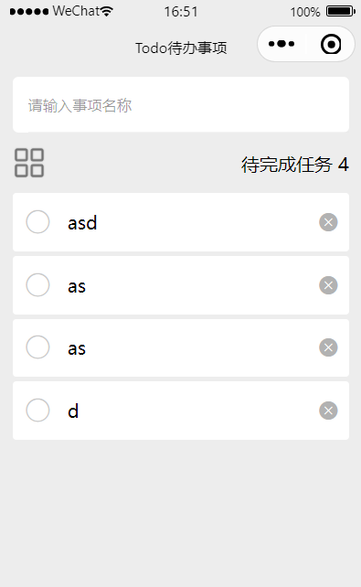
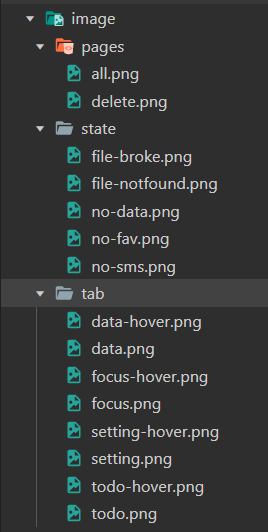

### 前言

本项目依据开源项目:[点击前往 GITHUB 仓库](https://github.com/realyao/WXminiprogram-Focus-clock)

仿照搭设而成，并主要对其中原理以及方法做出详细分析解读，望大家多多支持原作者！

<br>

### 简介

本项目将使用最新版微信开发者工具（1.06）作为演示

使用到的技术点：

1. 基础三件套
2. 腾讯 UI 库：TDesign

<br>

主要实现的功能

1. 允许用户添加任意多个待办事项，且事项能自动撑开外部盒子
2. 支持批量删除与单点删除
3. 支持批量完成与单点完成
4. 支持状态页
5. 支持回到顶部

<br>

说了这么多废话，那就来看看我们将来要做的成品基础页面吧：



<br>

本小项目已经上传至 Github，如有需要可以自取（求求各位如果不嫌麻烦可以点个 `star` 嘛呜呜呜）：  
https://github.com/zhiyiyi/WxAppletLearning

<br>

### 环境配置

#### TDesign

> 建议直接按照官方指示为小程序配置 UI 库：https://tdesign.tencent.com/miniprogram/getting-started

由于我们项目使用 js 开发而非 ts，故不需要针对 ts 做特殊配置

进入小程序项目所在根目录，打开命令行安装 UI 库  
`npm i tdesign-miniprogram -S --production`

待安装完毕，在小程序开发面板顶部菜单选择 `工具->构建 npm`

紧接着打开 `app.json` ，删去 `"style": "v2"` （因为只要存在这一行，就表示使用微信自带的 UI 进行开发）

一切准备就绪，现在就可使用 `TDesign` 了！

<br>

#### 图片

在根目录下创建 image 文件夹用来管理所有的图标图片

大家可以按照我的文件结构，划分不同的功能区，或者根据个人喜好设置

注意！下方图片展示的仅为我开发时图片库设置结构，不代表着当前项目会用到这里的所有图片！图片等具体源文件可以自行去 github 下载源代码后获取



<br>

#### 页面文件

与 pages 下新建文件夹 todo，之后再选择“新建 page”，这样小程序即可为我们自动生成页面所需的四大主文件，并且自动把页面注册到 `app.json` 里面

如果你是手动创建 page 的话，还需要到 `app.json` 的 `pages` 属性里自行配置页面映射

<br>

### 文件基础配置

#### app.wxss

为主页面提供一个基础的 CSS

```css
/**app.wxss**/
.container {
  height: 100%;
  display: flex;
  flex-direction: column;
  align-items: center;
  justify-content: space-between;
  padding: 200rpx 0;
  box-sizing: border-box;
}
```

<br>

#### app.json

修改一下 `window` 下的几个属性，使得导航条与背景颜色作出区分

这里的 `navigationBarTitleText` 设置为空，是为了后续配置页面可以自定义标题，如果在这里设置了全局标题就相当于写死了没法改了！

```json
"window": {
    "backgroundTextStyle": "light",
    "navigationBarBackgroundColor": "#EDEDED",
    "navigationBarTitleText": "",
    "navigationBarTextStyle": "black"
  },
```

<br>

之后可以配置一下底部导航条（此步可以忽略，因为我们仅需要一个 todo 页面就可以了）

```json
"tabBar": {
    "color": "#cdcdcd",
    "selectedColor": "#000000",
    "borderStyle": "black",
    "backgroundColor": "#f7f7f7",
    "list": [
      {
        "pagePath": "pages/index/index",
        "iconPath": "image/tab/focus.png",
        "selectedIconPath": "image/tab/focus-hover.png",
        "text": "专注"
      },

      {
        "pagePath": "pages/todo/todo",
        "iconPath": "image/tab/todo.png",
        "selectedIconPath": "image/tab/todo-hover.png",
        "text": "待办"
      },
      {
        "pagePath": "pages/datas/datas",
        "iconPath": "image/tab/data.png",
        "selectedIconPath": "image/tab/data-hover.png",
        "text": "数据统计"
      },
      {
        "pagePath": "pages/setting/setting",
        "iconPath": "image/tab/setting.png",
        "selectedIconPath": "image/tab/setting-hover.png",
        "text": "我的"
      }
    ]
  },
```

<br>

#### todo.json

tdesign 仅提供了按需引入的方法，故需要在 todo.json 引入后续我们将要使用的 tdesign 组件

ps:不要漏掉了 `component` 这个属性，否则按钮会显示异常

```json
{
  "component": true,
  "usingComponents": {
    "t-input": "tdesign-miniprogram/input/input",
    "t-button": "tdesign-miniprogram/button/button",
    "t-fab": "tdesign-miniprogram/fab/fab",
    "t-message": "tdesign-miniprogram/message/message"
  }
}
```

<br>

> END--下一节我们将上手开发完整的 TodoList 小项目啦！
