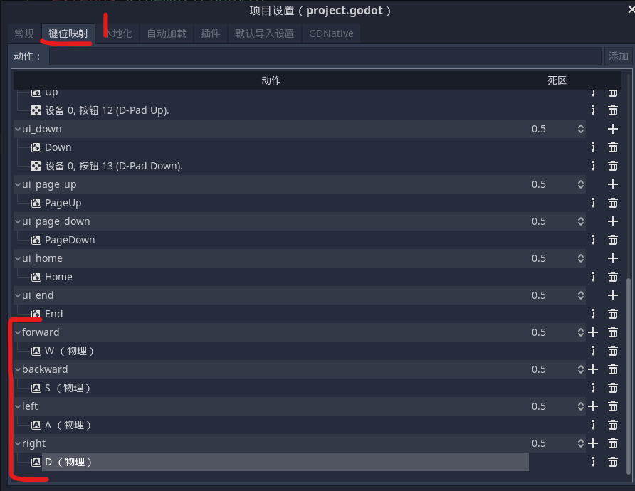
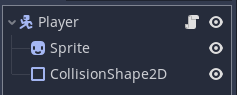
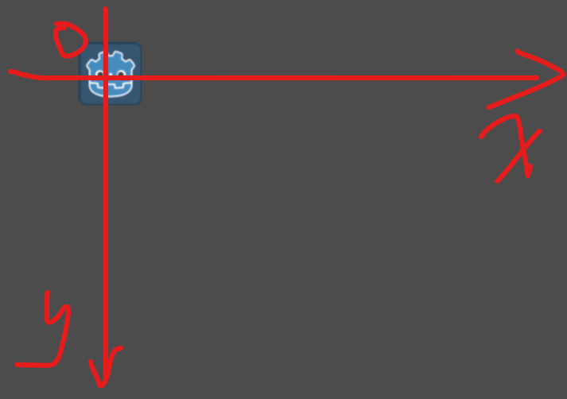

### 基础角色移动

#### 键位设置

点击 `项目->项目设置->键位映射`

添加四个按键 `forward backward left right`  
分别对应 wsad 四个按键

新添加的自定义按键默认排列在最末尾，需要你自己翻看，下图为配置完毕后的完成图



<br>

#### 场景配置

一个 kinematicbody2d 作为 player 根节点，sprite 精灵图，还有简单的方形碰撞箱



<br>

#### 代码

原理：通过配置一个单位向量，根据玩家按下的按钮决定向量所指向的方向，然后调用 `move_and_slide` 内置方法使玩家往对应方向以指定速度进行移动

这是在 godot 中二维世界的坐标系：



为 player 根节点添加代码

```go
extends KinematicBody2D

# 暴露速度供外部配置
# dir作为单位向量指示玩家的移动方向
export var speed = 300
var dir = Vector2.ZERO

# _physics_process方法保证每一帧在不同的机器上运行都是一致的
func _physics_process(delta):
    # 保证每一帧开始的单位向量均为零向量
	dir = Vector2.ZERO
    # 按键映射对应的方向
	if Input.is_action_pressed("forward"):
		dir.y = -1
	if Input.is_action_pressed("backward"):
		dir.y = 1
	if Input.is_action_pressed("left"):
		dir.x = -1
	if Input.is_action_pressed("right"):
		dir.x = 1

    # 变为标量，然后再使用该标量去移动物体
	dir = dir.normalized()
    # 指定方向以指定speed移动玩家
	move_and_slide(dir*speed)
```
