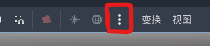
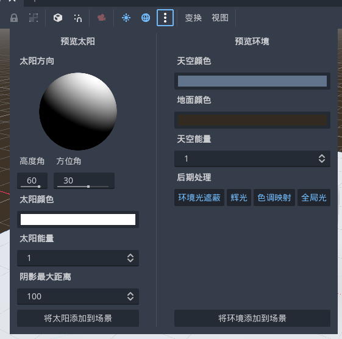
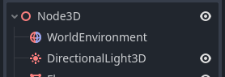
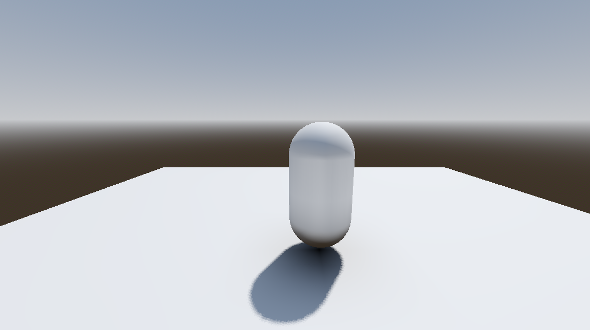
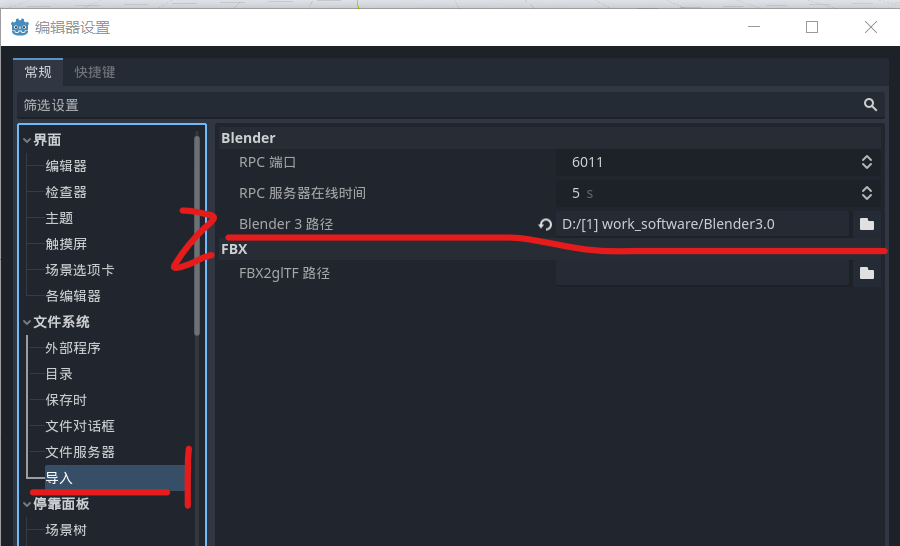

### 快速添加环境

> godot4 开发时默认自带一个快速环境，但仅能在开发时预览用；故我们必须手动添加到场景后，渲染游戏时才会显示该场景

默认场景下，点击顶部栏的三个小点，开启环境配置面板

如果你只想使用默认配置，你可以直接点击“将太阳添加到场景”以及“将环境添加到场景”两个按钮  
此时 hierarchy 就会出现两个新的节点，一个为环境，一个为太阳光

最后添加简单的场景，再配置一个摄像机，即可看到渲染后的结果了

 

### 直接导入 blender 文件

点击 `编辑器->编辑器设置` ，找到“导入”选项卡，自己吧 blender 安装的根路径补全

补全路径后关闭编辑器设置，选择 `项目->重新加载项目`

项目再次打开时，就可以直接把 blender 后缀文件拖动到场景中进行添加了；  
或者把 blender 文件放到资源文件夹内，然后使用链接的方法为场景添加模型；

 
