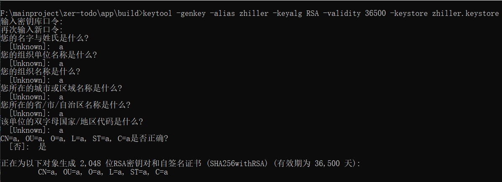
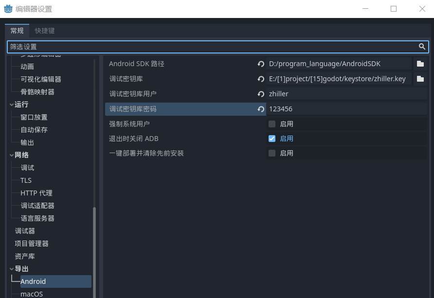
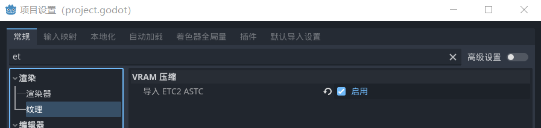

### Godot4 导出 Android

#### 安装

再开始之前，需要安装两个东西：

1. android studio
2. JDK

JDK8 或者 JDK16 都可以，但还是推荐使用较新版本的 JDK

AndroidStudio 一般在安装过程中会按照 `AndroidSDK` 我们要记住这个 SDK 的安装位置

 

#### 密钥库签名

> 生成密钥库过程需要记住两个东西：密钥库别名、密钥库口令

安装 JDK 后会默认自带一个生成密钥库的命令 keytool，在命令行中调用来生成指定密钥库

在任意一个文件夹内打开命令提示符，输入以下指令生成密钥库：  
`keytool -genkey -alias zhiller -keyalg RSA -validity 36500 -keystore zhiller.keystore`

这句话代表：  
`-alias zhiller` 生成密钥库的别名（需要记住）  
`-keyalg RSA` 加密方式为 RSA  
`-validity 36500` 密钥库存活时间为 36500 天  
`-keystore zhiller.keystore` 生成的密钥库文件名为 zhiller.keystore

 

命令执行过程中会首先让你指定密钥库密码，这玩意你也要记住  
剩余的配置随便写就可以了

最后需要输入中文的“是”或者“y”来完成密钥库生成

 

#### 编辑器配置

打开 godot4 中的 `编辑器->编辑器设置`

找到导出选项的 android，我们仅需配置前四项内容即可

- AndroidSDK 路径：顾名思义，直接填写 SDK 根目录路径
- 调试密钥库：生成的 keystore 文件路径
- 调试密钥库用户：填写密钥库别名
- 调试密钥库密码：填写密钥库口令

 

#### 项目设置

打开 项目->项目设置

直接搜索 ETC，找到纹理模块，启用“导入 ETC2 ASTC”

关闭项目设置面板

 
