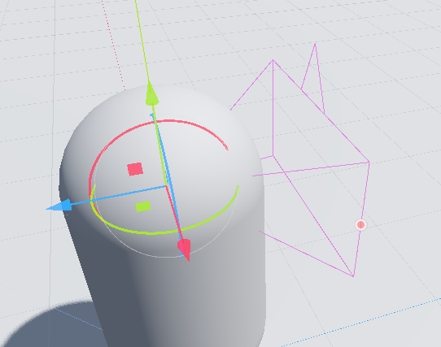

### 第一人称控制器

#### 角色配置

所有节点展示

`DirectionalLight3D` 标准太阳光  
`WorldEnvironment` 标准世界环境

`MeshInstance3D` 带碰撞的地面  
`CharacterBody3D` 玩家  
`Neck` 一个空物体，挂载在玩家的颈部位置


neck 是一个空物体，他处于玩家的颈部位置，其下有一子节点为摄像机，我们之后即控制 neck 物体的旋转来带动摄像机以实现自由视角效果

这是 neck 以及对应摄像机的部位（直接右键点击 neck 并创建摄像机节点，摄像机会默认在该节点位置处创建，不需要二次调整位置！）



<br>

#### 脚本

为对象 CharacterBody3D 创建脚本

注意，默认 godot 会为该脚本指定一个模板：CharacterDefault，我们可以直接选用该第一人称控制器模板做二次开发，或者完全从头开始手写，这取决于你

这是对应的完整代码：

```go
extends CharacterBody3D

# 定义移动速度以及跳跃高度（强度）
const SPEED = 5.0
const JUMP_VELOCITY = 6

var gravity = ProjectSettings.get_setting("physics/3d/default_gravity")

# onready初始化，获取节点
# := 看起来像是go的写法，在这里表示自动类型推断并赋值
@onready var neck := $Neck
@onready var camera := $Neck/Camera3D

# 鼠标移动相机跟随与锁定光标方法
func _unhandled_input(event):
	# 当点击游戏窗口自动锁定鼠标且隐藏光标
	# 按下exit退出焦点锁定
	if event is InputEventMouseButton:
		Input.set_mouse_mode(Input.MOUSE_MODE_CAPTURED)
	elif event.is_action_pressed("ui_cancel"):
		Input.set_mouse_mode(Input.MOUSE_MODE_VISIBLE)

	# 获取鼠标移动方向，设置摄像机跟随该方向，实现上下左右自由视角
	if Input.get_mouse_mode() == Input.MOUSE_MODE_CAPTURED:
		if event is InputEventMouseMotion:
			neck.rotate_y(-event.relative.x *0.01)
			camera.rotate_x(-event.relative.y *0.01)
			camera.rotation.x = clamp(camera.rotation.x,deg_to_rad(-30),deg_to_rad(60))


func _physics_process(delta):
	# 判断是否在地面，以此决定能否再次按下跳跃按键
	if not is_on_floor():
		velocity.y -= gravity * delta
	# 控制跳跃
	if Input.is_action_just_pressed("ui_accept") and is_on_floor():
		velocity.y = JUMP_VELOCITY

	# 使用我们映射的wsad按键进行角色移动
	var input_dir = Input.get_vector("left", "right", "forward", "back")

	# neck.transform.basis获取当前脖子朝向，使角色向该角度前进！
	var direction = (neck.transform.basis * Vector3(input_dir.x, 0, input_dir.y)).normalized()
	if direction:
		velocity.x = direction.x * SPEED
		velocity.z = direction.z * SPEED
	else:
		velocity.x = move_toward(velocity.x, 0, SPEED)
		velocity.z = move_toward(velocity.z, 0, SPEED)

	move_and_slide()

```

### 高配第一人称控制器

包含以下功能：

1. 二段跳
2. 加速跑
3. 潜行状态
4. 自动滑铲

```go
extends CharacterBody3D

# 定义移动速度
@export var speed := 10
@export var sprint_speed := 20
@export var common_accelerate := 15
@export var sneck_speed := 6
@export var quick_exit_sneck := false
var is_sneck = false
var is_shovel = false
var shovel_dir = Vector3.ZERO
var current_speed = null

# 定义跳跃相关
@export var jump_speed := 12
@export var jump_max_count := 2
var jump_counter = 0
var jump_gravity = -20
var jump_accelerate = 8
var current_velocity = Vector3.ZERO.y


var gravity = ProjectSettings.get_setting("physics/3d/default_gravity")

# onready类似初始化，获取节点
@onready var neck := $Neck
@onready var camera := $Neck/Camera3D


# 鼠标移动相机跟随与锁定光标方法
func _unhandled_input(event):
	# 当点击游戏窗口自动锁定鼠标且隐藏光标
	# 按下exit退出焦点锁定
	if event is InputEventMouseButton:
		Input.set_mouse_mode(Input.MOUSE_MODE_CAPTURED)
	elif event.is_action_pressed("ui_cancel"):
		Input.set_mouse_mode(Input.MOUSE_MODE_VISIBLE)

	# 获取鼠标移动方向，设置摄像机跟随该方向，实现上下左右自由视角
	if Input.get_mouse_mode() == Input.MOUSE_MODE_CAPTURED:
		if event is InputEventMouseMotion:
			neck.rotate_y(-event.relative.x *0.01)
			camera.rotate_x(-event.relative.y *0.01)
			camera.rotation.x = clamp(camera.rotation.x,deg_to_rad(-30),deg_to_rad(60))


func _physics_process(delta):
	process_jump(delta)
	process_movement()
	process_shovel()

# 处理移动相关法
func process_movement():

	var input_dir = Input.get_vector("left", "right", "forward", "back")
	var direction = (neck.transform.basis * Vector3(input_dir.x, 0, input_dir.y)).normalized()

	if is_shovel:
		return

	# 如果点击了潜行按键，则视角向下移动并且设置潜行状态为开
	if Input.is_action_just_pressed("sneck") :
		if !is_sneck:
			$Neck/Camera3D.position.y -= 0.7
			if current_speed==sprint_speed:
				shovel_dir = direction
				current_speed = sprint_speed
				is_shovel=true
				print("正在滑铲")
		else:
			$Neck/Camera3D.position.y += 0.7
		is_sneck = !is_sneck

	if is_shovel:
		return

	# 指定速度
	if is_sneck:
		current_speed = sneck_speed
	elif Input.is_action_pressed("sprint"):
		current_speed = sprint_speed
	else:
		current_speed = speed

	# 设置前进向量
	if direction:
		velocity.x = direction.x * current_speed
		velocity.z = direction.z * current_speed
	else:
		velocity.x = move_toward(velocity.x, 0, current_speed)
		velocity.z = move_toward(velocity.z, 0, current_speed)

	move_and_slide()

# 处理滑铲方法
func process_shovel():
	# 若当前处于滑铲状态
	if is_shovel:
		# 滑铲时点击了跳跃键，立刻退出状态
		if Input.is_action_just_pressed("jump"):
			$Neck/Camera3D.position.y += 0.7
			is_shovel = false
			is_sneck = false
			return
		# 滑铲时固定方向递减速度直到玩家停下
		if current_speed>0:
			print(current_speed)
			current_speed-=0.1
			if shovel_dir:
				velocity.x = shovel_dir.x * current_speed
				velocity.z = shovel_dir.z * current_speed
			else:
				velocity.x = move_toward(velocity.x, 0, current_speed)
				velocity.z = move_toward(velocity.z, 0, current_speed)
			move_and_slide()
		# 速度归零时自动退出滑铲模式
		else:
			# 如果开启了快速退出潜行，则滑铲结束立刻恢复正常状态
			if quick_exit_sneck:
				is_sneck = false
				$Neck/Camera3D.position.y += 0.7
			shovel_dir = Vector3.ZERO
			is_shovel = false

# 处理跳跃相关方法
func process_jump(delta):
	velocity.y += jump_gravity*delta
	if is_on_floor():
		jump_counter = 0
	if Input.is_action_just_pressed("jump") and jump_counter<jump_max_count:
		jump_counter += 1
		velocity.y += jump_speed
```

<br>

### 摄像机锁定目标环绕
