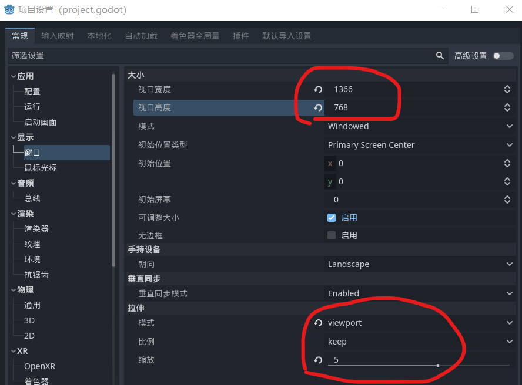

### 前言

> 笔记收集自 youtube 视频：https://www.youtube.com/watch?v=Mg_V27arKdg&list=PLbsqaO4vI1a_1JsL07804DMpBPlBB5gek

 

### 方法一：调整低分辨率

打开项目设置，按照下图所示设置

- 视口宽高设置为你想要的宽高，由于我的笔记本电脑分辨率不高所以设置 1366x768
- 模式调整为 viewport
- 比例使用 keep
- 缩放最好选择 4-5 之间，这样子才能呈现出像素效果，如果设置为 1 则表示原始图像

缺点：所有图像均被像素化，可控性极低

