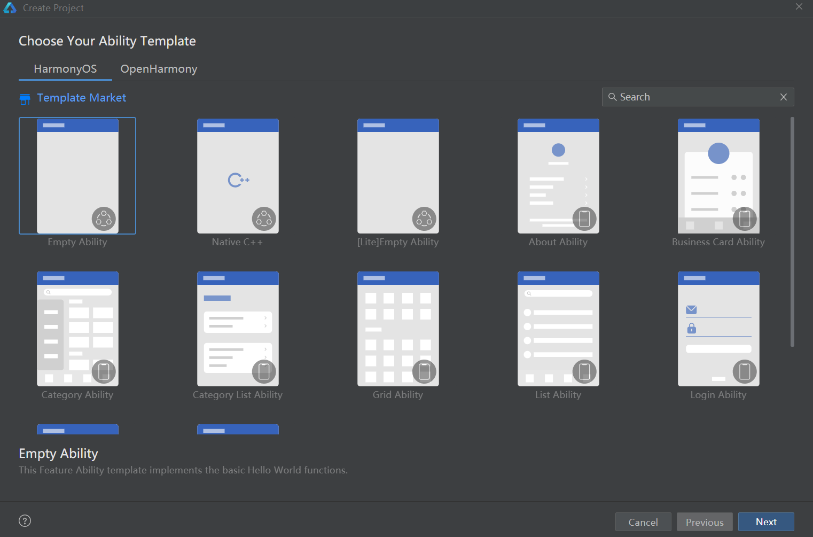
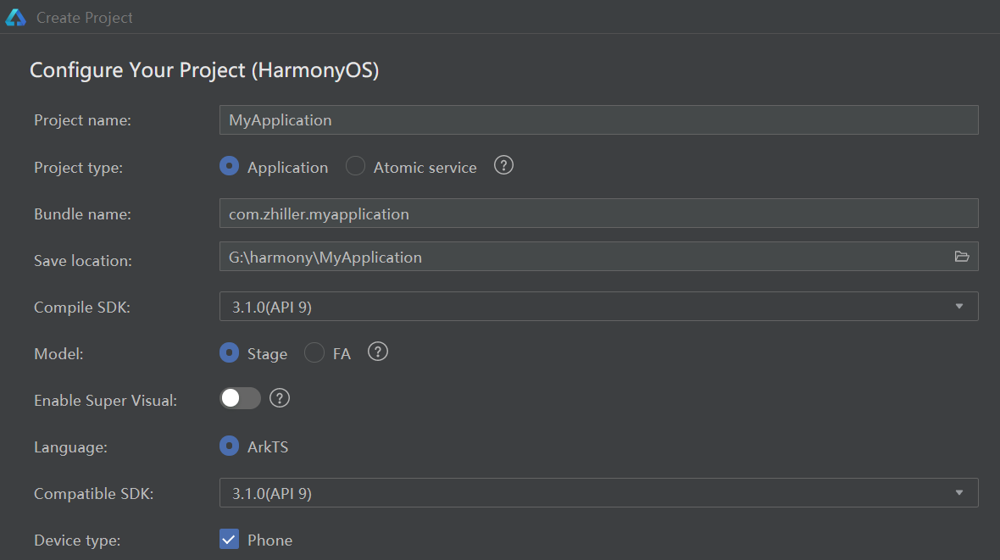
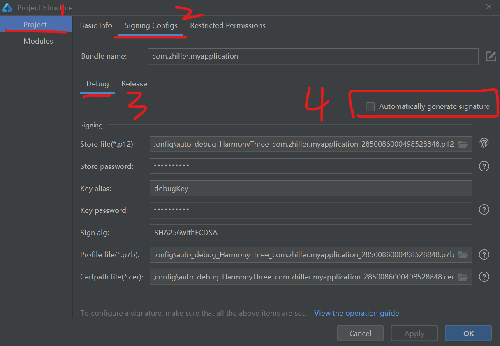
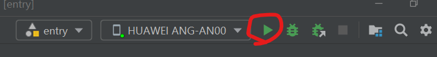

### 下载开发环境

前往官网下载 DevEco 开发环境：https://developer.harmonyos.com/cn/develop/deveco-studio#download

下载并安装，请记住你选择的 IDE 与 SDK 安装位置，后续可能会用到！

如果大家先前有做过前端开发，可能会下载 nodejs1.14 以上的版本，而当前 harmony 开发仅支持 1.14 及以下的 nodejs，此时安装过程会弹出提示让你选择本地 nodejs 源或者从华为镜像下载一个新的  
根据个人需要选择

 

### 创建工程

双击打开 DevEco，点击左侧的“create project”，可见以下窗口

当前版本已经支持开发 harmony 手机应用，故我们直接选择第一项：empty activity  
点击 next

 

这里有几个重要配置项需要具体讲一下：

1. project type 有两个选择，一个是 application（纯应用 APP），一个是 atomic serivce（类似快应用，没有 APP 专属的 Icon，而是直接通过 URL 或者二维码驱动打开）
2. compile sdk 编译 SDK 如果版本过低将不会有 ArkTs 支持，目前最适合的是 SDK7
3. compatible sdk 这个 SDK 值和编译 SDK 是联动的

> 操作完毕，点击 finish 即可创建新项目  
> 创建后耐心等待 gradle 构建完毕

 

### 登录华为账户

如果我们有一个华为实体机，并且想直接在开发中运行在实体机上的话，则必须要注册一个华为账号并且登录到 DevEco 里面去，获取指纹

打开项目结构面板（在 file->project structure）

下图展示的是我已经注册并登录验证完毕后的结果，如果你第一次使用则必须登录一次

> 图书序号 4 标注的为自动生成指纹，可选可不选

 

### 测试应用

建议使用华为实体机进行测试前，自己去看看当前的 harmony 版本号，选择对应的 SDK，以免跑不起来

将 USB 链接实体机，并确保手机开启了开发者模式，且允许 USB 调试后，DevEco 会自动识别设备

下图为识别到了我的实体机的状态，直接点击它右边的小绿三角进行构建即可生产我们的第一个空 APP

 
