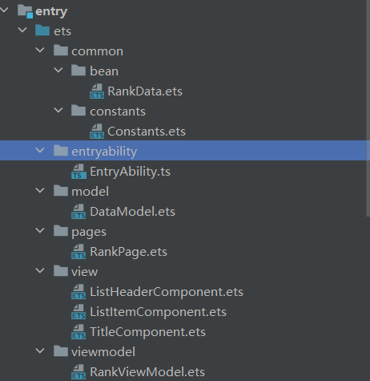

## 第一课 运行 helloworld

> [官方第一课教程地址](https://developer.huawei.com/consumer/cn/training/course/slightMooc/C101667303102887820?ha_linker=eyJ0cyI6MTY5NjY3MjQzNDU3MywiaWQiOiIzM2RhYmRhODgzYzA2NTU3NGIxOWMwNGU3NDE1NjVmMiJ9)

<br>

### 基本工程目录

新建一个项目后，默认出现以下文件夹

`AppScope` 中存放应用全局所需要的资源文件。
`entry` 是应用的主模块，存放 HarmonyOS 应用的代码、资源等。
`oh_modules` 是工程的依赖包，存放工程依赖的源文件。
`build-profile.json5` 是工程级配置信息，包括签名、产品配置等。
`hvigorfile.ts` 是工程级编译构建任务脚本，hvigor 是基于任务管理机制实现的一款全新的自动化构建工具，主要提供任务注册编排，工程模型管理、配置管理等核心能力。
`oh-package.json5` 是工程级依赖配置文件，用于记录引入包的配置信息。

<br>

`AppScope>resources>base` 中包含 element 和 media 两个文件夹，

其中 element 文件夹主要存放公共的字符串、布局文件等资源。
media 存放全局公共的多媒体资源文件。

<br>

## ArkTS

> huawei 推荐的官方声明式开发语言，自 API9 及以后 stage 框架下的所有版本将不再支持 js 和 java 开发，只能使用 ArkTS

<br>

### 初识 ArkTS

#### ViewModel



上面为官方示例代码 RankingDemo 的文件结构  
这是一个标准的 viewmodel 开发结构，编写小型项目时我们可以直接套用该结构

- `bean` 存放数据模型（相当于后端的实体类 entity）
- `constant` 存放全局常量，如字体大小等
- `model` 模型，设置实体类对应的数据
- `view` 存放单个组件（类似于 vue 中的 component）
- `viewmodel` 视图模型

<br>

先处理实体类

定义一个清单实体，包含三个字段，因为我们后续需要对其进行实例化，所以记得添加构造函数 constructor

代码清单：`/common/bean/RankData.ets`

```ts
export class RankData {
	name: Resource;
	vote: string; // Number of votes
	id: string;

	constructor(id: string, name: Resource, vote: string) {
		this.id = id;
		this.name = name;
		this.vote = vote;
	}
}
```

<br>

接下来新建模型类，实例化我们的实体类，为其赋予内容

下方代码我们创建了两组数据，rankData1 以及 rankData2

代码清单：`/model/DataModel.ets`

```ts
import { RankData } from "../common/bean/RankData";

export { rankData1, rankData2 };

const rankData1: RankData[] = [
	new RankData("1", $r("app.string.fruit_apple"), "12080"),
	new RankData("2", $r("app.string.fruit_grapes"), "10320"),
	new RankData("3", $r("app.string.fruit_watermelon"), "9801"),
	new RankData("4", $r("app.string.fruit_banana"), "8431"),
	new RankData("5", $r("app.string.fruit_pineapple"), "7546"),
	new RankData("6", $r("app.string.fruit_durian"), "7431"),
	new RankData("7", $r("app.string.fruit_red_grape"), "7187"),
	new RankData("8", $r("app.string.fruit_pears"), "7003"),
	new RankData("9", $r("app.string.fruit_carambola"), "6794"),
	new RankData("10", $r("app.string.fruit_guava"), "6721"),
];

const rankData2: RankData[] = [
	new RankData("11", $r("app.string.fruit_watermelon"), "8836"),
	new RankData("12", $r("app.string.fruit_apple"), "8521"),
	new RankData("13", $r("app.string.fruit_banana"), "8431"),
	new RankData("14", $r("app.string.fruit_grapes"), "7909"),
	new RankData("15", $r("app.string.fruit_red_grape"), "7547"),
	new RankData("16", $r("app.string.fruit_pears"), "7433"),
	new RankData("17", $r("app.string.fruit_pineapple"), "7186"),
	new RankData("18", $r("app.string.fruit_durian"), "7023"),
	new RankData("19", $r("app.string.fruit_guava"), "6794"),
	new RankData("20", $r("app.string.fruit_carambola"), "6721"),
];
```

<br>

最后，使用视图模型来管理模型类，提供给 view 获取对应数据的能力

代码清单：`/viewmodel/RankDataViewModel.ets`

```ts
import { RankData } from "../common/bean/RankData";
import { rankData1, rankData2 } from "../model/DataModel";

export class RankViewModel {
	// 加载模型类定义的第一个数据集rankData1
	loadRankDataSource1(): RankData[] {
		return rankData1;
	}

	// 返回第二个数据集
	loadRankDataSource2(): RankData[] {
		return rankData2;
	}
}
```

<br>

#### 主页面代码

现在我们已经定义好了 viewmodel，那么来看看主页是怎么写的  
对应代码位于：`/pages/RankPage.ets`

第一行，导入我们的视图模型，定义为全局变量

```ts
let rankModel: RankViewModel = new RankViewModel();
```

然后在入口组件内顶部，定义四个属性

```ts
// 两个数据源对应的变量
// @State实现动态绑定
@State dataSource1: RankData[] = [];
@State dataSource2: RankData[] = [];

// 是否切换到另一个数据源的开关
@State isSwitchDataSource: boolean = true;
// 点击返回键后计时的时间
private clickBackTimeRecord: number = 0;
```

<br>

在页面准备显示的钩子函数内，获取数据源

```ts
aboutToAppear() {
    this.dataSource1 = rankModel.loadRankDataSource1();
    this.dataSource2 = rankModel.loadRankDataSource2();
}
```

下面的代码实现了这个功能：  
用户点击一次返回键，弹出气泡，告诉用户需要再点击一次返回键才可以退出程序  
开启 interval 定时器，当两次点击间隔到达一定时间后，才允许用户退出（避免用户疯狂点击返回键，气泡还没显示出来就直接退出 app 了）

```ts
onBackPress() {
    if (this.isShowToast()) {
      prompt.showToast({
        message: $r('app.string.prompt_text'),
        duration: TIME
      });
      this.clickBackTimeRecord = new Date().getTime();
      return true;
    }
    return false;
  }

isShowToast(): boolean {
    return new Date().getTime() - this.clickBackTimeRecord > APP_EXIT_INTERVAL;
}
```

<br>
