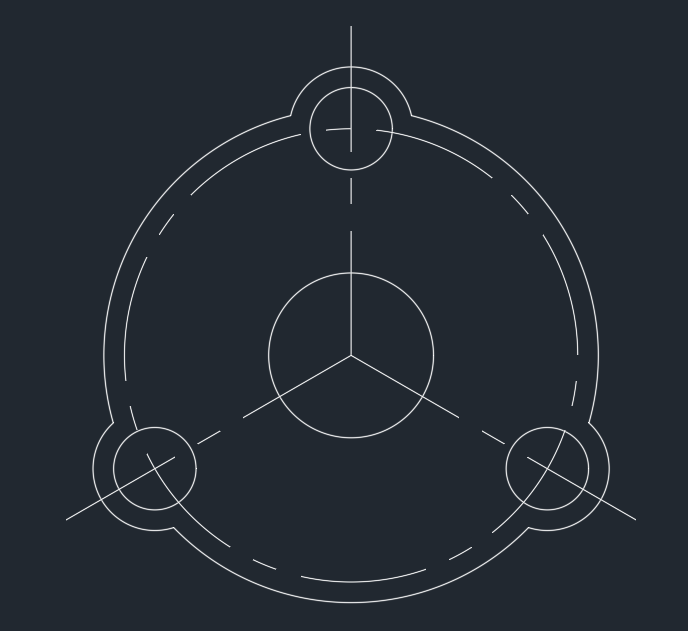

### 2020 基础

#### 基础指令

`UNITS` 设置全局单位

`PREFERENCES` 全局设置

`LIMITS` 画布边界

`NEW` 新建文件  
`OPEN` 打开文件  
`SAVE` 保存文件  
`SAVES` 另存为  
`QUIT` 退出文件

`DRAWINGRECOVERY` 图像修复管理器

 

#### 基础输入输出

重复命令：  
命令行窗口直接按 enter  
绘图页面右键点击

撤销命令：  
输入命令 UNDO  
直接按下 esc 键

重做：  
输入命令 REDO

缩放平移视图代码  
ZOOM 缩放物体  
PAN 却规定

 

#### 文件格式

dwg 标准 CAD 文件  
dwf 以文本形式描述图形，许多绘图软件都支持此格式

 

### 辅助工具

#### 图层

输入命令开启：`layer`

面板左侧为过滤器，可将其视为存储不同图层的文件夹  
面板右侧为图层，每个图层分别由不同粗细、样式的线条所表示

过滤器和图层面板上面的一排小按钮均为用来添加或者删除对应项目

双击图层面板内任意一项的 `“线型”“线宽”“透明度”` ，来更改对应的值

 

输入命令开启颜色选择盘：`color`

索引颜色、真彩色、配色系统，三者分别表示不同的取色方式，最终结果都是设置图层颜色，没有实质性差别

 

线设置相关

- 自定义线型：`linetype`
- 自定义线宽：`lineweight`

> 没有显示线宽的原因：  
> 没有开启状态栏中的“显示线宽”按钮  
> 线宽如果设置为 0.3mm 以下，CAD 则无法渲染该线段

 

#### 精确定位

右下角状态栏提供了很多用来捕捉的快捷按钮

常用的只有左侧前几个：显示图形栅格、捕捉模式、正交限制光标、将光标捕捉到二维参考点  
顾名思义

偏右侧的小齿轮图标可以用来配置工作区，由于较高版本的 CAD 默认使用“草图与注释”画板，可切换为经典版

正交模式快速开启指令：`ortho`

 

**特殊位置点捕获（十分重要！！！）**

开启任一画图指令（如 line 划线指令）后，直接输入以下代码，可以改变捕获的功能

- `m2p` 捕获两点的中点
- `end` 捕获端点
- `mid` 捕获中点
- `int` 捕获焦点
- `ext` 捕获延长线
- `cet` 捕获圆或者圆弧的圆心
- `tan` 捕获切点
- `per` 捕获垂足
- `par` 捕获平行线
- `nea` 拾取最近点

 

对象捕获设置面板：DDOSNAP

 

#### 动态输入与约束

动态输入命令：DSETTINGS
几何约束：CSETTINGS

 

### 平面图形编辑

#### 编辑

选择全部元素：先 s 后 all

复制 CAD 中图纸到 word 里面：

1. 打开 CAD，直接输入 copylink 复制链接
2. 来到 word，ctrl+v 黏贴即可

 

镜像：`mirror`

偏移（相当于复制选中对象并在偏移一段距离后粘贴）：`offset`

移动：move  
旋转：rotate  
缩放：scale

阵列：array（命令模式下极不方便，推荐直接顶部菜单栏点击对应按钮图形化编辑更快！）

 

#### 几何特性指令

修剪：trim  
延伸：extend  
圆角：fillet  
倒角：chamfer

拉伸：stretch  
拉长：lengthen

打断：break

 

#### 删除恢复

橡皮擦：erase  
恢复：oops、u

 

### 高级二维指令

#### 面域

> 面域的存在是为了便于复杂的二维图形操作

创建面域：region、reg  
（选择对象后点击回车即可将他们变成面域）

 

布尔操作：union 并集、intersect 并集、subtract 差集

布尔操作仅能在面域之间进行，普通对象不参与布尔运算

以下结构为面域+并集实现对对应圆进行切割

 

#### 图案填充

填充指令：BHATCH、bh

其中比较重要的参数是孤岛检测，即决定系统是否自动填充嵌套图形中的内容；  
对应的填充方式 CAD 已经以图案的方式提供给你了，这里不再阐述

 

填充图案编辑：HATCHEDIT

 

#### 多段线

多段线 pline、pl

多线 mline

 

### 文本样式

 
