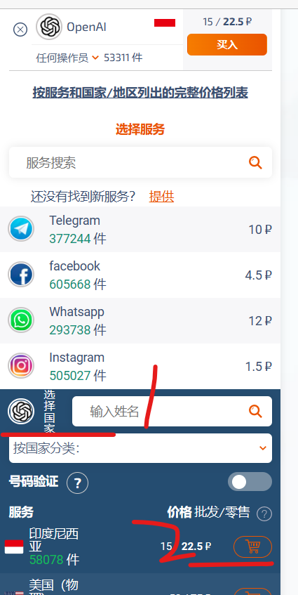
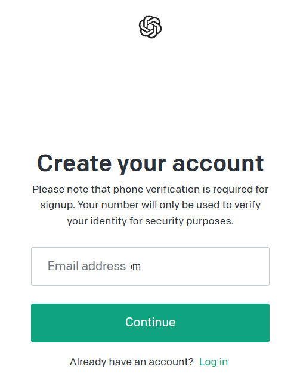
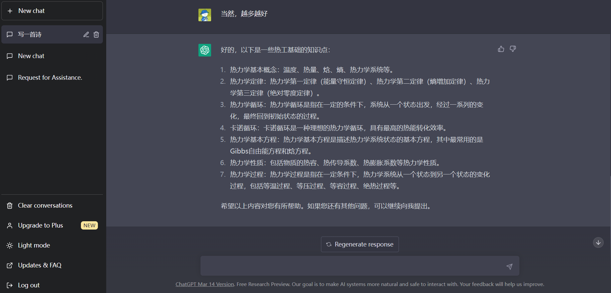

### 前置环境

必备条件：科学上网

`clash` 选择的代理推荐新加坡，或者其余亚洲国家，延迟低

请确保以下激活注册过程全程代理均为开启状态

 

### 完整过程

#### 发码平台

访问虚拟手机号平台：https://sms-activate.org/

注册一个账号，并向其充值 1 美刀（充值可以使用支付宝）

点击左侧 openai 图标，将下方的“印度尼西亚”加入购物车

此时发现我们被扣费了，并且在当前界面出现了一个剩余时间为 20 分钟的电话号码

这表示在这 20 分钟内，该虚拟号码会自动接收验证码并传回给你，如果你不准备现在注册，可以直接点击取消订购，此时退款将会在一段时间内返还

 

#### 注册 openai 状态

进入 openai 测试案例网站：https://platform.openai.com/examples

点击右上角 `sign up`

进入注册界面，使用邮箱注册，国内推荐直接用 QQ 邮箱，163 或者其他邮箱似乎都不能用

 

如果注册过程中提示 `too many signups from the same ip`

是因为代理问题，把浏览器切换成隐私模式再注册（或者一直换代理，直到换成功为止）

 

填写手机号是，回到发码平台，复制电话号码（不要复制前面的区号 62），粘贴进去即可

此时 openai 发送验证码，你在发码平台得到验证码，粘贴进去即可完成注册

 

### 测试

进入 chatgpt 官网：https://chat.openai.com/

此时就可以直接 `sign in` 登录进去使用了

此时不需要隐私模式访问

gpt 支持中文对话

 
