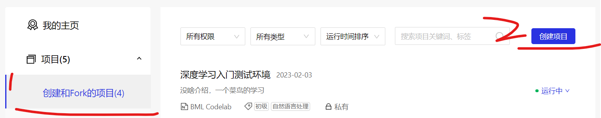
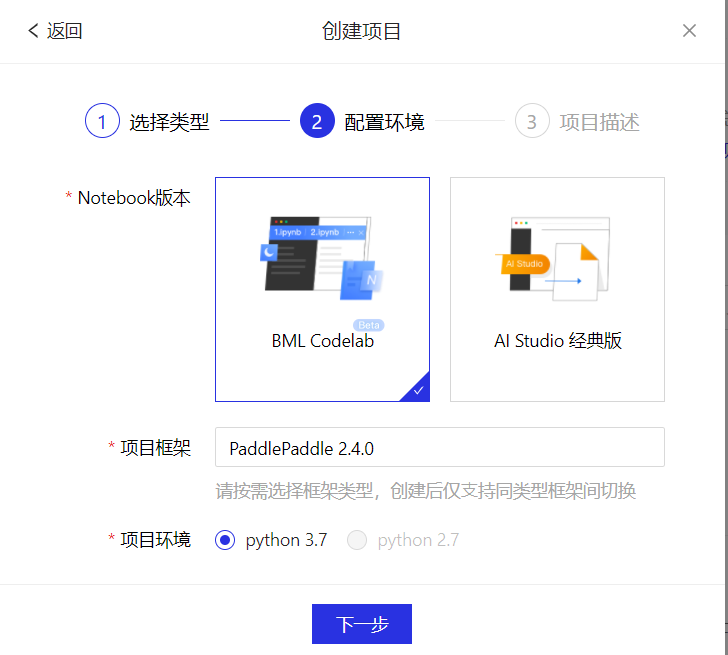

### 平台

> 笔记完全依照官方文档并做简化处理便于理解与复习，如有疏漏请查看原文：https://aistudio.baidu.com/aistudio/projectdetail/5440316

<br>

#### 简介

为提升开发效率，这里使用百度飞浆的 `BML codelab` 进行所有代码过程的演示

百度飞浆平台提供了两种编译技术：
`动态图编译` 用户无需预先定义完整的网络结构，每写一行网络代码，即可同时获得计算结果  
`静态图编译` 用户需预先定义完整的网络结构，再对网络结构进行编译优化后，才能执行获得计算结果

> 飞浆默认 2.0+版本的都为动态图模式，且在动态图模式下需要使用 to_static 才可以将其转换为静态图模式

<br>

#### 创建个人项目

请自行注册一个账号，然后前往个人中心，依次点击项目->创建于 fork 项目->创建项目



类型选择 notebook（可以把它看成我们本地操作的 jupyter）  
配置环境选择飞浆平台推出的最新的 BML  
项目描述自己写



创建完毕，进入项目后点击“启动环境”后即可进入环境进行开发

关于 notebook 的使用请自行参考官方文档：https://ai.baidu.com/ai-doc/AISTUDIO/Gktuwqf1x

<br>

### 数据处理

首先需要下载数据集，在这里搜索“housing.data”下载数据集：https://aistudio.baidu.com/aistudio/datasetoverview

把数据集上传到环境的 work 文件夹内

<br>

#### 基础处理

读取数据，标准的数据集 housing 是一个一位数组

```py
# 导入需要用到的package
import numpy as np
import json
# 读入训练数据
datafile = './work/housing.data'
data = np.fromfile(datafile, sep=' ')

print(data)
```

<br>

划分数据

因为有 14 个特征值，所以要把一维数据转换为二维数据

一组数据包含 14 个值，即对于 14 个特征值

`data.shape[0] // feature_num` 可以得到需要划分为多少组

```py
# 读入之后的数据被转化成1维array，其中array的第0-13项是第一条数据，第14-27项是第二条数据
# 这里对原始数据做reshape，变成N x 14的形式
feature_names = [ 'CRIM', 'ZN', 'INDUS', 'CHAS', 'NOX', 'RM', 'AGE','DIS',
                 'RAD', 'TAX', 'PTRATIO', 'B', 'LSTAT', 'MEDV' ]
feature_num = len(feature_names)
data = data.reshape([data.shape[0] // feature_num, feature_num])


# 查看数据
x = data[0]
print(x.shape)
print(x)
```

<br>

划分训练集与测试集之间的比率一般为 8:2，即表示为 0.8

```py
# 设定训练集与测试集数据数量之间的比率
ratio = 0.8
offset = int(data.shape[0] * ratio)
training_data = data[:offset]
training_data.shape
```

<br>

对每个特征进行归一化处理，使得每个特征的取值缩放到 0~1 之间

```py
# 计算train数据集的最大值，最小值
maximums, minimums = \
                     training_data.max(axis=0), \
                     training_data.min(axis=0)
# 对数据进行归一化处理
for i in range(feature_num):
    data[:, i] = (data[:, i] - minimums[i]) / (maximums[i] - minimums[i])
```

<br>

#### loaddata

这就是对以上数据基础处理的额一个封装版本

```py
def load_data():
    # 从文件导入数据
    datafile = './work/housing.data'
    data = np.fromfile(datafile, sep=' ')

    # 每条数据包括14项，其中前面13项是影响因素，第14项是相应的房屋价格中位数
    feature_names = [ 'CRIM', 'ZN', 'INDUS', 'CHAS', 'NOX', 'RM', 'AGE', \
                      'DIS', 'RAD', 'TAX', 'PTRATIO', 'B', 'LSTAT', 'MEDV' ]
    feature_num = len(feature_names)

    # 将原始数据进行Reshape，变成[N, 14]这样的形状
    data = data.reshape([data.shape[0] // feature_num, feature_num])

    # 将原数据集拆分成训练集和测试集
    # 这里使用80%的数据做训练，20%的数据做测试
    # 测试集和训练集必须是没有交集的
    ratio = 0.8
    offset = int(data.shape[0] * ratio)
    training_data = data[:offset]

    # 计算训练集的最大值，最小值
    maximums, minimums = training_data.max(axis=0), training_data.min(axis=0)

    # 对数据进行归一化处理
    for i in range(feature_num):
        data[:, i] = (data[:, i] - minimums[i]) / (maximums[i] - minimums[i])

    # 训练集和测试集的划分比例
    training_data = data[:offset]
    test_data = data[offset:]
    return training_data, test_data
```

<br>

### 模型设计
