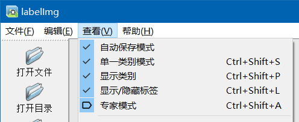

### 安装

使用清华镜像源，一句话搞定

```sh
pip install labelimg -i https://pypi.tuna.tsinghua.edu.cn/simple
```

<br>

### 入门

#### 标注类别

对图像进行打标时，需要针对不同的识别对象定义类别标签 label

在 `labelimg` 根目录下的 data 文件夹中找到 `predefined_classes.txt` 文件

以单行的形式填写你需要定义的类型，后续启动 labelimg 后，就会自动出现在类型预选下拉框里面了

譬如我们定义两个类型：  
并把它均保存到 predefined_classes.txt 内

```
sun
moon
```

<br>

#### 运行 labelimg

进入根目录并在此处打开命令提示符

运行： `python labelImg.py` 即可开启软件

<br>

#### 推荐设置

在打标前，请在菜单栏的 `“查看”` 中将最顶部的五个选项全部勾选，便于加快我们的工作效率



<br>

#### 文件管理

一般的，建议新增一个文件夹来管理打标图片以及标注坐标文本文件

见以下参考目录结构：  
| demo 数据集名称  
|- images 图片存放  
|- annotations 标注坐标文本输出

<br>
