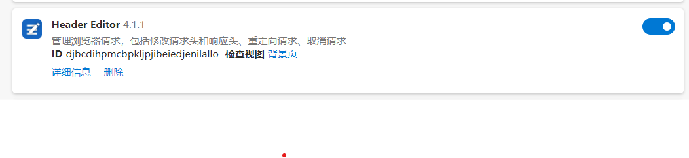
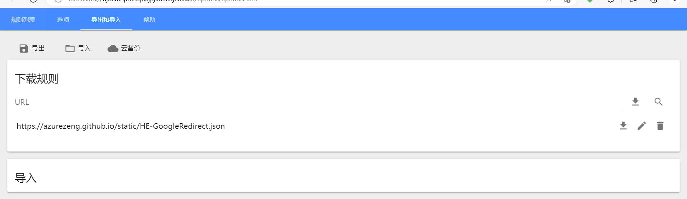

### kaggle

> 推荐，里面包含众多免费数据集（且均已打标过）

首先使用 edge 浏览器安装扩展 header editor

 

进入 header editor 管理界面（点击浏览器右上角的对应小图标即可找到入口）

在“导入和导出”这一栏内，填入以下 URL，并点击右侧的下载图标；  
待解析完成，出现三个文件，直接点击全部导入并保存即可！

 

之后前往 kaggle 官网注册即可，以上 header editor 的设置是为了显示出人脸识别验证的图片，如果没有这一步的话将导致无法注册！

 
