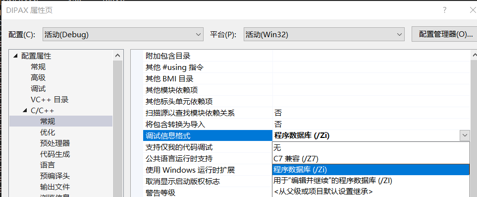
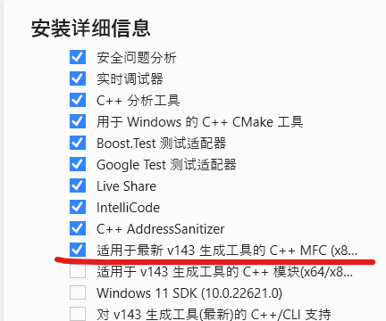

### error：D8016 “/ZI”和“/Gy-”命令行选项不兼容 ”

依次点击 `项目->属性->配置属性->C/C++->常规`

将“调试信息格式”改为程序数据库

 

### error MSB8041: 此项目需要 MFC 库

> 此错误发生于我使用 VS2022 打开 VS2010 项目时报错

只需要为咱们的 VS 添加最新版的 MFC 构件即可

我这里使用的是 VS2022 最新的 v143 版本 MFC（如下图所示）

 
