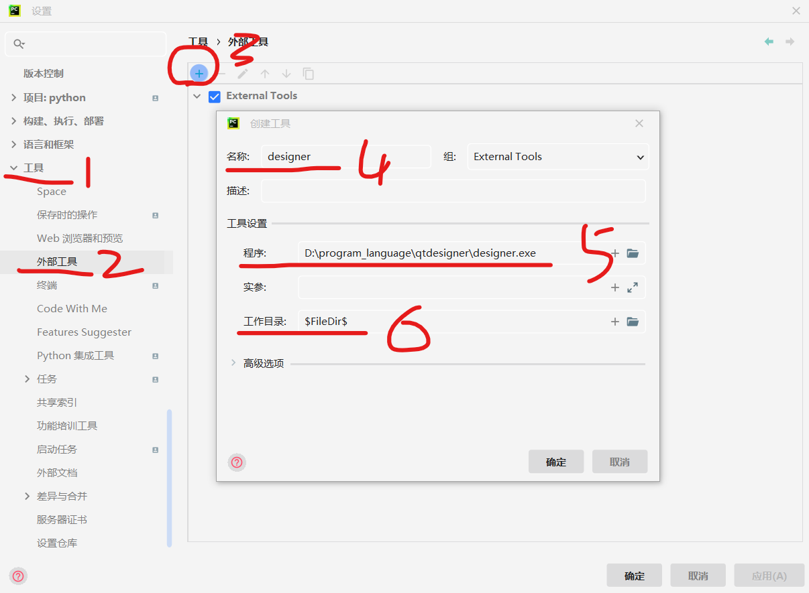
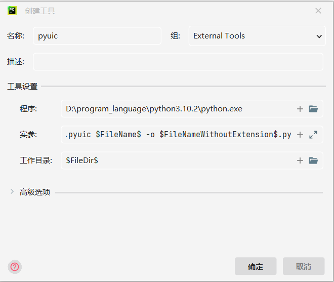

### 下载 Qtdesigner

一般的，直接 pip 安装 pyqt6 后自动会在对应的包下存在该文件，但某些情况下是没有的；

可以直接网上下载一个 qtdesigner，使用起来没有差别；

<br>

### 配置外部工具

打开 pycharm，开启设置窗口

依次点击 工具->外部工具->左上角加号

之后填写相关内容：  
名称：随便取  
程序：designer.exe 的文件位置  
工作目录：$FileDir$ （点击右侧的小加号就可以看到对应的变量值，并且可直接插入）



<br>

之后还需要使用 pyuic 对 ui 文件进行编译后产出 py 文件

再次点击左上角加号，之后填入以下内容：  
名称：任意  
程序：python 解释器（即 python.exe）所在位置  
实参：-m PyQt6.uic.pyuic $FileName$ -o $FileNameWithoutExtension$.py  
工作目录： $FileDir$



<br>

### 开始使用

创建新的 python 工程，右键点击任意一个文件夹；

选择 `external tools -> designer` 即可快速打开 qtdesigner；  
并且我们设计完窗体后直接 ctrl s 保存的默认路径也就在当前文件夹下，是不是很方便！！！

保存设计文件 ui 后，右键点击该文件，使用 `external tools -> pyuic` 即可编译出 py 文件供我们使用了！

> 此时我们生成的页面文件大致是这样的：

```py
import sys
from PyQt6 import QtCore, QtWidgets

class Ui_MainWindow(object):
    def setupUi(self, MainWindow):
        MainWindow.setObjectName("MainWindow")
        MainWindow.resize(800, 600)
        self.centralwidget = QtWidgets.QWidget(MainWindow)
        self.centralwidget.setObjectName("centralwidget")
        MainWindow.setCentralWidget(self.centralwidget)
        self.menubar = QtWidgets.QMenuBar(MainWindow)
        self.menubar.setGeometry(QtCore.QRect(0, 0, 800, 26))
        self.menubar.setObjectName("menubar")
        MainWindow.setMenuBar(self.menubar)
        self.statusbar = QtWidgets.QStatusBar(MainWindow)
        self.statusbar.setObjectName("statusbar")
        MainWindow.setStatusBar(self.statusbar)

        self.retranslateUi(MainWindow)
        QtCore.QMetaObject.connectSlotsByName(MainWindow)

    def retranslateUi(self, MainWindow):
        _translate = QtCore.QCoreApplication.translate
        MainWindow.setWindowTitle(_translate("MainWindow", "MainWindow"))
```

<br>

### 显示页面

但是这还不够，我们直接编译出来的 py 文件还没法渲染，此时我们要在生成的页面文件内部添加如下内容：

导入

```py
from PyQt6.QtWidgets import QApplication, QMainWindow
```

<br>

运行函数（）

```py
class init(QMainWindow, Ui_MainWindow):
    def __init__(self):
        super(init, self).__init__()
        self.setupUi(self)


if __name__ == "__main__":
    app = QApplication(sys.argv)
    form = init()
    form.show()
    sys.exit(app.exec())
    pass
```

<br>

直接运行即可生成页面

<br>
