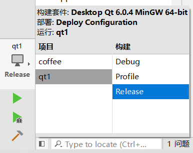
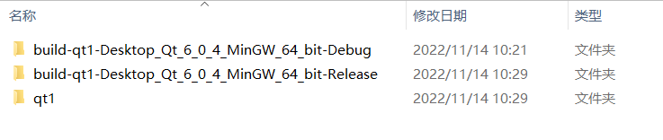
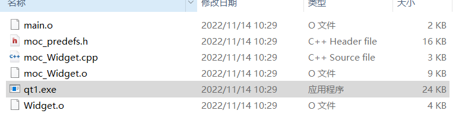
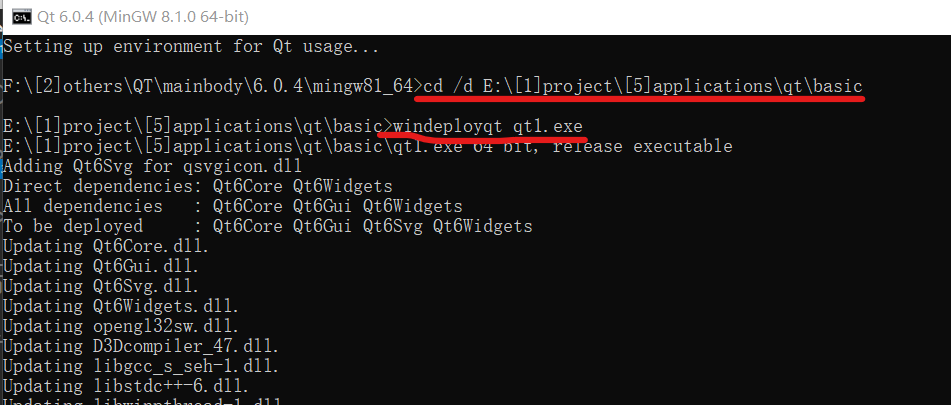

### 打包成可执行文件

qt creator 左下角切换编译模式为 release；

之后直接点击绿色三角执行编译过程；

 

打开项目目录，选择文件夹尾部名称为 release 文件夹

再进入 release 文件夹，把里面的 exe 文件拿出来放到任意一个空的文件夹内

 

复制你存放 exe 文件的绝对路径；

开始菜单中找到（或者搜索）`qt for desktop mingw x64` 命令行界面；

输入指令 `cd /d xxx`（xxx 即你刚刚复制的绝对路径） 进入软件文件夹内

再次输入 `windeployqt xxx` 让 mingw 把软件对应的库都全部添加上去

 

> 编译完成后使用任意一个打包软件将其打包成单文件应用就可以直接发布了

 

###
