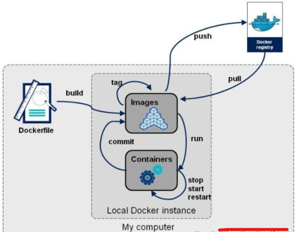
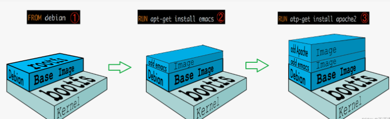
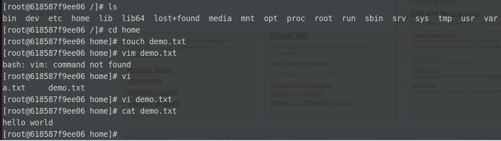
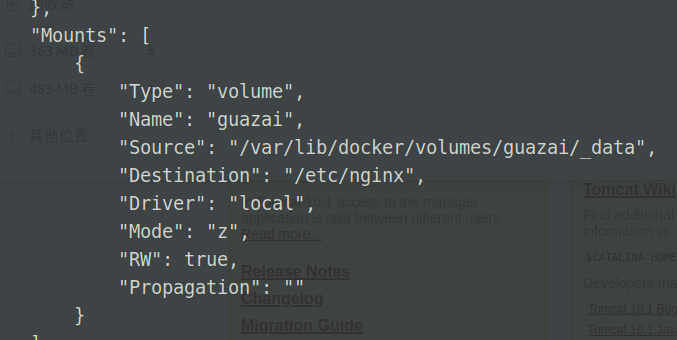

### Docker 与虚拟机区别

虚拟机：系统镜像占用内存较大，启动缓慢，但功能较为齐全

docker

- 运行环境不包括操作系统层次，即容器中的系统是运行于应用层的，底层操作系统由物理机操作系统支持
- 镜像包体积小，运行速度快，轻量级
- 支持多种操作系统容器，linux、windows、macos
- 平台限制 linux（但目前退出了 docker desktop 后界限不那么明显了）
- 只用于计算，无法处理外部存储

<br>

### 运作流程



docker 最简工作流程

1. 运行 docker
2. 从云端 pull 对应镜像
3. 容器内运行镜像实例

<br>

### 常用指令实操

> 下载过程建议直接挂梯子，或者修改镜像源，以便下载超时

搜索 centos 镜像：`docker search centos`

此时会列出 docker 云端存储的所有对应镜像文件，有 official 官方版本与非官方版本

安装官方镜像：`docker pull centos`  
因为我们没有附加任何参数，故默认下载最新版的 centos 镜像

或者你可以选择从指定文件夹下导入外部镜像：`docker load -i /xxx/xxx.tar`

查看当前镜像列表 `docker images`

删除镜像 `docker rmi centos`

<br>

### 镜像原理



`UnionFS`：一致分层且轻量级的高效文件系统，可将不同目录挂载到同一个虚拟文件系统下

`bootfs`：Docker 镜像的底层结构，由 bootloader 和 kernel 组成，用于引导加载 kernel

`rootfs`：位于 bootfs 之上，为不同操作系统的发行版

<br>

docker 镜像均按层添加，此时所有镜像都会用到一个统一的 base 镜像层，有利于数据共享

docker 所有的镜像均为只读，只有顶层镜像被称为容器层，容器层之下的所有东西都被称为镜像层

<br>

### 制作个人镜像

`docker commit`命令用于将当前容器的文件系统创建为新的镜像。该命令将会根据容器的当前状态创建新的镜像，包括所有修改过的文件和文件系统状态。使用`docker commit`命令可以将容器的修改保存为新的镜像，方便将来使用。

`docker commit`的基本语法如下：

```shell
docker commit [OPTIONS] CONTAINER [REPOSITORY[:TAG]]
```

其中，`CONTAINER`是要创建镜像的容器的名称或 ID。`REPOSITORY`和`TAG`是可选参数，可以用来指定新创建的镜像的名称和标签，如果不指定则默认为`<none>`和`latest`。

常用的`docker commit`选项包括：

- `-a, --author`：指定新创建的镜像的作者。
- `-m, --message`：指定新创建的镜像的描述信息。
- `-c, --change`：在新的镜像中应用 Dockerfile 格式的指令。
- `-p, --pause`：在创建镜像之前暂停容器的运行。

以下是一个使用`docker commit`命令创建新镜像的示例：

```shell
# 启动一个容器
docker run -it --name mycontainer ubuntu:latest bash

# 在容器中修改文件
echo "Hello, Docker" > /tmp/hello.txt

# 退出容器
exit

# 使用docker commit创建新镜像
docker commit -m "Added hello.txt file" mycontainer myimage:latest
```

新镜像文件可以使用此命令查看 `docker images`

以上命令创建了一个名为`myimage`的新镜像，包含了容器中修改过的文件和文件系统状态。该镜像的标签为`latest`。通过`docker run`命令启动该镜像的容器时，将会包含`/tmp/hello.txt`文件。

<br>

### 容器数据卷

> 数据卷可以存储我们运行一个容器是所产生的数据

<br>

#### 直接挂载

下载 centos 最新镜像 `docker pull centos`

挂载格式 `docker run -it -v 主机目录:容器目录 /bin/bash`

据此格式，我们将主机文件夹和容器文件夹进行挂载映射 `docker run -it -v /home/zhiller/docker:/home centos /bin/bash`

由于我们没有附带`-d`参数，所以不是后台运行，直接进入 centos 的命令行下



使用 ls 查看以下当前目录，在我们挂载的 home 目录下使用 touch 新增文本文件，用 centos 自带的 vi 随便写一些东西然后保存

此时我们就可以发现，在主机的对应文件夹下 `/home/zhiller/docker` 出现了我们刚刚新增的文件，这就是挂载的作用！！！

<br>

#### 具名挂载

顾名思义，即为挂载取一个名字，但是不指定主机挂载在那个文件夹下

首先下载 nginx `docker pull nginx`

使用具名挂载 `docker run -d -P --name=nginx2 -v guazai:/etc/nginx nginx`

上述代码执行后，会创建一个具名挂载点 `guazai`

使用该代码快速查询主机挂载文件夹 `docker inspect 84 [容器ID] | less`

找到下图所示的 mounts 对象，里面的 source 属性即为主机挂载文件夹！  


<br>

#### 匿名挂载

匿名挂载就是直接指定容器挂载文件夹，忽略掉主机文件夹，具体的查询方式和具名挂载差不多，可以借鉴

```shell
# 多种挂载方式
-v  容器内路径               #匿名挂在
-v  卷名：容器内路径          #具名挂在
-v  /宿主机路径：容器内路径    # 指定路径挂载
```

<br>

### dockerfile

dockerfile 指令表

```shell
Dockerfile 指令选项:

FROM                  #基础镜像 。 （centos）
MAINTAINER            #镜像的作者和邮箱。（已被弃用，结尾介绍代替词）
RUN                   #镜像构建的时候需要执行的命令。
CMD                   #类似于 RUN 指令，用于运行程序（只有最后一个会生效，可被替代）
EXPOSE                #对外开放的端口。
ENV                   #设置环境变量，定义了环境变量，那么在后续的指令中，就可以使用这个环境变量。
ADD                   # 步骤：tomcat镜像，这个tomcat压缩包。添加内容。
COPY                  #复制指令，将文件拷贝到镜像中。
VOLUME                #设置卷，挂载的主机目录。
USER                  #用于指定执行后续命令的用户和用户组，
                       这边只是切换后续命令执行的用户（用户和用户组必须提前已经存在）。
WORKDIR               #工作目录（类似CD命令）。
ENTRYPOINT            #类似于 CMD 指令，但其不会被 docker run
                       的命令行参数指定的指令所覆盖，会追加命令。
ONBUILD               #当构建一个被继承Dokcerfile，就会运行ONBUILD的指令。出发执行。


注意：CMD类似于 RUN 指令，用于运行程序，但二者运行的时间点不同:
CMD 在docker run 时运行。
RUN 是在 docker build。
作用：为启动的容器指定默认要运行的程序，程序运行结束，容器也就结束。
CMD 指令指定的程序可被 docker run 命令行参数中指定要运行的程序所覆盖。
如果 Dockerfile 中如果存在多个 CMD 指令，仅最后一个生效。

LABEL（MAINTALNER已经被弃用了，目前是使用LABEL代替）
LABEL 指令用来给镜像添加一些元数据（metadata），以键值对的形式，语法格式如下：
LABEL <key>=<value> <key>=<value> <key>=<value> ...
比如我们可以添加镜像的作者：
LABEL org.opencontainers.image.authors="runoob"

```

<br>

Dockerfile 关键字务必使用全大写

docker 是根据 dockerfile 来构建 image 的

`docker history [镜像名称]` 可以查看对应镜像的构建历史记录

<br>

#### 登录 dockerhub

在 linux 命令行中登录 dockerhub 之前，我们需要到对应的网站上注册一个账号

然后回到命令行，执行登录操作 `docker login`  
此时叫你输入账户名与密码，照做即可

<br>

#### 制作个人镜像

首先确保我们已经下载了 centos 镜像，我们将在 centos 基础上生成我们自己的一个镜像文件

随意创建一个文件夹，使用 vim 编辑新的文件 `vim mydockerfile`

mydockerfile 写入如下脚本，作为我们的编译选项（具体代码意思可以查询上表，或者直接看英文应该也可以直到意思）

```
FROM centos
MAINTAINER demo<test@qq.com>
ENV MYPATH /usr/local
WORKDIR $MYPATH
CMD echo #MYPATH
CMD echo "hello centos7"
CMD /bin/bash
```

然后进行打包 `docker build -f mydockerfile -t hw:1.0 .`  
（特别注意，代码行末有一个圆点！！！别忘了！！！）

<br>

构建完毕，使用 `docker images` 即可查看我们刚刚构建的自定义镜像了

之后对我们的镜像打标注 tag `docker tag [容器完整名] [dockerhub用户名]/[仓库名]`

标注玩意后直接 push `docker push [用户名]/[仓库名]`

> 容器完整名意思是，如果你定义的容器版本为 1.0，那么完整名应该为 demo:1.0 ，否则默认会被识别为 latest

<br>

### docker 网络
