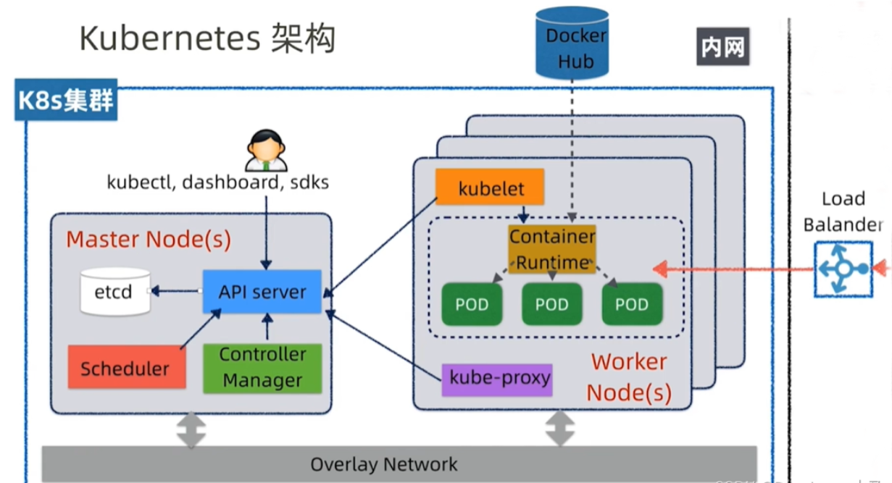

### 前言

> 参考文献：[点击前往](https://blog.csdn.net/weixin_53072519/article/details/125228115?ops_request_misc=%257B%2522request%255Fid%2522%253A%2522168304943016800182776443%2522%252C%2522scm%2522%253A%252220140713.130102334..%2522%257D&request_id=168304943016800182776443&biz_id=0&utm_medium=distribute.pc_search_result.none-task-blog-2~all~top_positive~default-1-125228115-null-null.142^v86^insert_down1,239^v2^insert_chatgpt&utm_term=k8s&spm=1018.2226.3001.4187)

 

### k8s 架构

k8s 使用 `master slave` 架构，存在 `master` 和 `worker` 两个节点

 

#### master 节点

`ETCD` 一种的分布式存储机制，底层采用 Raft 协议，k8s 集群的状态数据包括配置、节点等都存储于 etcd 中，它保存了整个集群的状态

`API server`，对外提供操作和获取 k8s 集群资源的的 API，是唯一操作 etcd 的组件，其他的组件包括管理员操作都是通过 API server 进行交互的.

`Scheduler`，在 k8s 集群中做调动决策，负责资源的调度，按照预定的调度策略将 Pod 调度到相应的机器上。

`Controller Manager`，相当于集群状态的协调者，观察着集群的实际状态

 

#### worker 节点

`Controller Runtime`，下载镜像和运行容器的组件，负责镜像管理以及 Pod 和容器的真正运行（CRI）。

`Pod`，k8s 中特有的一个概念，可以理解为对容器的包装，是 k8s 的基本调度单位，实际的容器时运行在 Pod 中的，一个节点可以启动一个或多个 Pod。

`kubelet`，负责管理 worker 节点上的组件，与 master 节点上的 API server 节点进行交互，接受指令执行操作。

`kube-proxy`，负责对 Pod 进行寻址和负载均衡

 

### 关键概念

cluster 集群：由节点组成，各个节点有一定的 CPU 和 RAM

container 容器：一个抽象概念，k8s 实际上就是一个容器调度平台

POD  
一个 POD 管理 N 个 container  
POD 是 k8s 的基本调度单位  
同一个 POD 内部的 container 可以相互调度各自的资源  
一个 POD 使用单独的一个 IP

ReplicaSet 副本集：一个副本集代表一组 POD，用于规范以及监控

service 服务：因 POD 变动频繁，而 service 提供了一条专用通道，让消费者可直接访问目标服务

deployment 发布：用于管理副本集，实现某些高级的发布机制

configmap 微服务配置：服务器上线时的一些可变配置项，另有 secretmap 专门存储敏感数据与隐私值

 
