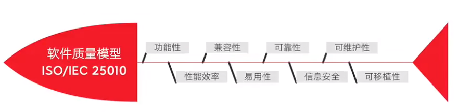
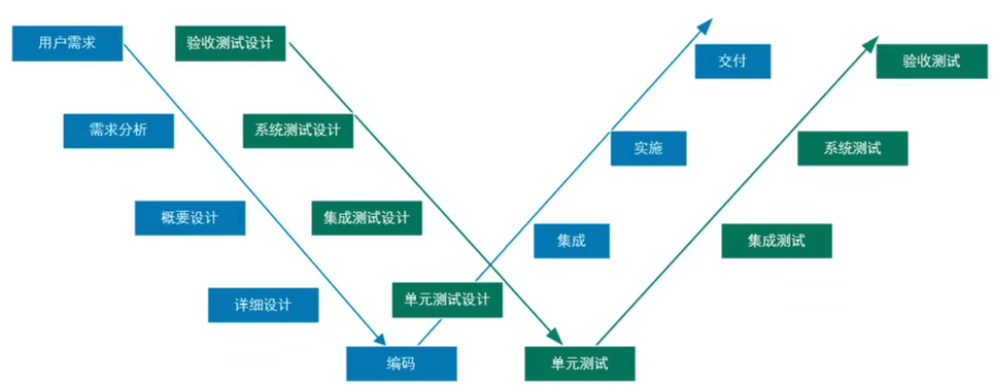
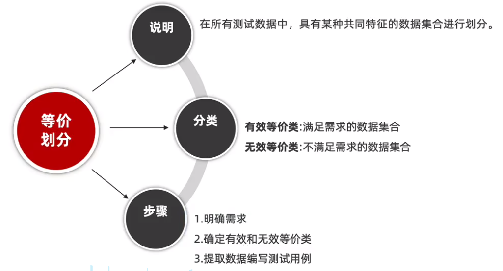
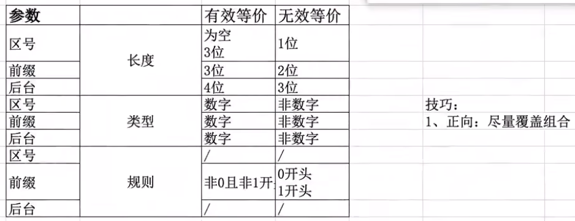
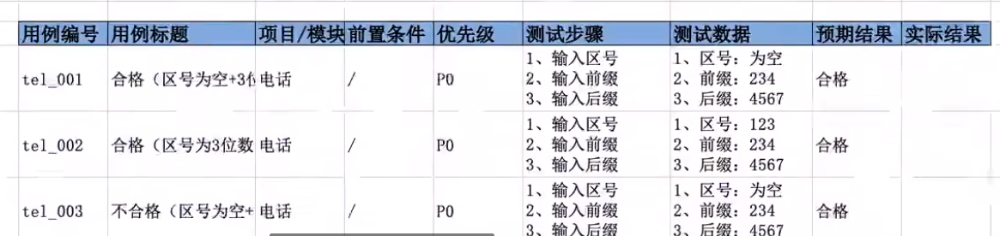

### 测试分类

- 单元测试：针对程序源代码的测试
- 集成测试：也称为接口测试，针对模块之间或者系统之间的接口验证
- 系统测试：对软件进行全面验证
- 验收测试：通过内侧或者公测实现的测试

 

- 黑盒测试：源码不可见，对程序功能测试
- 灰盒测试：可见部分源码，对程序接口测试
- 白盒测试：全部源代码可见，主要对源代码调试

 

冒烟测试：大规模测试之前，先验证程序主要功能，保证程序有可测试性

 

### 软件质量模型

一般有两大模型：质量模型、测试模型

 

**W 模型**

实施起来较为复杂且难度大对需求阶段和设计阶段的测试设计要求较高

 

### 测试流程

主流测试流程六步走：  
需求分析、测试计划、编写用例、执行用例、缺陷管理、测试报告

 

### 测试用例

主要考察质量模型

测试用例编写通用格式

- 用例编号：项目+模块+编号
- 用例标题：预期结果+操作步骤
- 模块或者项目
- 前置条件：执行该用例需要那些前置操作
- 优先级：用例的重要度
- 测试步骤
- 测试数据
- 预期结果

 

### 测试方法

#### 等价类划分法

快速实践：校验手机号码是否正确

 

#### 边界值分析

边界范围节点：

- 上点：正好等于边界值
- 离点：刚好大于或者刚好小于边界值的点
- 内点：边界值内的点

 
