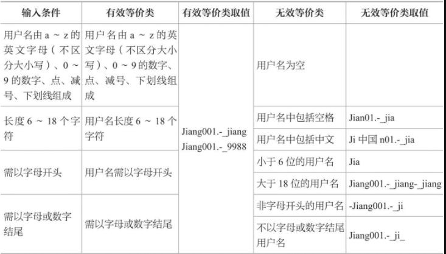
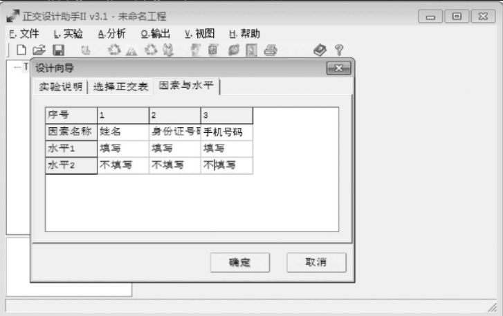
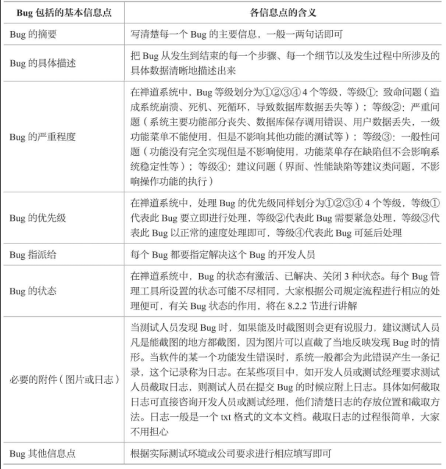

### 软测基本概念

#### 软测定义

软件测试是从前期需求文档的评审，到中期测试用例设计及测试执行，再到后期问题单的提交和关闭等一系列的测试过程。

`80/20` 原则指的是 80%的 Bug 集中在 20%的模块里面

 

#### 软件分类

黑盒测试：是不关注软件内部代码的结构和算法，只关注这个软件外部所展现出来的所有功能特性的测试

白盒测试：的定义刚好与黑盒测试相反，白盒测试是只关注软件内部代码的结构和算法，而不关注这个软件外部所展现出来的功能点的测试

 

测试阶段

1. 单元测试：用于测试代码的，采用的是白盒测试的方法
2. 集成测试：使用黑盒测试，针对单元测试得到的模块
3. 系统测试：测试软件的外观界面、功能、性能、安全性、易用性、兼容性这 6 个方面是否满足需求文档里的要求（测试人员在此阶段介入）
4. 验收测试：由用户进行的测试

 

### 软测计划

软测计划五大分类：测试范围、测试环境、测试策略、测试管理、测试风险

测试策略要点

1. 测试依据：根据需求文档以及测试用例决定
2. 测试准入标准：明确系统满足什么条件后开始测试，准入标准一般为冒烟测试（即在系统测试前针对基本功能点进行测试，若结果均通过才开始系统测试）
3. 测试工具：selenium
4. 测试重点及方法
5. 测试准出标准：

测试管理：主要指测试任务的分配、时间进度的安排、沟通方式这三方面的内容

测试风险：常见的风险有不透彻理解需求文档、估计不足测试时间及测试执行不到位

 

#### 软测计划模板

一 文档标识  
二 测试目的  
三 测试范围  
四 测试环境  
五 测试策略  
六 测试管理  
七 测试风险

 

### 测试用例设计

测试用例是为某个特殊目标而编制的一组测试输入、执行条件以及预期结果，以便核实是否满足某个特定需求

测试用例是测试人员具体执行测试的依据，它是非常关键的文档，它作为测试的标准并指导测试人员进行测试工作

 

#### 测试用例设计方法

> 测试的基本思想：凡是需求文档限定内的数据，测试人员需要进行测试；凡是需求文档限定以外的数据，测试人员一样也要测试

`等价类划分法`  
把所有可能输入的数据划分为若干个区域，然后从每个区域中取少数有代表性的数据进行测试即可

- 把不符合需求文档中规定的数据称之为无效等价类
- 有效等价类即符合需求文档要求

以下图片展示了对注册时填写用户名格式规范化的测试数据

 

`边界值分析`  
边界值分析法是取稍高于或稍低于边界的一些数据进行测试

 

`错误推测法`  
测试人员凭借自己的直觉、测试经验、发散思维去设计一些容易导致软件出错的测试点

 

`正交表分析法`  
比如我们需要同时测试三个输入框内容，就必须用到正交表法

 

因果判断法  
主要针对逻辑更为复杂的测试程序使用

 

#### 测试用例评审

测试人员一般会根据以下五点执行测试用例评审
（1）测试用例是否是依据需求文档编写的。  
（2）测试用例中的执行步骤、输入数据是否清晰、简洁、正确；对于重复度高的执行步骤，是否进行了简化。  
（3）每个测试用例是否都有明确的预期结果。  
（4）测试用例中是否存在多余的用例（无效、等价、冗余的用例）。  
（5）测试用例是否覆盖了需求文档中所有的功能点，是否存在遗漏。

 

### 测试环境

> 软件系统有两种主要架构：浏览器/服务器（Browser/Server，B/S）结构的软件系统，客户端/服务器（Client/Server，C/S）结构的软件系统

B/S 架构，对于初级软测工程师，需要熟悉使用 windows 平台下的各种浏览器的测试使用方法，同时熟练 vmware 搭设虚拟机

C/S 架构，需要熟悉 windows server 平台，操纵数据库

 

### 记录 BUG

#### 如何记录一个 bug

一个 bug 可以包括如下信息点

 

#### 回归测试

上一轮的 Bug 被修复了，在下一轮的测试中还可能发现新的 Bug，并不是说上一轮的 Bug 修复好了就不会再出现其他问题了

软件测试并不是测试一轮就完成了，一般情况下，一个软件产品可能需要经过多轮反复测试和验证才能达到上线标准。

 

### 软测报告

下方是一个简单的测开基础报告模板

一 编写目的  
二 模块功能描述  
三 测试过程  
四 测试环境  
五 功能点测试范围  
六 测试执行结果  
七 风险评估  
八 测试结论

 

### 面试分析

软件测试的工作更注重测试人员的动手能力和沟通能力

公司在招聘初级软件测试人员时，大概只有 35%的公司会出笔试题目，大部分的公司招聘是没有笔试的，主要针对应聘者的简历直接进行面试

 

软件测试应遵循什么原则？  
参考回答：我觉得软件测试应遵循 80/20 原则，即容易出现问题的模块或是问题较多的模块要重点测试。

软件测试是在什么阶段介入的？  
参考回答：一般情况下，对于功能测试人员，我们是在进行系统测试的时候介入的。
