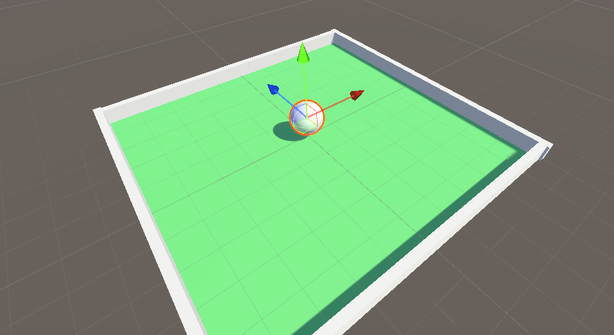

### 场景搭设

搭设如下图所示场景



给球体挂上一个刚体组件，并保持其为默认值不变；

<br>

### 控制脚本

> 新建脚本文件 `MoveTest.cs` 来控制小球

<br>

#### 设置变量

代码开头写入以下变量

1. Range 设置变量可以被一个操纵杆调控
2. 设置最大速度与最大加速度
3. velocity 表示当前速度向量，desiredVelocity 表示下一步的速度向量

```cs
[SerializeField, Range(0f, 100f)] public float maxSpeed = 10f;

[SerializeField, Range(0f, 100f)] public float maxAcceleration = 10f;

Vector3 velocity, desiredVelocity;

private Rigidbody body;
```

<br>

#### 获取速度向量

首先，我们需要获取玩家身上的刚体组件

```cs
private void Awake()
{
    body = GetComponent<Rigidbody>();
}
```

<br>

获取 desiredVelocity 的步骤

1. playerInput 记录玩家按键输入，因为我们没有涉及跳跃，所以此处用 vector2 记录
2. ClampMagnitude 限制向量的长度，后面的 1f 表示该向量最长为 1f
3. desiredVelocity 直接构造一个三维向量，并乘以最大速度即可

```cs
void Update()
{
    Vector2 playerInput;
    playerInput.x = Input.GetAxis("Horizontal");
    playerInput.y = Input.GetAxis("Vertical");
    playerInput = Vector2.ClampMagnitude(playerInput, 1f);

    desiredVelocity =
        new Vector3(playerInput.x, 0f, playerInput.y) * maxSpeed;
}
```

<br>

#### 玩家移动

一般的，因为玩家挂载了刚体组件，所以最好把物理相关的更新放到 fixedupdate 方法里面！

以下代码进行 desiredVelocity 的二次处理，添加了便于物体平缓运动的加速度；

```cs
private void FixedUpdate()
{
    // 获取当前速度向量
    velocity = body.velocity;

    // 为了让玩家平缓运动，设置速度该变量
    float maxSpeedChange = maxAcceleration * Time.deltaTime;

    // 设置最终的速度向量
    velocity.x = Mathf.MoveTowards(velocity.x, desiredVelocity.x, maxSpeedChange);
    velocity.z = Mathf.MoveTowards(velocity.z, desiredVelocity.z, maxSpeedChange);

    // 赋予玩家动力
    body.velocity = velocity;
}
```

<br>

### END
