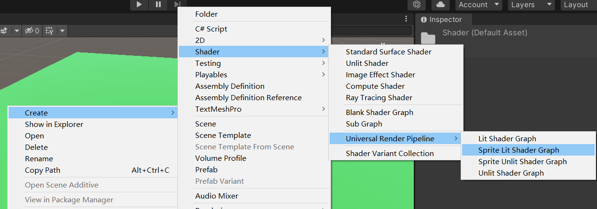

### ShaderGraph 概述

ShaderGraph 是一款可视化 shader 编写插件

ShaderGraph 于 unity2018 版本后自动捆绑，如您使用的版本较早，可以自行前往 assets 资源商店获取；

ShaderGraph 只会在选择使用 `通用渲染管线 URP` 或者 `高清渲染管线 HDRP` 时自动捆绑，故可以直接使用；  
若使用默认渲染器，则仍然需要导入 ShaderGraph 包；

 

### 快速上手

#### 界面

在 project 面板中；

右键点击，依次选择 create->shader->urp->xxx 即可创建对应类型的 shadergraph；

目前 shadergraph 有四种默认类型，但我们主要用的还是下面这俩种：

1. lit 有光照类型（真实感强）
2. unlit 无光照类型（常用来模拟卡通角色或者场景）

 

双击文件后进入 shadergraph 编辑器，下面是重要的区域介绍  
变量编辑区（红框）：对应右上角的 blackbroad 按钮，主要是进行变量的处理；  
图形属性（蓝框）：对应右上角倒数第二个，处理节点属性；  
shader 预览（橙框）：右键点击这个框还可以切换显示的模型哦~

 

中间默认有两个节点：  
顶点着色器节点 vertex；  
片元着色器节点 fragment；

> 右键点击空白处或者空格键新增新的节点！

> 🎯 改完 shader 后千万记得点击左上方的 save 进行保存！只要你不点，材质就无法真正生效！

 

#### shader 赋予

新建一个 material 材质球；  
然后在属性面板，顶部下拉框直接选择 shader graph，找到你刚刚编辑好的 shader 就 ok 了；

> 之后把材质球拖到物体身上。。。
