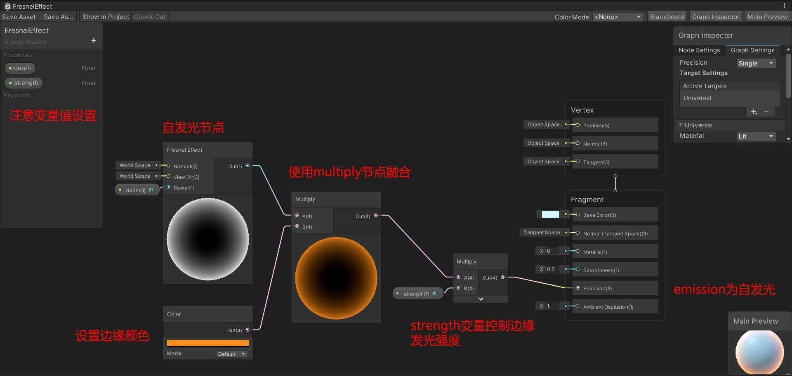

### 完整图

 

### 原理解释

1. 使用节点 fresnel effect 模拟边缘发光效果，并创建变量 depth 控制边缘发光深度；
2. 添加一颜色 color 节点，并使用 multiply 节点融合二者；
3. 为了灵活控制，可以添加一个 strength 变量控制整体的自发光强度
4. 连接到片元着色器节点的 emission

> END，后续文章会有介绍如何制作类似 unity 场景中选择物体，边缘呈现非渐变橙色光效果！
