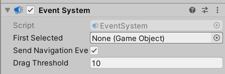

### EventSystem

#### EventSystem 组件

一般的，新建 UI 对象后都会默认向场景添加 EventSystem 对象，该对象管理所有 UI 的点击触发事件

EventSystem 对象下也有一个同名组件，以下是对应参数介绍
`send navigation eve` 表示是否支持使用上下左右箭头来切换不同的 UI 对象



<br>

#### Standalone Input Module

处理鼠标点击或者触摸事件，之后进行事件的分发；

一般的，一个游戏内只能同时存在一个 Input，所以大家都默认使用 `Standalone Input Module` 而不换别的

<br>

### IPointerHandler 交互

#### 检测鼠标移动到某 3d 物体上

不同于 EventTrigger，使用 IPointer 接口可以方便的对 3d 物体进行事件操作

首先为主摄像机添加一个 `Pysics Raycaster` 组件，这样就可以在点击时从摄像机发出一条射线到鼠标点击位置；

新建脚本 `IPointerTest.cs` ，把他挂载到场景中需要进行检测的物体上

```cs
using System.Collections;
using System.Collections.Generic;
using UnityEngine;
using UnityEngine.EventSystems;

public class PointerTest : MonoBehaviour,IPointerEnterHandler
{
    public void OnPointerEnter(PointerEventData eventData)
    {
        Debug.Log(eventData);
    }
}
```

> 这里的接口 IPointerEnterHandler 检测射线经过（进入）
> 一旦鼠标移动经过该物体，就会输出 log
