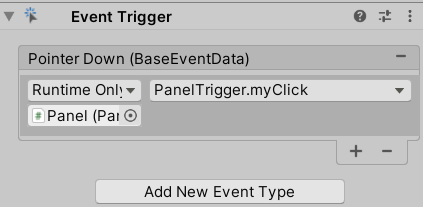
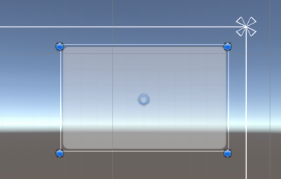

## EventTrigger 触发响应

<br>

### 解释

EventTrigger 专门用来处理各种事件，通常用在 UI 的点击事件上；

当然可以通过 ray 射线检测来将 EventTrigger 运用到 3d 场景中去；

<br>

### EventTrigger 组件使用

为任意一个 UI 对象上添加 EventTrigger 组件；

在该 UI 对象上添加 PanelTrigger.cs 脚本，写下以下点击触发事件；  
注意：触发事件必须要有一个形参，且必须是 BaseEventData 类型的，否则无法正常侦听事件

```cs
public void myClick(BaseEventData data)
{
    Debug.Log("被点击");
}
```

直接看 EventTrigger 组件的属性，点击 `add new event type` 来添加一个新的事件监听；
左下角添加挂载了触发事件的对象，右上角就是选择对应的触发事件；  
我们的脚本挂到了 Panel 对象上，且定义了一个触发方法 myClick，按下图格式选择填入即可



<br>

### 基本使用

> 为物体添加 EventTrigger 组件来实现事件监听（大项目里一般使用事件总线，所以不推荐使用本方法）

创建 canvas，并为画布上添加 panel 组件；

把 panel 移动到画布右上角，调整好约束关系即可；



<br>

选中 panel，为其添加组件 `EventTrigger` （可以在属性面板里面加，也可以通过顶部菜单的 component 添加）

新建脚本 PanelTrigger.cs ，挂载到 panel 上面；
以下是脚本内容

```cs
using System.Collections;
using System.Collections.Generic;
using UnityEngine;
using UnityEngine.Events;
using UnityEngine.EventSystems;

// 此注解可以让系统自动添加EventTrigger相关的依赖组件
[RequireComponent(typeof(UnityEngine.EventSystems.EventTrigger))]
public class PanelTrigger : MonoBehaviour
{
    void Start()
    {
        // 注册点击事件
        UnityAction<BaseEventData> click = new UnityAction<BaseEventData>(myClick);

        // 设置EventTrigger类型的事件
        EventTrigger.Entry myclick = new EventTrigger.Entry();
        // 设置触发方式为鼠标按下
        myclick.eventID = EventTriggerType.PointerDown;
        // 设置触发后回调函数（事件动作）为click
        myclick.callback.AddListener(click);

        // 获取当前组件下的EventTrigger组件，并且挂载触发事件
        EventTrigger trigger = gameObject.GetComponent<EventTrigger>();
        trigger.triggers.Add(myclick);
    }

    // 点击后触发的事件
    // 形参data必须存在，并且其类型为BaseEventData
    public void myClick(BaseEventData data)
    {
        Debug.Log("被点击");
    }

}
```

> 代码的主要思想是，构建一个 EventTrigger 事件，然后把他插入到对象属性中的 EventTrigger 组件下作为触发事件！
> 代码执行完后直接运行即可看到点击结果

<br>

### 事件总线
