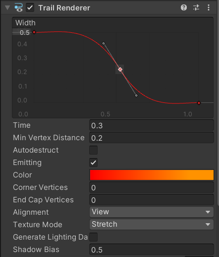
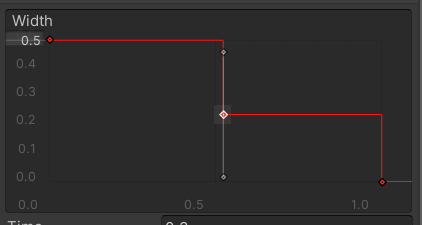
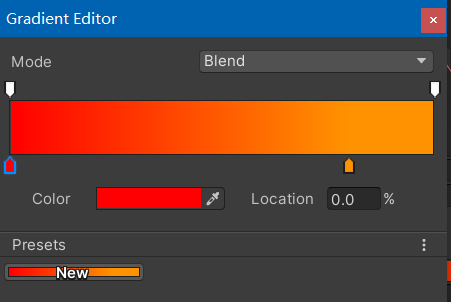
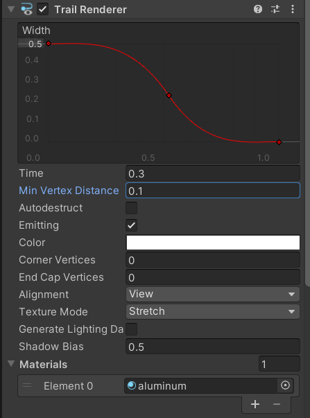
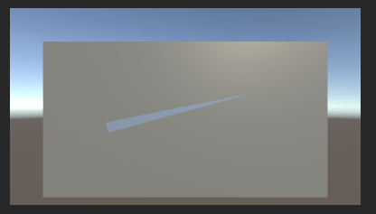

### 1. TrailRenderer

#### 1.1 常见属性



顶部曲线图 拖尾结构  
time 持续时间  
min vertex distance 最小顶点距离  
texture mode 贴图类型（如果你想要拖尾使用某贴图，就需要配置此项）  
shadow bias 投影权重

<br>

#### 1.2 曲线图调节

如果我们没有为拖尾赋予一个贴图，那么可以通过调节曲线图来改变拖尾的整体结构（譬如头宽尾细）

1. 曲线图的左侧为当前线宽，红色曲线代表整个拖尾不同部位的线宽，默认情况下整个拖尾线宽均为 1.0
2. 双击左侧数字即可更改线宽；
3. 双击红色线任意部位新建操纵点，拖动它来改变当前位置的线宽；
4. 拖动灰色操纵杆调节曲线平滑度，如果转角过大就会直接把曲线变成尖锐的断层过渡（如下图）



<br>

#### 1.3 颜色设置

点击属性 color 右侧的拾色器，即可打开颜色设置面板；

色板下方的两个操纵杆分别控制左右侧的颜色取值；

拖动下方两个操纵杆来调节不同颜色的占比；



<br>

### 2. 小案例

#### 屏幕划线

创建一个空物体，命名为 trail；

让主摄像机对准该 trail，因为我们要模拟鼠标滑动带动拖尾

为其添加 trailrenderer 组件，并将组件设置为下图；  
其余配置项保持默认



<br>

新建代码 `TrailRendererController.cs`，把他挂载到 trail 空物体上

```cs
using System;
using System.Collections;
using System.Collections.Generic;
using UnityEngine;

public class TrailRendererController : MonoBehaviour
{
    // 拖尾组件
    public TrailRenderer trail;

    // 拖尾离摄像机的距离
    private float distance = 8f;

    void Update()
    {
        if (Input.GetMouseButtonDown(0))
        {
            // 为了防止拖尾漂移，鼠标点击一瞬间关闭拖尾发光
            // 把空物体移动到鼠标点击位置
            trail.emitting = false;
            var mousePos = Input.mousePosition;
            transform.position = Camera.main.ScreenToWorldPoint(new Vector3(mousePos.x, mousePos.y, distance));
            return;
        }

        if (Input.GetMouseButton(0))
        {
            // 直到鼠标按住不动了，才开始发光并渲染拖尾
            trail.emitting = true;
            var mousePos = Input.mousePosition;
            transform.position = Camera.main.ScreenToWorldPoint(new Vector3(mousePos.x, mousePos.y, distance));
        }
    }
}
```

<br>

效果图：


