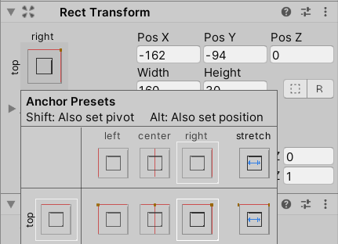
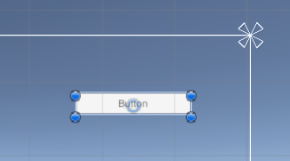
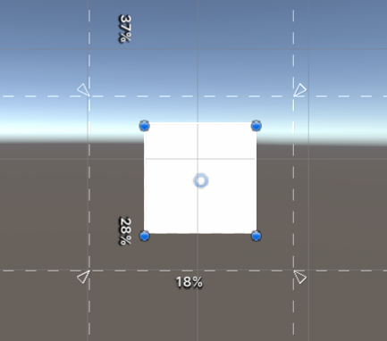
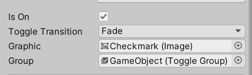
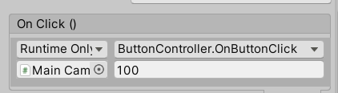
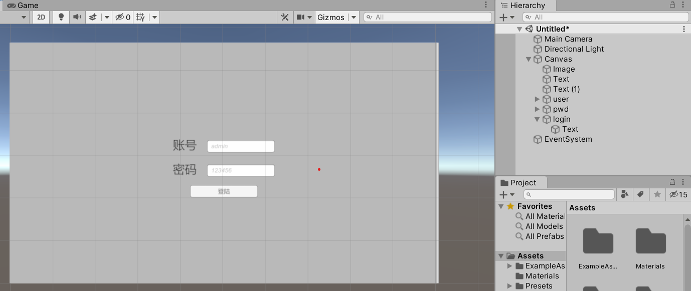

## UI 基础

<br>

<hr>

### 组件使用

#### 使用约束布局

新建组件后在组件中心有一个类似于雨伞状的白色图标，它表示当前组件的约束点；
当我们调节游戏窗口大小时，组件就会根据约束点动态改变自身位置，以避免超出游戏窗口；

点选组件，在属性面板的 transform 的左上角即可设置约束点所在位置；  
下图设置了约束点在 canvas 的右上角；



此时，编辑器的 canvas 中约束点位置已经转移，移动组件至 canvas 右上角；  
那么现在无论怎么调节窗口大小，都不会导致该组件被遮盖；



<br>

#### 启用组件缩放

拖动约束点的四个白色控制点，即可自行划定约束区域；  
位于约束区内的图片在窗口缩放的同时，自身也会进行等比例的缩放！



<br>

#### 单选框组

创建两个 toggle，并将二者放在同一个空物体下，再给空物体添加 toggle group 组件；  
分别将这两个 toggle 下的属性中找到 group，直接把空对象拖进来，然后就变成单选模式了！！！



<br>

### 脚本编写

#### 点击按钮触发脚本

> 注：因为 canvas 是依附于主摄像机上的，所以我们要把代码挂载到摄像机上

于主摄像机内新增脚本 `ButtonController.cs`

设置按钮点击后触发的方法，可以附带若干个形参（一个不带也可以）  
方法名称可以任意指定！

```cs
public class ButtonController : MonoBehaviour
{
    public void OnButtonClick(int i)
    {
        Debug.Log(i);
    }
}
```

之后进入按钮的属性页面，在 button 组件内最下方找到 `Onclick()`  
点击加号新增点击事件，然后右上角下拉框找到我们刚刚定义好的按钮点击方法 `OnButtonClick`  
第二行依次输入摄像机对象、传入的实参值；

> 至此已完成按钮点击触发方法的效果，除此之外还可以绑定更多内容



<br>

### 简单案例

#### 模拟登录

按照上面学的知识点，对照约束关系搭建起如下图所示的简单登陆页面；  
hierarchy 面板里面有组件对应名字；



为主摄像机挂载脚本 ButtonController.cs  
之后为登陆按钮添加点击事件就大功告成了；

> 以下代码中加载的场景 SampleScene 是 URP 项目默认自带的场景

```cs
public class ButtonController : MonoBehaviour
{
    // 获取输入框组件
    public InputField user;
    public InputField pwd;

    public void onLoginClick()
    {
        String username = user.text;
        String password = pwd.text;
        // 检测账户和密码是否对应
        if (username == "admin" && password == "123456")
        {
            // 登陆成功就切换场景
            SceneManager.LoadScene("SampleScene");
        }
    }
}
```

<br>
