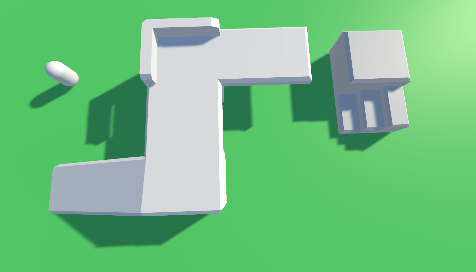
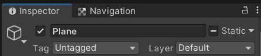
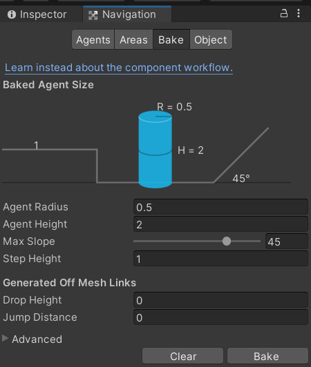

## 搭建一个基本的寻路系统

### 寻路角色与场景

创建一个胶囊体作为玩家，添加刚体组件，并且冻结所有旋转和 y 轴的位置；

之后为玩家添加导航网格代理组件，即 `NavMeshAgent`

添加外部的场景模型（或者自行搭建），并移动摄像机到一个合适的位置；

> 技巧：可以先在场景中对准位置，然后取 hierarchy 面板，右键点击主摄像机，选择 align with view，即可把摄像机视角定位为目前场景视角！



<br>

### 设置场景导航与烘焙

选中场景中除了玩家以外的所有静态物体，在属性面板最右上角的 `"static"` ，点击小三角，选择 `navigation static`；  
如果弹出提示说需要应用到子物体，点击确认应用即可！



<br>

依次点击 window -> ai -> navigation 打开导航控制面板；

navigation 面板有四个子面板，目前我们仅需要关注 bake 面板，点击进入，直接点击右下角 bake 按钮进行场景导航网格的烘焙；

烘焙完成后，场景中我们之前设置的静态物体均出现淡蓝色导航网格，这表示玩家可以行走的路段！



<br>

### 鼠标点击导航

新建脚本 NavClick.cs，以下是全部代码：

1. 首先获取导航网格对象以及主摄像机
2. 照抄屏幕发射射线的代码
3. agent.SetDestination 方法可以设置玩家的导航点，即玩家会根据导航网格来计算最优路径来到达目的地
4. Debug.DrawLine 为了显示射线更清晰，我们可以使用此方法在场景面板中显示红色射线轨迹！

```cs
using System.Collections;
using System.Collections.Generic;
using UnityEngine;
using UnityEngine.AI;

public class NavClick : MonoBehaviour
{
    public NavMeshAgent agent;

    public Camera camera;

    void Update()
    {
        if (Input.GetMouseButtonDown(0))
        {
            Ray ray = camera.ScreenPointToRay(Input.mousePosition);
            RaycastHit hit;
            if (Physics.Raycast(ray, out hit))
            {
                agent.SetDestination(hit.point);
                Debug.DrawLine(camera.transform.position,hit.point,Color.red);
            }
        }
    }
}
```

<br>

代码挂载到主摄像机，并设置好导航网格代理之后，点击运行按钮，即告完成；

此时我们可实现类似 LOL 的点击位置玩家计算路径并前往的效果了

<br>

### 一些废话

> 别以为这就学完了，这仅仅是启发你的兴趣，后面还要好多要学的！！！
