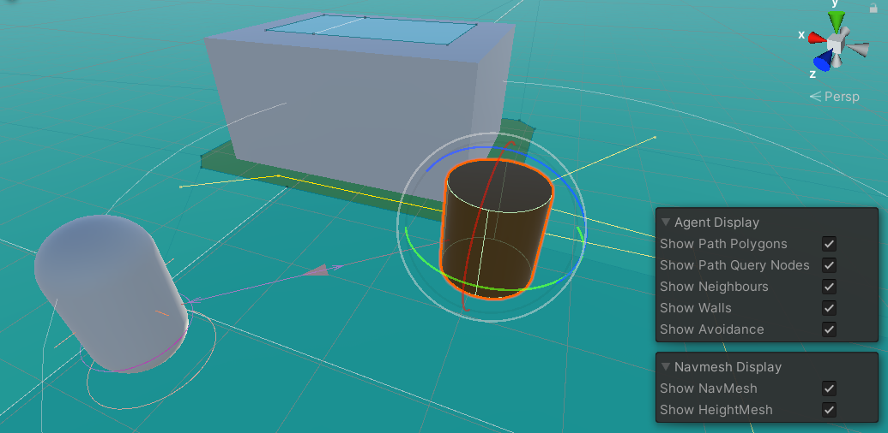

### 导航场景

#### 场景元素

> 下图展示了一个典型的 navigation 场景；  
> 我们需要在选中 navigation 面板以及挂载了 navmeshagent 的物体的情况下，才会显示对应的元素

 

元素解释：

淡蓝底： 导航区域；  
未被划分为淡蓝的区域：非导航区（即不可到达区）

棕色对象周围的白色细圆环： 导航网格对象的避障范围  
俩对象之间的紫色箭头： 表示一个对另一个的追踪（即设置了 SetDestination）

> 视图右下方的面板可以随时开闭元素展示！

 

### Navigation 面板

#### Agents

在这里配置导航网格代理的各种属性；

譬如针对不同敌人高度、爬坡能力等；

name 该代理属性的名字；  
radius 代理网格半径；  
step hight 代理可以跨越的高度（譬如从高处跳下来，超过了这个最大范围你就没法跳）

 

#### Areas

区域类型；

因为代理在经过不同区域（公路或者水面）所花费的成本是不同的，而代理遇到此情况时会先行避开成本高的区域；

这个面板就是增删不同区域类型的成本的，每个区域类型都赋予了一个颜色；

> 点击某个 navigation static 的对象，进入 object 面板，即可设置该区域的类型了！

 

#### Bake

烘焙导航网格；

baked agent size 表示当前需要进行烘焙的导航网格代理的属性；

我们可以让系统自动计算不同区域的间隙，以便构建区域连接；  
off mesh link 设置代理的能力  
drop height 代理可以下落的最大高度；  
jump distance 代理可以跨越的最大宽度；

> 以上二者默认为 0，只要设置了，系统就会自动根据代理能力进行区域导航链接

 

#### Object

选中场景中任意一个物体即可弹出上图所示的配置项；

如果目前选中的是静态场景（即设置为 `navigation static` 的对象）  
那么勾选 `generate offmeshlinks` 将会让系统自动构建导航链接

navigation area 即可设置当前区域的类型！（对应上文的 area 面板）

 
