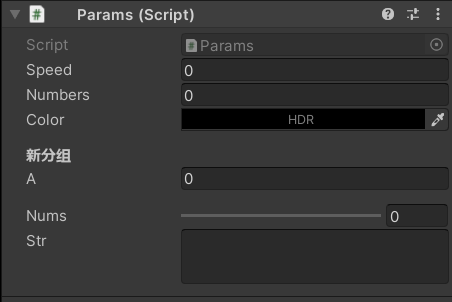

### 概述

注解的存在作用即为了方便我们进行变量调试与设置；

分别由类注解、变量注解、方法注解；

使用率最多的就是变量注解

<br>

### 变量注解

#### 常见注解展示

| 注解名                                   | 作用                                            |
| ---------------------------------------- | ----------------------------------------------- |
| [SerializeField]                         | 显示该变量到 Inspector 面板中，无论是否 private |
| [HideInInspector]                        | 隐藏任何类型的变量                              |
| [Tooltip("")]                            | 鼠标移动到该变量上时出现的提示                  |
| [ColorUsage(showAlpha: true, hdr: true)] | 高级版拾色器                                    |
| [Header("")]                             | 给这个变量加上一个加粗的标题（用来制作分组）    |
| [Space(10)]                              | 与上方变量分割一段距离，推荐取值 10             |
| [Range(10, 100)]                         | 滑块调节变量                                    |
| [Multiline]                              | 将普通的一行文本框扩展为多行文本框              |

<br>

#### 注解演示结果

这是代码

```cs
public class Params : MonoBehaviour
{
    // 显示private变量
    [SerializeField] private float speed;

    // 隐藏任何变量
    [HideInInspector] public float hideSpeed;

    // 提示，顾名思义
    [Tooltip("这是一段提示")] public int numbers;

    // 高级的拾色器
    [ColorUsage(showAlpha: true, hdr: true)]
    public Color color;

    // 添加一个标题
    [Header("新分组")] public float a;

    // 划分一定空间
    [Space(10)]
    // 设置一个滑块10-100
    [Range(10, 100)] public int nums;

    // 加大版的文本框
    [Multiline] public string str;

}
```

这是演示结果



<br>

### 类注解

| 注解名称                        | 作用                              |
| ------------------------------- | --------------------------------- |
| [Serializable]                  | 让这个类在 Inspector 面板中显示   |
| [RequireComponent(typeof())]    | 强制挂载某个组件，且无法被删除    |
| [AddComponentMenu("")]          | 将脚本添加到 Component 菜单中     |
| [HelpURL(“http://www.asd.com“)] | 设置组件右上角的帮助文档 url 指向 |

<br>
