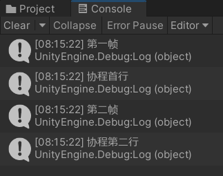

### 协程原理

#### 协程与用户态

协程的上下文切换很快， 且只需在 `用户态` 内即可完成上下文的切换

协程上下文切换只涉及 CPU 上下文切换，即协程保存当前 CPU 寄存器状态，并把该状态加载到新进来的 CPU 寄存器上！  
（因为一般的内存存储都需要陷入内核态，十分耗费资源和时间）

<br>

#### 线程协程区别

1. 线程之间切换路径时用户态和内核态；协程只在用户态内切换
2. 协程运行在线程之上，他可以选择性让出或者抢占
3. 协程不是进程或线程，其执行过程更类似于子例程，或者说不带返回值的函数调用
4. 协程之间切换与否由协程自身决定

<br>

### Unity 协程

#### 概念

unity 实际上是吧 c#中的协程进行了进一步的封装；

unity 协程具有以下几个功能：

- 协程与 update 方法一样都是每帧执行的
- 协程运行在主线程之上
- 协程也有自己单独的上下文切换机制

<br>

#### 基本协程

这是一个基础的协程结构：

1. 若使用协程名字的方式开启协程，则形参最多只能有一个；
2. 若使用协程方法的方式开启协程，则形参数目不限；
3. 遇到 yield return 后会自动挂起，直到 return 后面条件满足后才会继续执行下面的代码（特别注意这里，和其他方法不同，return 后面的代码也是可以执行的！！！）
4. 一般的，协程都是放在 start 方法中开启的

> 以下代码演示延迟指定秒数后移动物体到一个随机位置

```cs
// StartCoroutine开启携程
void Start()
{
    StartCoroutine(changePos(1f));
}

// IEnumerator定义一个协程
IEnumerator changePos(float timeout)
{
    yield return new WaitForSeconds(timeout);
    Vector3 randomPos = new Vector3(Random.Range(1, 10), 0, Random.Range(1, 10));
    transform.Translate(randomPos);
}
```

<br>

#### 协程相关 API

无参启动协程：  
`StartCoroutine(name()) || StartCoroutine("name")`  
单参启动协程：  
`StartCoroutine(name(123)) || StartCoroutine("name",123)`  
多参启动协程（此时不可使用协程名字启动）：  
`StartCoroutine(changePos(1,2,3))`

终止协程：  
`StopCoroutine() `
终止所有协程：  
`StopAllCoroutines()`

> 终止协程方法传入的实参是线程的对象实例或者线程的名字，不可以是协程方法！

<br>

**yield 方法大杂烩**

| 语句                                          | 功能                                                                                                                             |
| --------------------------------------------- | -------------------------------------------------------------------------------------------------------------------------------- |
| yield return null                             | 下一帧再执行后续代码                                                                                                             |
| yield return 0                                | 下一帧再执行后续代码                                                                                                             |
| yield return 6(任意数字)                      | 下一帧再执行后续代码                                                                                                             |
| yield break                                   | 直接结束该协程的后续操作                                                                                                         |
| yield return asyncOperation                   | 等异步操作结束后再执行后续代码                                                                                                   |
| yield return StartCoroution(其它协程)         | 调用执行其它协程后再执行后续代码                                                                                                 |
| yield return WWW()                            | 等待 WWW 操作完成后再执行后续代码                                                                                                |
| yield return new WaitForSeconds(0.3f)         | 等待 0.3 秒，一段指定的时间延迟之后继续执行，在所有的 Update 函数完成调用的那一帧之后（这里的时间会受到 Time.timeScale 的影响）; |
| yield return new WaitForSecondsRealtime(0.3f) | 等待 0.3 秒，一段指定的时间延迟之后继续执行，在所有的 Update 函数完成调用的那一帧之后（这里的时间不受到 Time.timeScale 的影响）; |

<br>

> 特别注意：  
> 一般的协程在 start 方法中开启后只会运行一次；  
> 不要再 update 方法里开启协程，不然每帧都会创建新的协程，不卡死你才怪！

<br>

#### yield 生命周期

请看如下代码，每行代码注释都表明了执行顺序

1. 首先 start 方法进入，输出”第一帧”
2. 运行到 demo 协程，执行协程第一行代码后遇到 yield 挂起协程
3. 因为协程挂起，异步执行 start 方法中后续代码，故输出”第二帧”
4. start 方法结束后，yield 判断 null 符合条件，可以执行下方剩余代码，故输出”协程第二行”

```cs
void Start()
{
    Debug.Log("第一帧");  // 1
    StartCoroutine("demo");
    Debug.Log("第二帧");  // 3
}

IEnumerator demo()
{
    Debug.Log("协程首行");  // 2
    yield return null;
    Debug.Log("协程第二行"); // 4
}
```



<br>

`WaitUntil` 需要接收一返回布尔值的函数  
如果为 true，就会执行 yield 后续的代码；  
如果为 false，就一直挂起而不执行后续代码；

```cs
IEnumerator demo()
{
    Debug.Log("协程首行");
    yield return new WaitUntil(isTrue);
    Debug.Log("协程第二行");
}

bool isTrue()
{
    return false;
}
```

<br>

#### 协程注意事项

1. 函数 Update 和 FixedUpdate 中不能使用 yield 语句
2. StartCoroutine()表示新开启一个协程，并且和目前其他协程并行执行  
   yield return StartCoroutine()类似于中断函数

<br>

### 案例与应用场景

> END，目前没有更新计划
